<Lead>Enhancing multi-language sites of "Taobao" to increase promotion rate and trust for international users.</Lead>

<MetaGrid>

<Meta label="Timeline">

06/2025 - 10/2025

</Meta>

<Meta label="Role">

Design research UX design Interface design

</Meta>

<Meta label="Team">

UX Designer (3) UI Designer (2) Product Manager (2) Design Leader (1)

</Meta>

<Meta label="Tools">

</Meta>

</MetaGrid>

### Overview

<Row>

<Col span={6}>

TaoBao Overseas serves two distinct groups: overseas Chinese users already familiar with TaoBao's ecosystem, and new international users who have never experienced it. Spanning approximately 20 regional sites across 3 languages, the platform sits at a pivotal inflection point.

The core tension: **new business capabilities had no suitable design container to operate in.** My mandate was to systematically redesign three foundational modules — product cards, topic feeds, and the detail page — to increase L-to-P (landing-to-purchase) conversion rates across the full user journey.

</Col>

<Col span={6}>

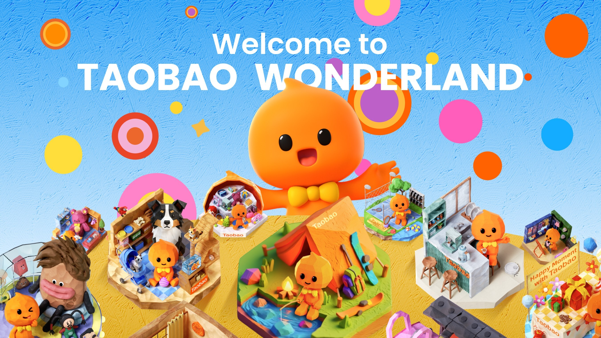

</Col>

</Row>

### Final Impact

<Row>

<Col span={6}>

#### Increase in overall L-P Rate

Product detail and personalized signals at key decision points reduced drop-off and drove a measurable lift in listing-to-purchase conversion across target categories.

</Col>

<Col span={6}>

#### Universal design for 20 sites and 3 languages

A multilingual-ready component system — built to handle variable text lengths and regional conventions — enabled consistent deployment across 20 storefronts in 3 languages without per-site redesign.

</Col>

</Row>

<Divider id="product">📱Main Features</Divider>

<Row>

<Col span={5}>

### 01. Product Card

#### A Standardized Grid System for 20 Sites

A four-zone grid layout (image, brand badge, benefit, price) that is structurally language-agnostic but content-localizable — stable across all 20 regional sites regardless of text length or script direction.Integrates into every touchpoint: homepage, search, category, detail page recommendations, order flows, and checkout surfaces.

</Col>

<Col span={7}>

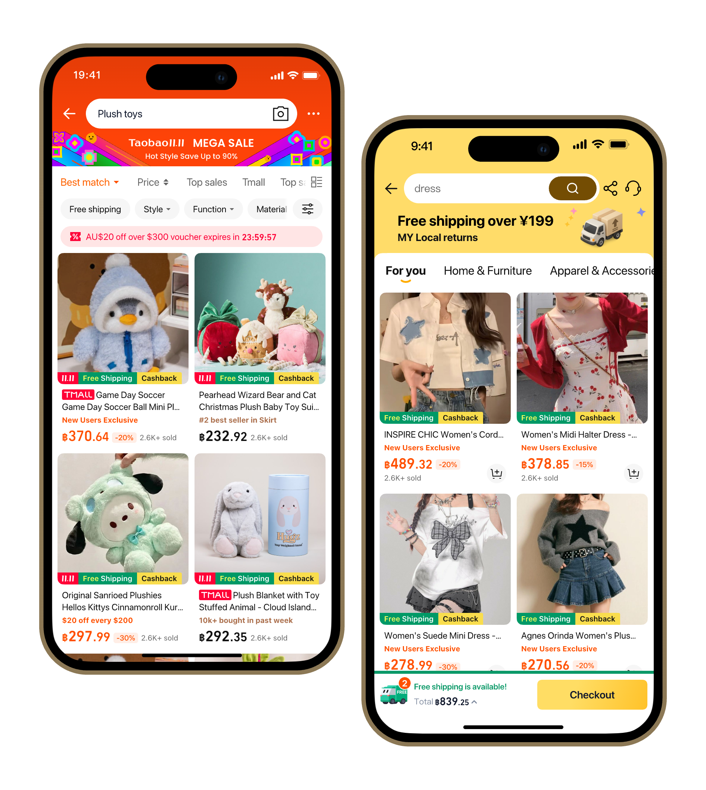

</Col>

</Row>

<Row>

<Col span={7}>

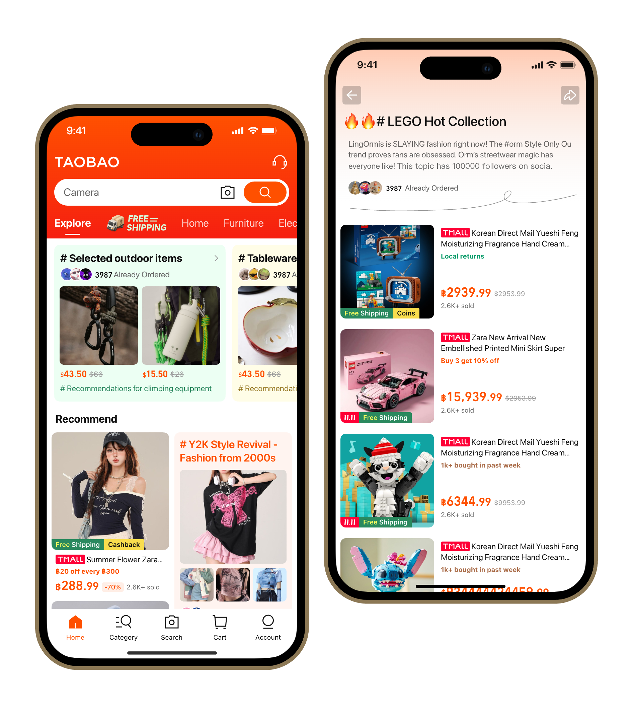

</Col>

<Col span={5}>

### 02. Promotion in #Theme

#### Localization promotion strategy with AI solutions

Three placement formats — homepage carousel cards, in-feed pinned topic cards, and store/campaign sub-cards — built to surface AIB-generated topic lists (e.g. Thailand's "Quirky Novelty" trending items) without disrupting existing recommendation logic.

Includes a Mini Detail large-card format (~half-screen) inspired by TikTok's infinite scroll, with industry-specific content layers for fashion and consumer electronics.

</Col>

</Row>

<Row>

<Col span={5}>

### 03. Product Detail

#### Localized Size Intelligence for First-Time Buyers

A redesigned size experience anchored in three improvements: localized size chart systems (US/EU/AU/cm/in switching), progressive personalized recommendations based on preferred brands and body metrics, and structured "true to size" review data surfaced inline at the point of decision.

Includes a fallback design for products without structured size data — replacing blank modules with seller-uploaded visual size guides.

</Col>

<Col span={7}>

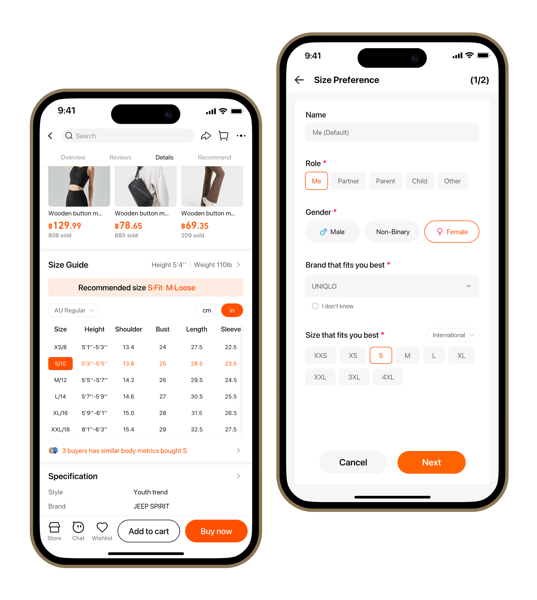

</Col>

</Row>

<Row>

<Col span={7}>

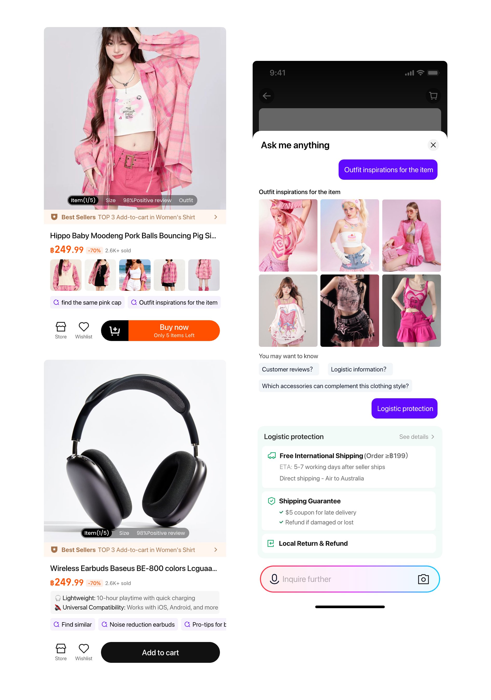

</Col>

<Col span={5}>

### 04. AI Quick Q&A Entry Points

#### Contextual AI — Built Into the Card, Not Bolted On

Rather than asking users to craft their own prompts, AI entry points are embedded directly into relevant card sections — fashion cards surface styling, review, and fit questions; electronics cards surface spec comparisons, compatibility, and shipping queries.

The design philosophy: *AI should find the right moment to intervene, not wait to be summoned.*

</Col>

</Row>

<Divider id="background">👋 Background</Divider>

### Why TaoBao Overseas needed a design infrastructure reset?

TaoBao Overseas launched with a foundational paradox: a platform with the breadth of "everything and anything" (万能的淘宝) trying to serve dramatically different users — from Chinese diaspora who grew up using TaoBao's domestic interface, to Thai or Australian first-time users who have never encountered it.

<Grid cols={3}>

<Cell bg="rgba(255, 255, 255, 0.1)">

### 🧠

#### AIB Algorithm & KOL Commerce

The design philosophy: *AI should find the right moment to intervene, not wait to be summoned.*

</Cell>

<Cell bg="rgba(255, 255, 255, 0.1)">

### 🌎

#### Brand & Localization Push

The platform was expanding English, Russian, and Thai language support — but the product card still used Chinese domestic layout conventions.

</Cell>

<Cell bg="rgba(255, 255, 255, 0.1)">

### 📉

#### Technical Constriant

Low screen efficiency, unclear benefit hierarchy, dual-currency price confusion, and multilingual layout instability were all inherited from the domestic version.

</Cell>

</Grid>

<Quote>

The core design problem: **new business capabilities had no suitable design container.** Before we could introduce AI-powered features and topic commerce, we needed to rebuild the experience foundation they would run on.

</Quote>

<Divider id="background">👋 Define</Divider>

<Divider id="background">👋 Strategy</Divider>

<Divider id="background">👋 Design</Divider>

### Product Card: Building the Grid

In light of the complex marketing information on Taobao and the localization requirements of multilingual sites, the design integrates the color contrast concept of Shopee (Southeast Asia) and the minimalist blank - space logic of Amazon (Australia). By establishing a layout with four zones, it conveys a visual sense that not only aligns with the lively atmosphere of Southeast Asia but also meets the minimalist and international aesthetic of Australia. Meanwhile, the expressions of the brand's perception regarding services, benefits, logistics, and selling points throughout the entire customer journey are presented with different priorities, thus avoiding the over - stacking of labels.

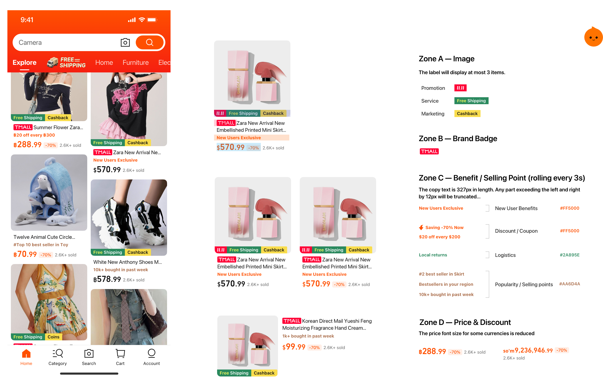

### Topic Feed: Three Formats, One Coherent System

When the business requested AIB topic placement, the design constraint was strict: visually differentiate from existing "Good Goods," free-shipping, and category channels — without disrupting existing recommendation click efficiency. I designed three formats:

<Grid cols={5}>

<Cell>

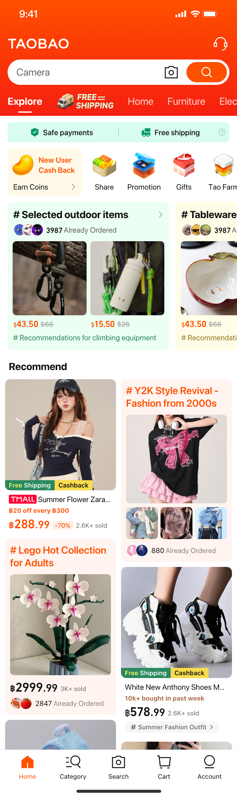

</Cell>

<Cell bg="rgba(255, 255, 255, 0.1)">

#### 1. Carousel Card

Shown on the home page, take the topmost exposure position. Guide users to enter the channel and have a look through interactive means.

</Cell>

<Cell>

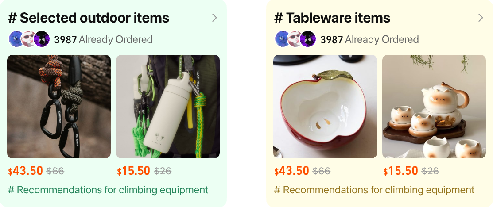

</Cell>

<Cell bg="rgba(255, 255, 255, 0.1)">

#### 2. In-Feed

Inserted at fixed positions in the product feed. Visual distinction from product cards is critical — tested via A/B to monitor return rate and topic page dwell time.

</Cell>

<Cell>

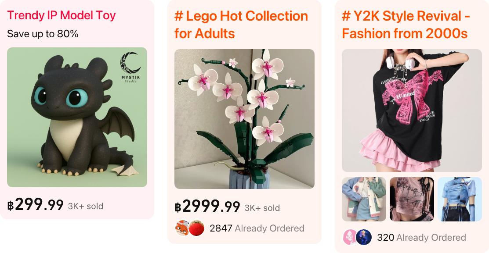

</Cell>

<Cell bg="rgba(255, 255, 255, 0.1)">

#### 3. Store / Campaign Sub-Card

Used beneath store storefronts and campaign landing pages. Compact format for more spaces showing product image, price, and sales volume.

</Cell>

<Cell>

</Cell>

</Grid>

### Mini Detail: Reimagining the Topic Channel Page

Standard product cards on a topic channel page surface four to five rows before users hit the bottom — not enough depth to create a "browsing" feeling. I reframed the channel page's core purpose:

<Quote>

Users come to a topic page not to find a specific product, but to be moved by the experience of discovery. The card format needed to serve that intent.

</Quote>

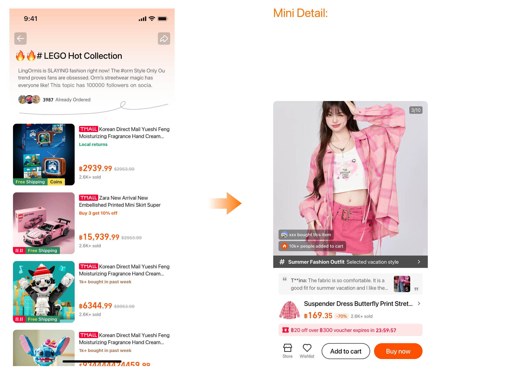

#### Card Design differ by industry category

The Mini Detail card — approximately half a screen tall — borrows from TikTok's infinite scroll immersion. It's industry-customized: fashion cards carousel through images, size guides, reviews, and styling suggestions; electronics cards carousel through images, specifications, user reviews, and similar product recommendations.

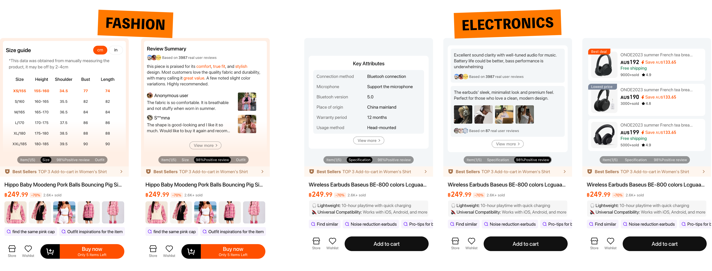

<Row>

<Col span={5}>

#### Contextual AI

To make AI assistance feel like a natural extension of the shopping experience rather than a separate tool users have to deliberately seek out, I embedded pre-surfaced questions directly into the relevant card layer.

Fashion cards surface *"what does this pair with?"*, electronics cards surface *"how does this compare to alternatives at the same price?"* The AI finds the right moment to show up. The user never has to go looking for it.

</Col>

<Col span={7}>

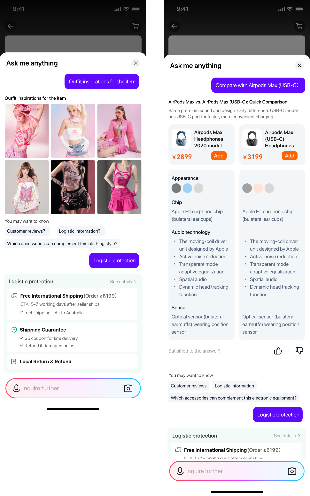

</Col>

</Row>

### Detail Page: The Size Experience Redesign

<Grid cols={3}>

<Cell>

#### Multiple entry for size reference

Size info is accessible via one-click entry points across key areas, while structured insights from purchase history and reviews (e.g., “too large,” “true to size”,"roo small") support recommendations.

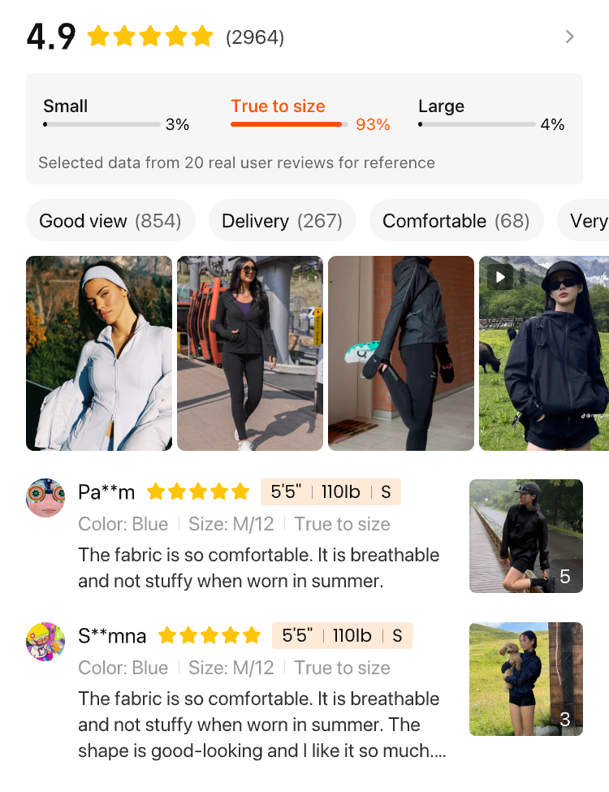

</Cell>

<Cell>

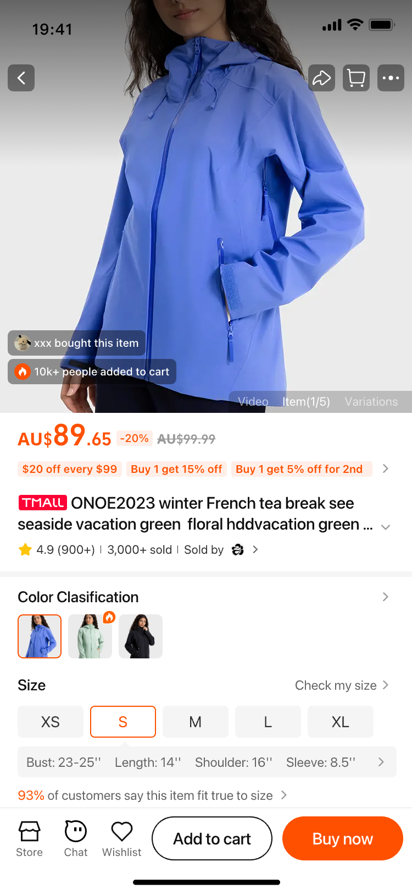

</Cell>

<Cell>

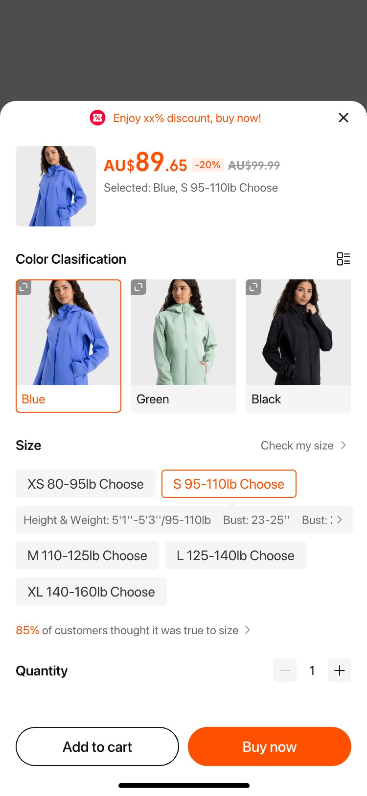

</Cell>

</Grid>

#### Reverse Design Strategy: Personalized Recommendations Based on Frequently Worn Brands

Use progressive guidance by first onboarding new users through a lightweight brand-matching flow, then prompting for additional body data later to avoid information overload. Present recommendations with both “smart suggestions” and supporting rationale to build trust.

<Grid cols={3}>

<Cell>

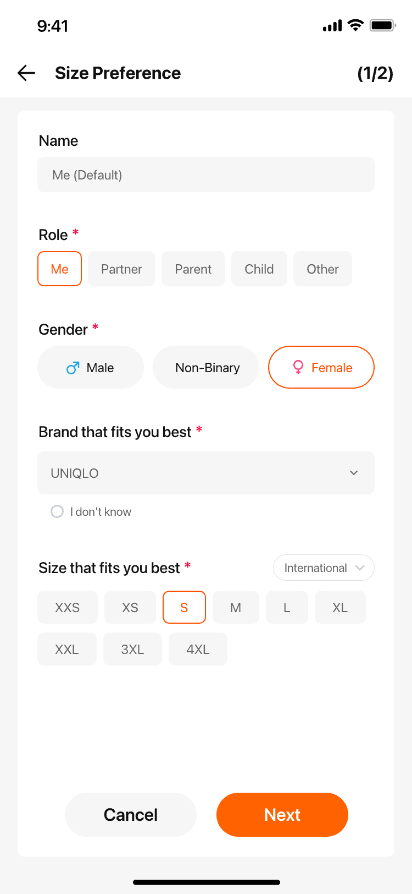

</Cell>

<Cell>

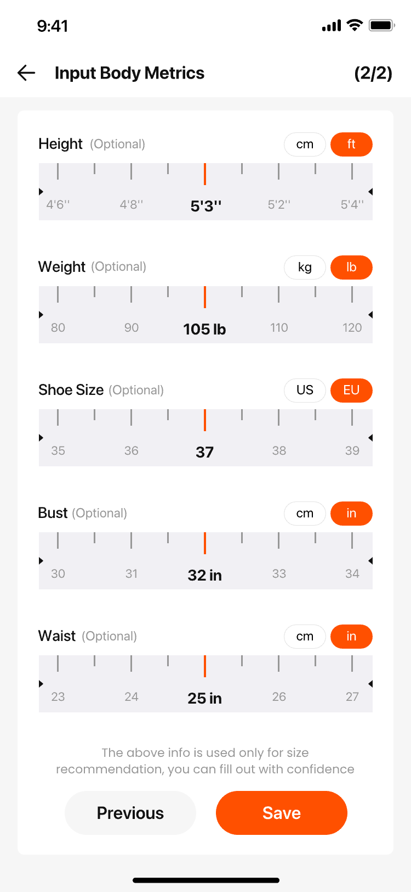

</Cell>

<Cell>

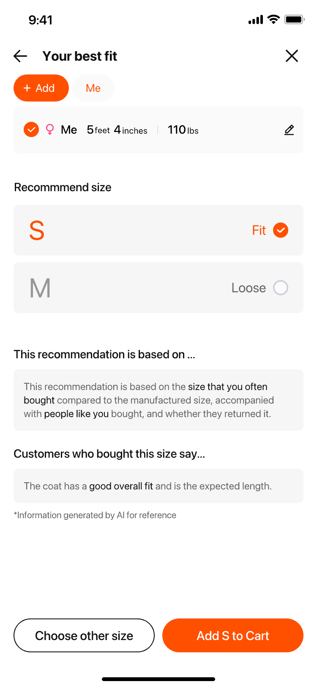

</Cell>

</Grid>

<Grid cols={3}>

<Cell>

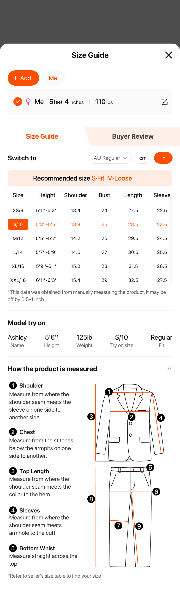

</Cell>

<Cell>

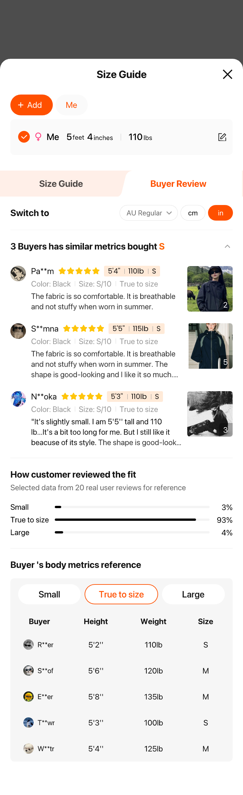

</Cell>

<Cell>

#### Multidimensional size information reference: Integrating model fittings, measurement standards and real user feedback

Standardize merchant sizing info into a unified format with model try-ons and measurement guides, while leveraging similar body-type data and fit feedback—enabling on-demand exploration without overwhelming users.

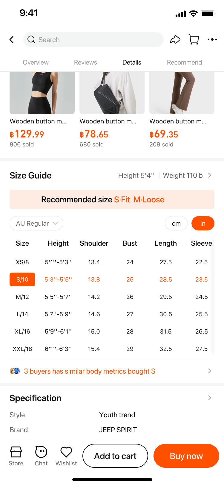

</Cell>

</Grid>

<Divider id="background">👋 Reflection</Divider>

<Grid cols={2}>

<Cell bg="rgba(255, 255, 255, 0.1)">

#### On global design

The most transferable insight from this project: when you're designing for 20 markets, invest heavily in structural containers and information hierarchies — because those are the things that travel. Visual aesthetics, copy tone, and cultural references all need localization; but a well-designed grid works everywhere.

</Cell>

<Cell bg="rgba(255, 255, 255, 0.1)">

#### On AI in commerce

The most important AI design decision in this project was about placement, not capability. Embedding size-related AI prompts inside the size zone — and styling prompts inside the outfit carousel — meant users got AI value without needing to formulate queries. The best AI intervention feels like an extension of the content, not a separate mode to enter.

</Cell>

</Grid>
