<Block pb={20}>

<Block mt={40} mb={20}>

<Lead>Aroute is a travel plan and route generator platform in web and app versions that acts as a guidance and community to support multi-destinaion trip for all level travelers.</Lead>

</Block>

<MetaGrid>

<Meta label="Timeline" color="#7462e5">

1 month

</Meta>

<Meta label="Role" color="#7462e5">

App Product Design UX Research Visual & Branding System Development

</Meta>

<Meta label="For" color="#7462e5">

Individual Final Project of "Web and app prototype" Course

</Meta>

<Meta label="Tools" color="#7462e5">

<Fit w={162}></Fit>

</Meta>

</MetaGrid>

### Overview

<Row>

<Col span={7}>

The integrated platform makes it more convenient for people to travel. But the planning behavior of independent travelers is therefore ignored by the market. They are forced to use office tools for planning, such as excel, word, memos, etc., to assemble bits and pieces of information. The monopolistic behavior of multiple platforms and their respective advantages force users to use them at the same time to obtain the most cost-effective travel experience, but they do not use all the functions of the app, resulting in a large number of users' mobile phones are occupied by redundant and invalid content.

The purpose of design is to allow different users from individuals to companies, to create their own journey with the tools built in. Ensure the responsible use of data and drive better outcomes with map management, intelligent route generation, visual analytics, and collaboration in a highly customizable way.

</Col>

<Col span={5}>

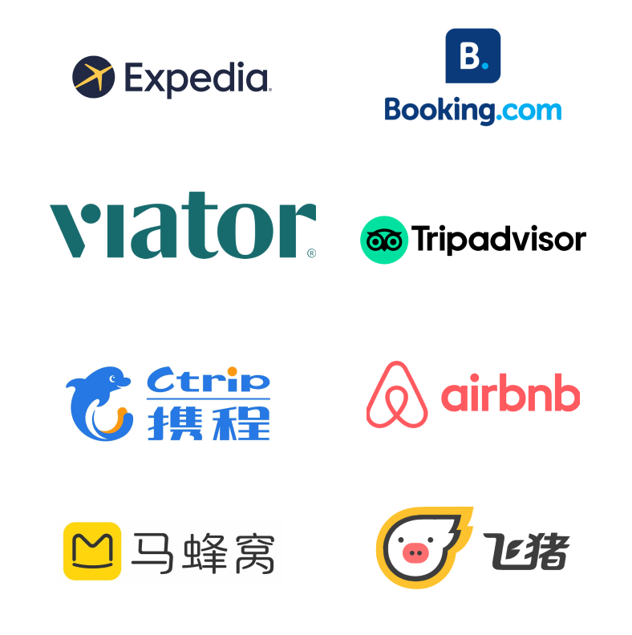

</Col>

</Row>

</Block>

<Block pt={20} pb={20}>

<Block pt={60} pb={60}>

<Row align="center">

<Col span={6}>

<Block pt={20} pb={20}>

<Divider id="main-features" color="#ffffff" wide>📱Main Features</Divider>

</Block>

</Col>

<Col span={6}>

<LinkButton href="https://www.figma.com/proto/NIfM4WX7ydJD9F90JWQEL3/Aroute-Desktop?page-id=0%3A1&node-id=1-337&viewport=191%2C265%2C0.02&scaling=scale-down&starting-point-node-id=1%3A337" offset={350}>View Prototype</LinkButton>

</Col>

</Row>

<Row mt={20} mb={40}>

<Col span={4} pad="60px 10px 0 10px">

### 01. Dashboard

#### Make Important Things Fast

The main screen has been designed to allow users quick access to primary functions of the application. The size of the icons make tapping easier, the order of the icons are based on ease of reach and the layout was chosen to provide a way for the design to scale for future releases.

</Col>

<Col span={8} pad="0 0 0 10px">

</Col>

</Row>

<Row mt={20} mb={20}>

<Col span={4}>

### 02. Plan

#### Minimise Learning

Primarily designed to support people on-the-go, users can depend on their prior experience with Google Maps and existing iOS design conventions to help them learn to use the app.

</Col>

<Col span={8}>

</Col>

</Row>

<Row mb={20}>

<Col span={6}>

</Col>

<Col span={6}>

#### Search, Add, Generate

A journey started by simply entering a location. Aroute empowers smart, intuitive big data to understand every single keyword. The user can leave the location as a specific spot or a general category to edit later on.

The app delivers key information you need to access, visualize, and design your plan. That information are only from other users' posts and is updated daily. With an intuitive drag, drop, click, and enter interface, people can uncover hidden insights and make smarter decisions faster.

</Col>

</Row>

<Row>

<Col span={6}>

#### Drag to Change Route

After adding a location to the list, no matter how specific it is, it forms a module, and users are allowed to drag to change the sequence. The route will also change automatically with visible animations.

#### Click to Add Note

Each location provides serviceable information from the system and remains a memo module for people to add their own notes from all sources, such as tickets, links, and copies of announcements and suggestions from others’ posts.

</Col>

<Col span={6}>

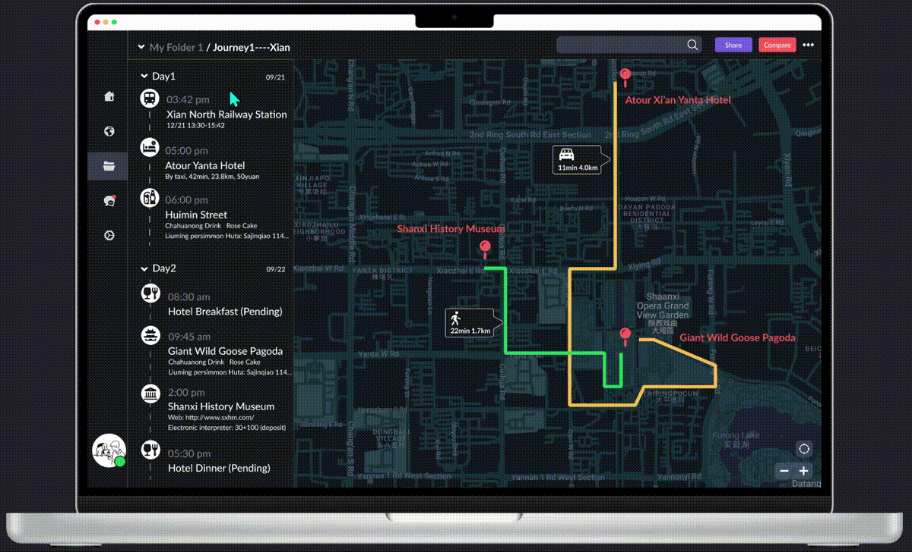

</Col>

</Row>

<Row pt={60} pb={20}>

<Col span={8}>

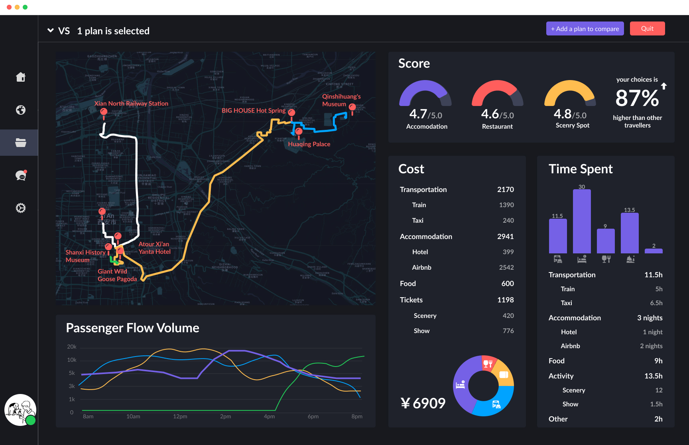

</Col>

<Col span={4}>

### 03. Comparison

The app empowers smarter, insight-driven decisions with fast, flexible, graphical analytics. Providing customer statistics and comparisons about Passenger Flow Volume, Cost, Time Spent, Score, and a lot more that can be added.

With Aroute's route optimization technology and data only from users, you will clearly and visually understand your plan and compare with other popular posts or your other designs under one click.

</Col>

</Row>

<Row pt={40} pb={40}>

<Col span={4} pad="60px 10px 0 10px">

### 04. Community

#### Looking for Friends

Aroute is a young and creative app which have a large community for your to explore. Easy access by starting to look at other travel enthusiasts' posts and copy and follow their journey. It is also available for solo adventures to find appropriate companions. A built-in chat environment is provided to talk to your follows, followers, and travel groups.

</Col>

<Col span={8} pad="0 0 0 10px">

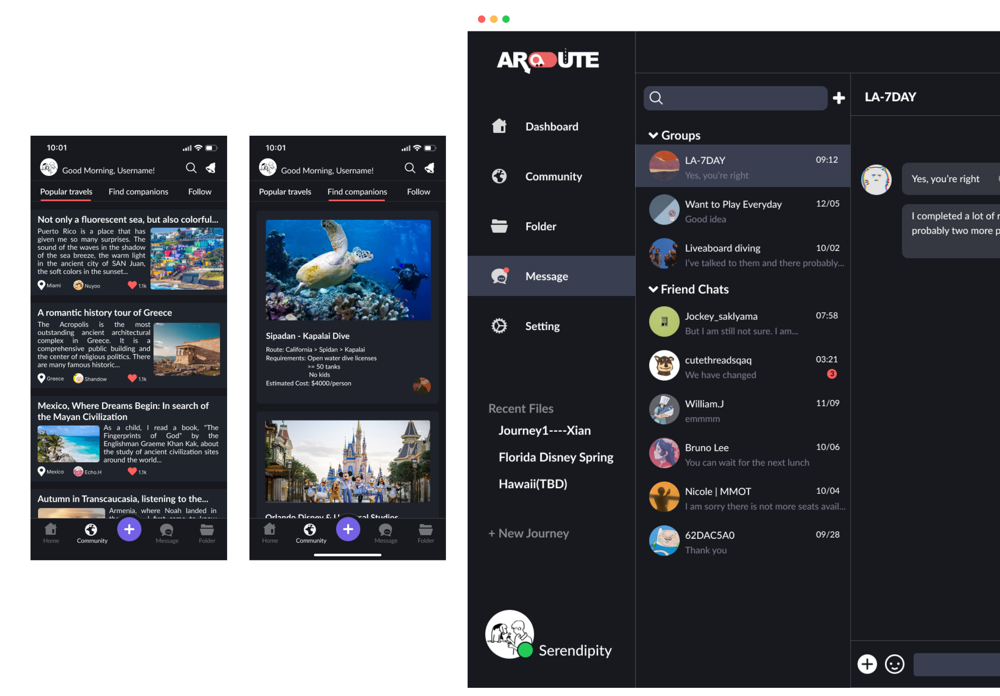

</Col>

</Row>

<Block mt={20}>

### 05. The Mobile Version

</Block>

<Row mb={20}>

<Col span={4}>

<Fit w={225} center>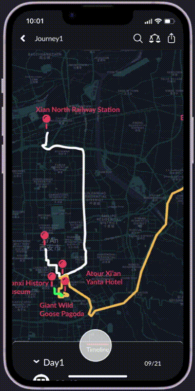</Fit>

<Text as="h4" lh={1.27} weight={400} align="center">To Track</Text>

<Text as="p" size={18} align="center" mb={0}>Real-time and location tracking helps you know what's happening throughout your whole journey. Build your travel map without recording yourself.</Text>

</Col>

<Col span={4}>

<Text as="h4" lh={1.27} weight={400} align="center">To Explore</Text>

<Text as="p" size={18} align="center" mb={0}>As phones are gradually developed into social devices, every app needs a community. Aroute has a unique channel for users with all kinds of travel experiences to find their potential companions to explore the world together!</Text>

<Fit w={223} center>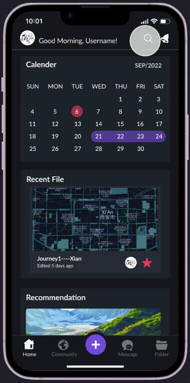</Fit>

</Col>

<Col span={4}>

<Fit w={229} center>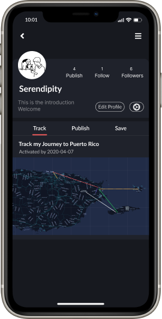</Fit>

<Text as="h4" lh={1.27} weight={400} align="center">To Share</Text>

<Text as="p" size={18} align="center" mb={0}>Cultivate an internal travel community and engage with the global Aroute Community to share your experiences.</Text>

</Col>

</Row>

<Block pt={60} pb={20}>

### 06. Reusable UI Components

<Fit w={1008} center>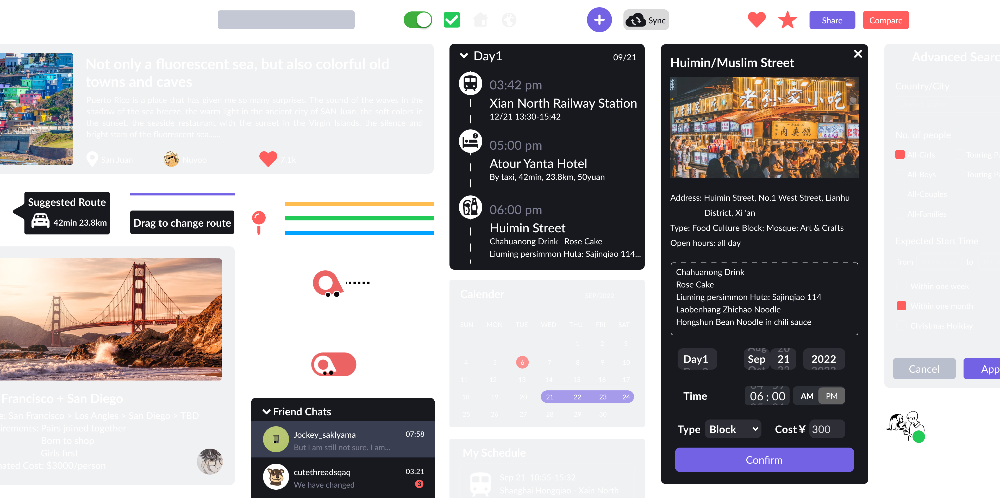</Fit>

</Block>

</Block>

</Block>

<Section bg="#ffffff" text="#333333" accent="#7462e5" pad="0px 0px 0px 0px" radius="0px">

<Block pt={60} pb={60}>

<Divider id="research">🔎Research</Divider>

<Text as="h3" lh={1.17} pad="0 5px 0 5px">Problems</Text>

<Row>

<Col span={8}>

<Row mb={20}>

<Col span={6} pad="0 0 0 0">

<Fit w={70}>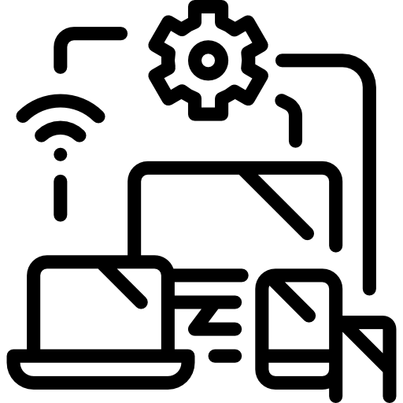</Fit>

<Text as="h4" mt={5} mb={5} pad="0 0 0 5px">Too Many Platforms</Text>

<Text as="p" size={18} mt={0} mb={0} pad="5px 30px 5px 5px">People use different platforms to book their transportation, stays, tickets, which took up space in their phone. And the only thing they need is a “order confirmation”.</Text>

</Col>

<Col span={6} pad="0 0 0 0">

<Fit w={70}></Fit>

<Text as="h4" mt={5} mb={5} pad="0 0 0 5px">Information</Text>

<Text as="p" size={18} mt={0} mb={0} pad="5px 30px 5px 5px">For informations collected from social medias, there are both useful and useless tips in one post. In order to eaiser find when we need, people screenshot instead of saving to folders inside apps</Text>

</Col>

</Row>

<Row mb={20}>

<Col span={6} pad="0 0 0 0">

<Fit w={70}></Fit>

<Text as="h4" mt={5} mb={5} pad="0 0 0 5px">Ambiguous</Text>

<Text as="p" size={18} mt={0} mb={0} pad="5px 30px 5px 5px">For locations, we are not familiar with, it is ambiguous about the real-time weather, condition, passenger volume even though we have some source to check.</Text>

</Col>

<Col span={6} pad="0 0 0 0">

<Fit w={70}></Fit>

<Text as="h4" mt={5} mb={5} pad="0 0 0 5px">Maps</Text>

<Text as="p" size={18} mt={0} mb={0} pad="5px 30px 5px 5px">Maps are only available to claculate one distance and cannot customize if we have certain road to travel.</Text>

</Col>

</Row>

</Col>

<Col span={4}>

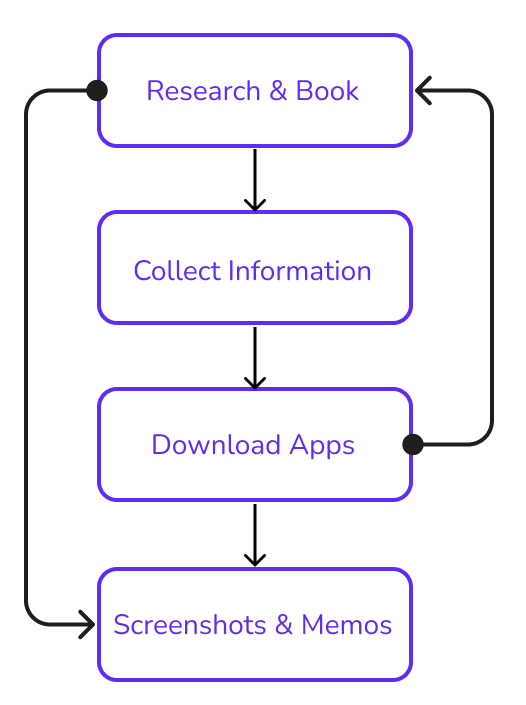

</Col>

</Row>

</Block>

<Box bg="#7462e5" accent="#ffffff" pad="0px 0px 0px 0px" radius="0px">

<Block pt={20} pb={20} padx="6.9%">

<Text as="h3" lh={1.17}>Prompt</Text>

<Text as="p" size={22} lh={1.27} weight={400} color="#ffffff" mt={0} mb={0}>Focusing on featuresGoals</Text>

<Quote size={48} color="#ffffff" mt={10} mb={20} padx={40}>

“HMW enable people with varied travel preferences to plan efficiently and collaboratively on a single platform?”

</Quote>

</Block>

</Box>

<Block pt={60} pb={60}>

<Text as="h3" lh={1.17} pad="0 5px 0 5px">User Persona</Text>

<Text as="p" size={18} mt={0} mb={0} pad="5px 30px 5px 5px">Our persona hypothesis consisted of three different archetypes which we used to facilitate discussions about our users needs, desires and varying contexts of use. We found our personas have overlapping journeys and the primaray users require more repetition.</Text>

<Row mt={10} mb={100}>

<Col span={4}>

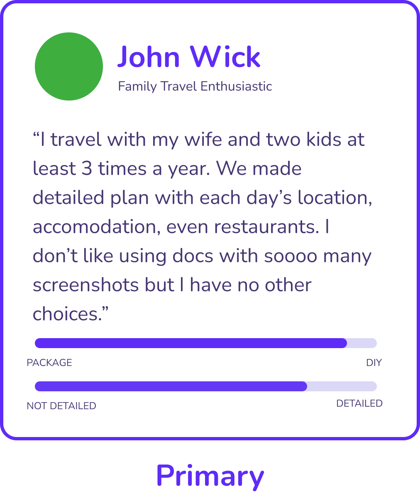

</Col>

<Col span={4}>

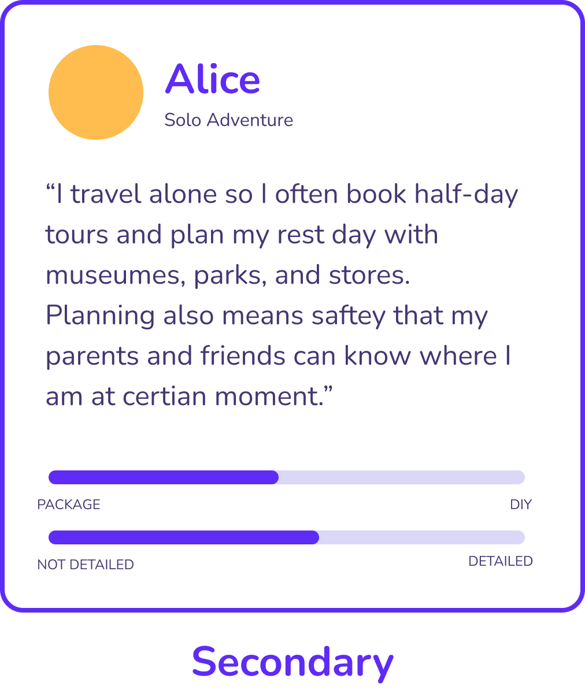

</Col>

<Col span={4}>

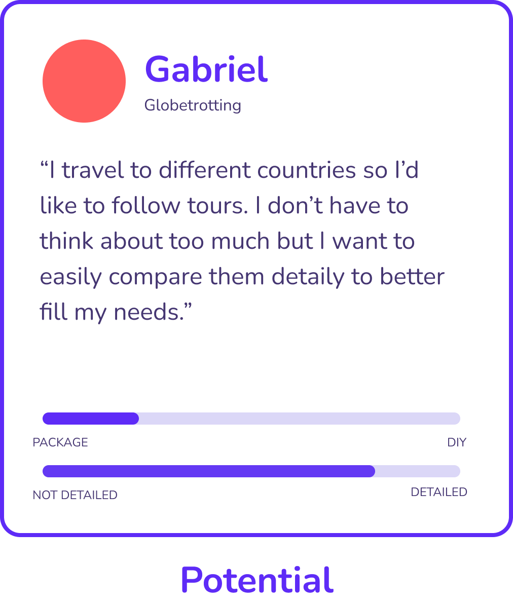

</Col>

</Row>

<Text as="h3" lh={1.17} pad="0 5px 0 5px">Questionnaire & Interview</Text>

<Row mb={60}>

<Col span={8}>

<Text as="h4" mt={5} mb={5} pad="0 0 0 5px">Sample Size: 157</Text>

<Text as="p" size={18} mt={0} mb={0} pad="5px 30px 5px 5px">1. Evaluate how detail you are going to plan a travel from 1 to 5? 2. Have you ever struggle with which app to use for travel planning? 3. Have you ever cannot find proper confirmation code/foget where your save them? 4. What is the most important element to consider when plan your travel? a. overall budget with score b. transportation (time, location, sequence, price, etc.) c. passenger volumesomething else 5. What are some of the challenges you face when planning group trips with friends or family members? 6. Have you ever used a travel planning app or website? If so, which ones have you found most helpful and why? 7. What kind of travel planning features do you find most useful, such as itinerary planning, destination research, or budget tracking? 8. How do you typically share your travel plans with others, such as friends or family members, and what are the biggest challenges you encounter in doing so?</Text>

</Col>

<Col span={4}>

<Block mb={40}>

<Stat>86%</Stat>

<Text as="p" size={18} mt={0} mb={0} pad="5px 30px 5px 5px">have struggled with using multiple apps and websites when planning their travel</Text>

</Block>

<Block mb={40}>

<Stat>72%</Stat>

<Text as="p" size={18} mt={0} mb={0} pad="5px 30px 5px 5px">of self-plan travellers will compare budgets between different plans</Text>

</Block>

<Block mb={40}>

<Stat>51%</Stat>

<Text as="p" size={18} mt={0} mb={0} pad="5px 30px 5px 5px">find difficult sharing plan before and after the trip becuase it is hard to read ( in word doc. or excel)</Text>

</Block>

</Col>

</Row>

<Text as="h3" lh={1.17} pad="0 5px 0 5px">User Journey</Text>

<Row mb={60}>

<Col span={8}>

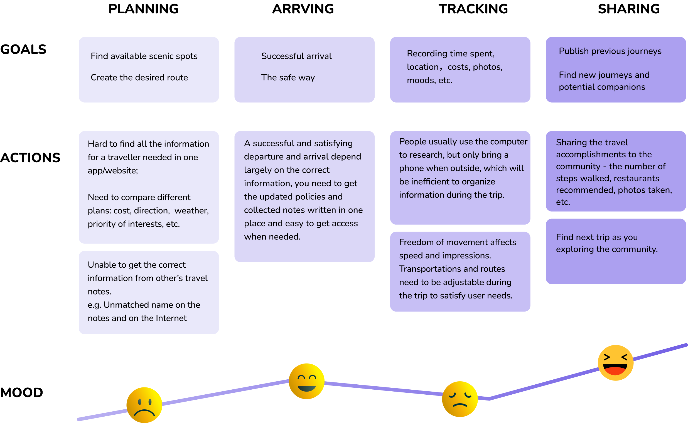

</Col>

<Col span={4}>

<Text as="p" size={18} mt={0} mb={0} pad="5px 30px 5px 5px">I created the user journey map to identify the detailed pain points and feelings the customer might go throught while planning and travelling in the contemporary way.</Text>

<Text as="p" size={18} mt={0} mb={0} pad="5px 30px 5px 5px">I imagined ideal experiences and focused on how our personas think and behave rather than getting into specifics about interfaces, technologies or business goals.</Text>

</Col>

</Row>

<Row mb={100}>

<Col span={5}>

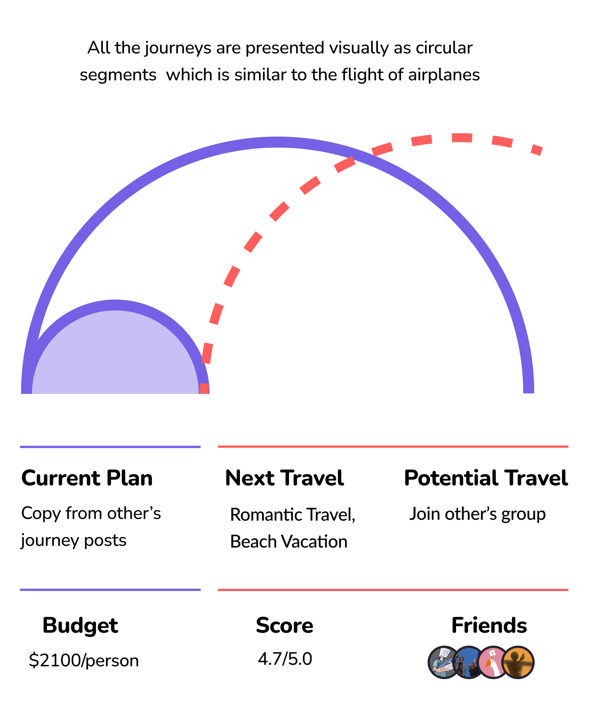

</Col>

<Col span={7}>

<Text as="h3" lh={1.17} pad="0 5px 0 5px">"Before Travelling"</Text>

<Text as="p" size={18} mt={0} mb={0} pad="5px 30px 5px 5px">We used experience mapping techniques to visualize the user experience throughout the whole shopping process across various touchpoints with the scheme. This allowed us to represent user pain points and it shows us we have to focus on the "Before Travelling.“</Text>

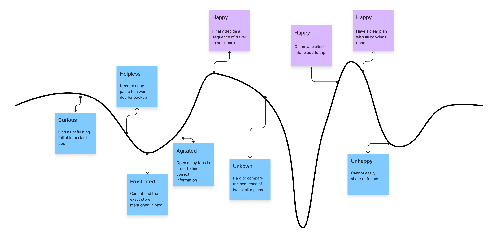

</Col>

</Row>

<Text as="h3" lh={1.17} pad="0 5px 0 5px">What does "travel plan" mean?</Text>

<Text as="p" size={18} mt={0} mb={0} pad="5px 30px 5px 5px">Our research revealed that the concept of 'travel plan' represented something different to users of the scheme. Users' motivations for starting a trip and generating information in the scheme differed, hinting at different requirements.</Text>

<Fit w={1008} center>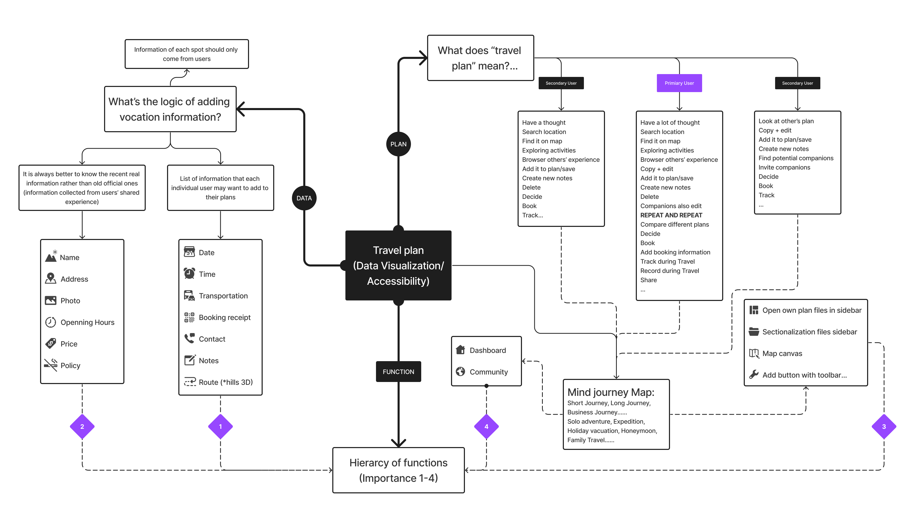</Fit>

<Text as="p" size={18} mt={0} mb={0} pad="5px 30px 5px 5px">The discovery phase was a quick, high‐intensity effort that allowed us to define project milestones, audit the existing work, review the competitor landscape, understand our client's vision, and begin research into user needs, behaviours and pain‐points. We also kicked off a technical discovery phase to understand feasibility and constraints.</Text>

</Block>

<Block pt={60} pb={60}>

<Divider id="definition">📌 Definition</Divider>

<Block pb={80}>

<Text as="h3" lh={1.17} pad="0 5px 0 5px">Hierarchy of Pain Points</Text>

<Block pt={20} pb={20} padx="13.9%">

<Row align="center">

<Col span={2}>

<Text as="p" size={100} lh={1.1} weight={900} font="roboto" color="rgba(116, 98, 229, 0.3)" mt={0} mb={0}>01</Text>

</Col>

<Col span={2}>

<Fit w={100}>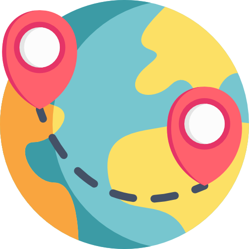</Fit>

</Col>

<Col span={8}>

<Text as="h4" mt={5} mb={5} pad="0 0 0 5px">Cumbersome to search each leg of the journey since every map and app did it separately.</Text>

</Col>

</Row>

<Row align="center">

<Col span={2}>

<Text as="p" size={100} lh={1.1} weight={900} font="roboto" color="rgba(116, 98, 229, 0.3)" mt={0} mb={0}>02</Text>

</Col>

<Col span={2}>

<Fit w={100}>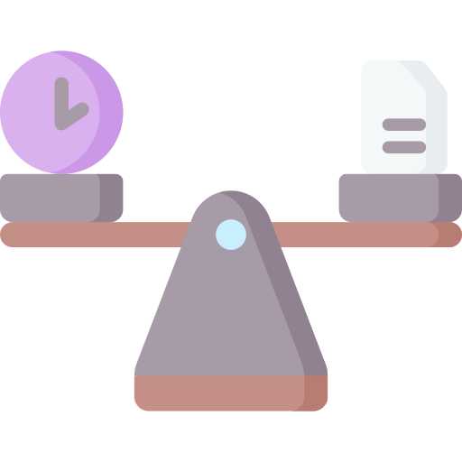</Fit>

</Col>

<Col span={8}>

<Text as="h4" mt={5} mb={5} pad="0 0 0 5px">Difficult to compare price, time, distance side-by-side with companions.</Text>

</Col>

</Row>

<Row align="center">

<Col span={2}>

<Text as="p" size={100} lh={1.1} weight={900} font="roboto" color="rgba(116, 98, 229, 0.3)" mt={0} mb={0}>03</Text>

</Col>

<Col span={2}>

<Fit w={100}>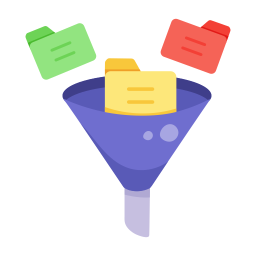</Fit>

</Col>

<Col span={8}>

<Text as="h4" mt={5} mb={5} pad="0 0 0 5px">Cannot copy valid information directly from other people's travelogues or articles posted on other social media platforms with one click.</Text>

</Col>

</Row>

<Row align="center">

<Col span={2}>

<Text as="p" size={100} lh={1.1} weight={900} font="roboto" color="rgba(116, 98, 229, 0.3)" mt={0} mb={0}>04</Text>

</Col>

<Col span={2}>

<Fit w={100}></Fit>

</Col>

<Col span={8}>

<Text as="h4" mt={5} mb={5} pad="0 0 0 5px">Unable to search precisely and share/record in real time without affecting the tour.</Text>

</Col>

</Row>

</Block>

</Block>

<Block pb={80}>

<Text as="h3" lh={1.17} pad="0 5px 0 5px">Competitive Analysis</Text>

<Row align="center" pt={20} pb={20}>

<Col span={6}>

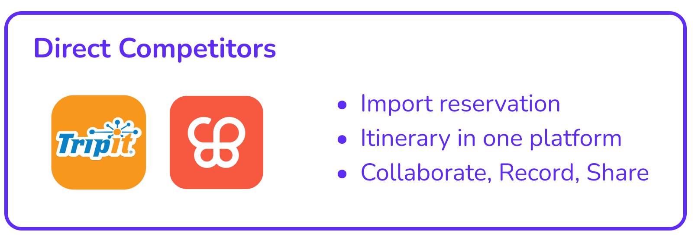

</Col>

<Col span={6}>

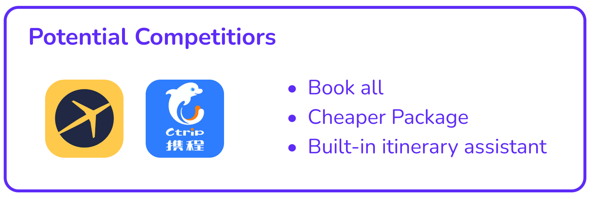

</Col>

</Row>

<Row align="center" pt={20} pb={20}>

<Col span={6}>

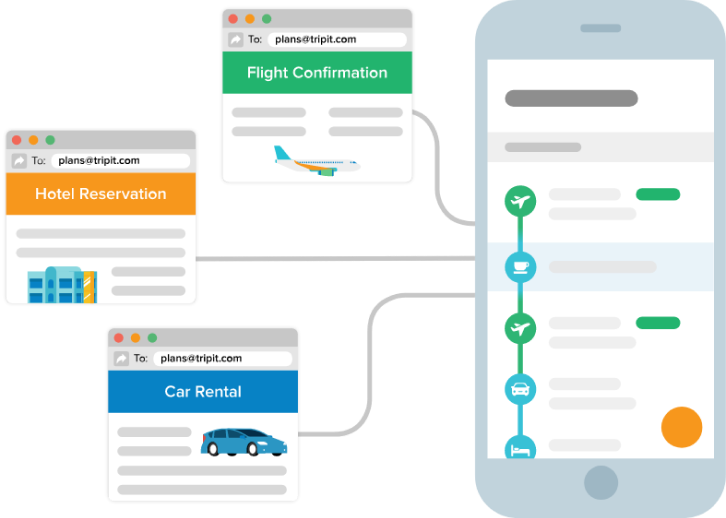

</Col>

<Col span={6}>

<Text as="h4" mt={5} mb={5} pad="0 0 0 5px">Find Travel Plans in One Place</Text>

<Text as="p" size={18} mt={0} mb={0} pad="5px 30px 5px 5px">Forward confirmation emails as soon as you book a flight, hotel, car, or other reservation, simply forward it to plans@tripit.com, and we'll automatically add it to your trip</Text>

</Col>

</Row>

<Row align="center" pt={20} pb={20}>

<Col span={6}>

<Text as="h4" mt={5} mb={5} pad="0 0 0 5px">Itinerary and Map in One View</Text>

<Text as="p" size={18} mt={0} mb={0} pad="5px 30px 5px 5px">No more switching between different apps, tabs, and tools to keep track of your travel plans. It can collaborate with friends in real time, optimze route, import flight and hotel reservations, and export to Google Maps.</Text>

</Col>

<Col span={6}>

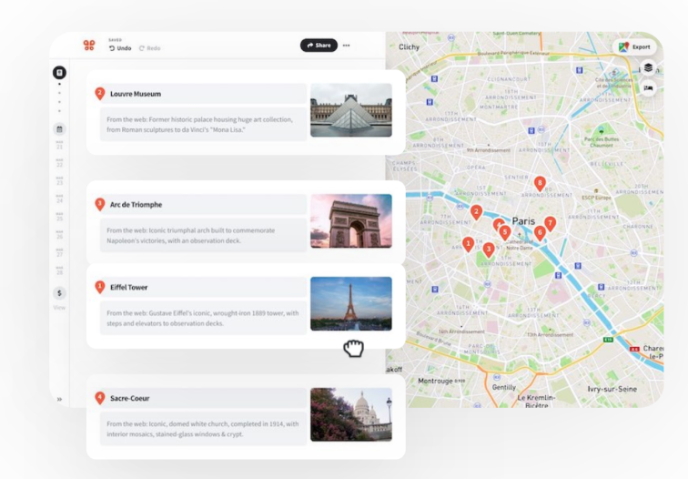

</Col>

</Row>

</Block>

<Block pb={80}>

<Text as="h3" lh={1.17} pad="0 5px 0 5px">The Vision</Text>

<Text as="p" size={18} mt={0} mb={0} pad="5px 30px 5px 5px">Understanding the usage contexts of the app helped me develop a clear vision of the tonal expectations of our users. To communicate the personality of our app to our client and team, I developed a set of experience principles. These were used to sense‐check design decisions, articulate core values and describe key attributes the app experience should uphold for both the users and the brand. The principles were used constantly to drive the aesthetic, feel and overall tonal direction of the app.</Text>

<Row align="center" mt={20}>

<Col span={4}>

<Fit w={200} center></Fit>

<Lead size={22} font="body" color="#7462e5">Minimise The Bad</Lead>

<Text as="p" size={18} align="center" mt={0} mb={0} pad="5px 10px 5px 10px">Our key priority for the early phases was to focus on primary user goals. Our first task-stripping the app to its core and focus on usability and conveniece of adding a location to your trip.</Text>

</Col>

<Col span={4}>

<Fit w={300} center></Fit>

<Lead size={22} font="body" color="#7462e5">Amplify the Good</Lead>

<Text as="p" size={18} align="center" mt={0} mb={0} pad="5px 10px 5px 10px">Beyond the obvious features, we saw opportunities to build a deep emotional connection with our users. Our vision was to create an honest, human app.</Text>

</Col>

<Col span={4}>

<Fit w={200} center>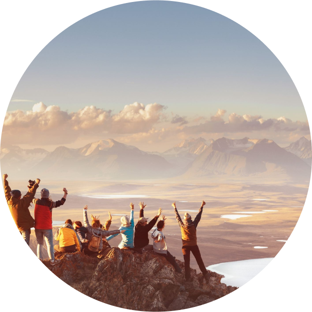</Fit>

<Lead size={22} font="body" color="#7462e5">Bring Travellers Together</Lead>

<Text as="p" size={18} align="center" mt={0} mb={0} pad="5px 10px 5px 10px">We envisioned empowering world-wide travelling culture, where travellers could co‐create safer and interesting routes and contribute to the community.</Text>

</Col>

</Row>

</Block>

</Block>

<Block pt={60} pb={60}>

<Divider id="design">🎨Design</Divider>

<Block pb={80}>

<Text as="h3" lh={1.17} pad="0 5px 0 5px">Information Architecture</Text>

<Fit w={1008} center>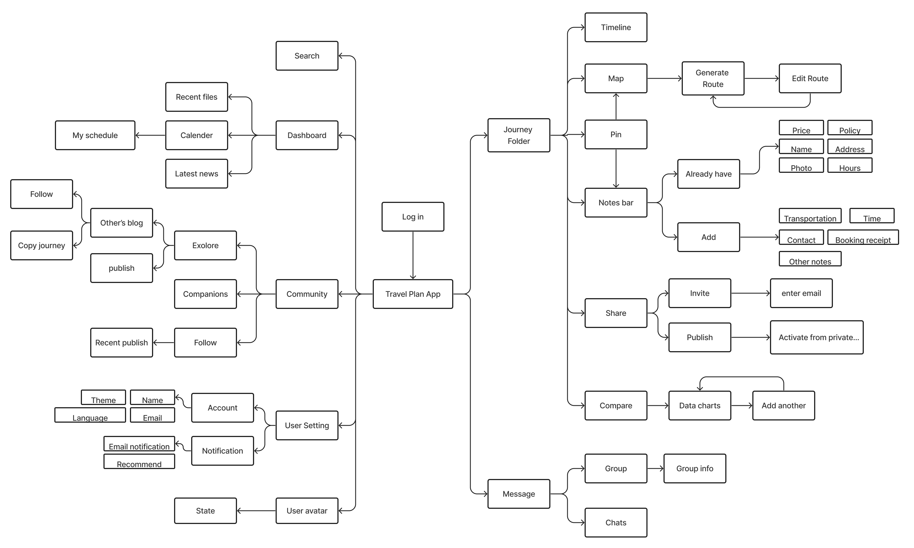</Fit>

</Block>

<Block pb={80}>

<Text as="h3" lh={1.17} pad="0 5px 0 5px">Low-Fi Wireframes</Text>

<Row>

<Col span={7}>

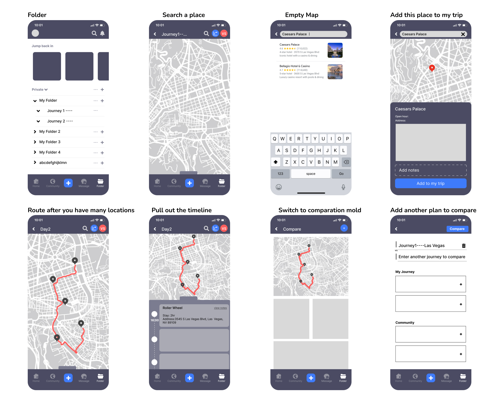

</Col>

<Col span={5}>

<Block pt={10} pb={20}>

<Text as="h4" mt={5} mb={5} pad="0 0 0 5px">Different knowledge levels</Text>

<Text as="p" size={18} mt={0} mb={0} pad="5px 30px 5px 5px">A very important aspect of this app is that we want this to be reliable for experts but also approachable for novices. Although heavily focused on in the Canvas Map, this is a design challenge that also drives much of the design decisions throughout the other app features.</Text>

</Block>

<Block pt={10} pb={20}>

<Text as="h4" mt={5} mb={5} pad="0 0 0 5px">Small Screen</Text>

<Text as="p" size={18} mt={0} mb={0} pad="5px 30px 5px 5px">Another challenge is the transition between horizontal desktop screen to limited vertical phone screen. Based on the UI principles of page overlay, I also add slide window to increase the possibility of interactivity.</Text>

</Block>

</Col>

</Row>

<Fit w={1008} center>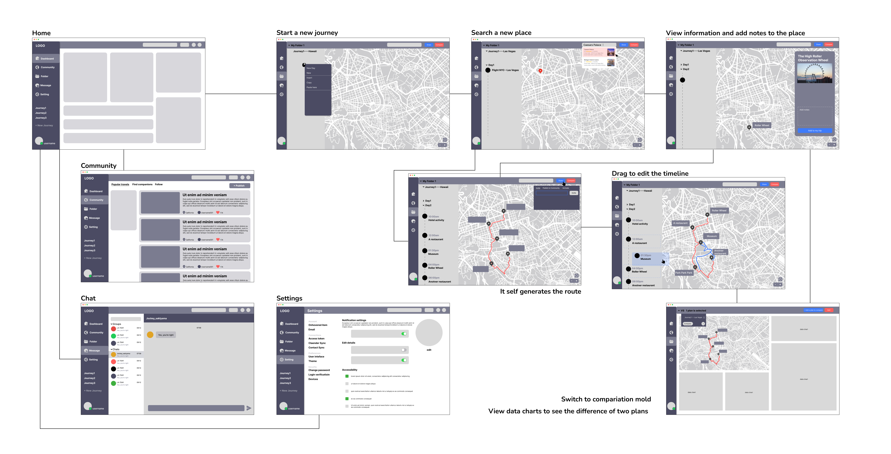</Fit>

</Block>

<Block pb={80}>

<Text as="h3" lh={1.17} pad="0 5px 0 5px">Problems & Feedbacks</Text>

<Row mt={20}>

<Col span={4}>

<Box bg="rgba(160, 144, 255, 0.4)" pad="0px 0px 0px 0px" radius="30px">

<Text as="p" size={30} lh={2} weight={700} color="#7462e5" mt={0} mb={0}>1</Text>

</Box>

<Text as="h4" mt={5} mb={5} pad="0 0 0 5px">Main Pages Only</Text>

<Text as="p" size={18} mt={0} mb={0} pad="5px 30px 5px 5px">After the low-fi frames were sketched, I made a prototype with main pages only to test a couple of users. Without telling them the functions of each icon, I asked them to self-explore my prototype and provide any suggestions they want as they go through their own journey.</Text>

</Col>

<Col span={4}>

<Box bg="rgba(160, 144, 255, 0.4)" pad="0px 0px 0px 0px" radius="30px">

<Text as="p" size={30} lh={2} weight={700} color="#7462e5" mt={0} mb={0}>2</Text>

</Box>

<Text as="h4" mt={5} mb={5} pad="0 0 0 5px">Affinity Diagram</Text>

<Text as="p" size={18} mt={0} mb={0} pad="5px 30px 5px 5px">After collecting insights from the participants, I made an affinity diagram to seek a pattern in the participants. This allows me to understand customers’ behaviors and frustrations during the “travel plan” process.</Text>

</Col>

<Col span={4}>

<Box bg="rgba(160, 144, 255, 0.4)" pad="0px 0px 0px 0px" radius="30px">

<Text as="p" size={30} lh={2} weight={700} color="#7462e5" mt={0} mb={0}>3</Text>

</Box>

<Text as="h4" mt={5} mb={5} pad="0 0 0 5px">Usability Test</Text>

<Text as="p" size={18} mt={0} mb={0} pad="5px 30px 5px 5px">Then I made a usability study presentation to showcase the study’s quick recap, critiques, and recommendations. I was able to find logic issues related to perceived affordances, layout and search.</Text>

</Col>

</Row>

<Fit w={1008} center>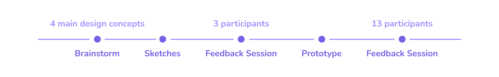</Fit>

<Fit w={1008} center>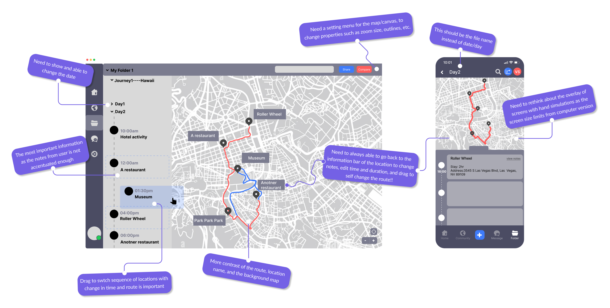</Fit>

</Block>

<Block pb={80}>

<Text as="h3" lh={1.17} pad="0 5px 0 5px">Structuring the Experience</Text>

<Text as="h4" mt={5} mb={5} pad="0 0 0 5px">Hifidelity Prototype of One User Scenario</Text>

<Text as="p" size={18} mt={0} mb={0} pad="5px 30px 5px 5px">After identifying the main 'plot‐points' in our scenarios, I defined the primary pathways our personas would explore through the app. Crafting several key user journeys was the best way to conceptualise and structure the proposed content and functionality.</Text>

<Fit w={1008} center>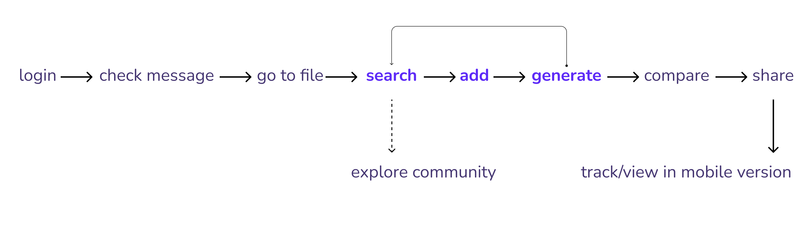</Fit>

</Block>

</Block>

<Block pt={60} pb={60}>

<Divider id="summary">💡Conclusion</Divider>

<Block pb={80}>

<Text as="h3" lh={1.17} pad="0 5px 0 5px">Usability Test</Text>

<Text as="p" size={18} mt={0} mb={0} pad="5px 30px 5px 5px">The tasks included checking chat messages, exploring communities, making a three-day travel plan, and comparing plans. throughout the tasks, I asked the users to talk through their though process and speak out when something is unclear or makes them irritated.</Text>

<Text as="p" size={18} mt={0} mb={0} pad="5px 30px 5px 5px">I invited 13 people to try out the prototype for useability test. I made a research plan where I outlined research goals, questions I wanted to know the answer from, methodology, information about the participants, and a script with tasks to complete. Mainly I wanted to be sure that the “Add, Research, Generate” process is smooth without any friction.</Text>

</Block>

<Block pb={80}>

<Text as="h3" lh={1.17} pad="0 5px 0 5px">Study Results</Text>

<Row mt={20} mb={20} pt={20} pb={20}>

<Col span={7}>

<Fit w={408} center>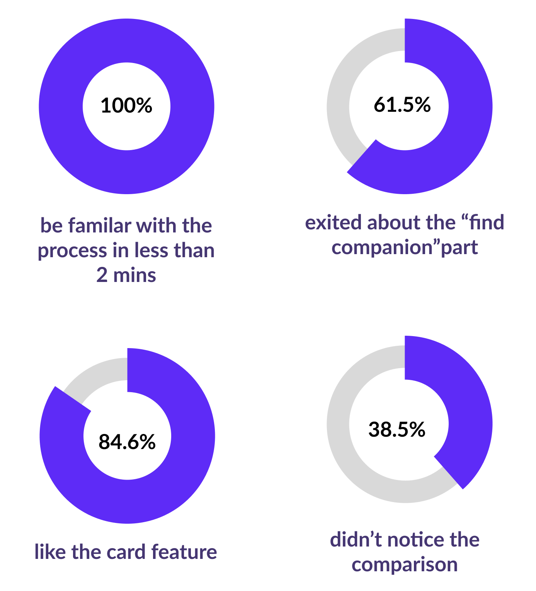</Fit>

</Col>

<Col span={5}>

<Block pt={40} pb={20}>

<Text as="h4" mt={5} mb={5} pad="0 0 0 5px">Main Route</Text>

<Text as="p" size={18} mt={0} mb={0} pad="5px 30px 5px 5px">All of the users were able to lo through the “add, search, generate” process and think it is well organized, especially love the cards.</Text>

</Block>

<Block pt={40} pb={20}>

<Text as="h4" mt={5} mb={5} pad="0 0 0 5px">Comparison Function</Text>

<Text as="p" size={18} mt={0} mb={0} pad="5px 30px 5px 5px">5 of 13 people didn’t notice the comparison function at first. They were amazed after I told them and love this function once they know how to use it.</Text>

</Block>

</Col>

</Row>

</Block>

<Block pb={80}>

<Text as="h3" lh={1.17} pad="0 5px 0 5px">Suggestions</Text>

<Block pt={10} pb={10}>

<Text as="h4" mt={5} mb={5} pad="0 0 0 5px">From Instructors</Text>

<Text as="p" size={18} mt={0} mb={0} pad="5px 30px 5px 5px">1. Very realistic prototype interactions, greate name, logo, and simulations. 2. Can explore more on the post and posted journeys since you include them as part of the design. It will show more about the accessibility and possibility of the app.</Text>

</Block>

<Block pt={10} pb={10}>

<Text as="h4" mt={5} mb={5} pad="0 0 0 5px">From Other Designers</Text>

<Text as="p" size={18} mt={0} mb={0} pad="5px 30px 5px 5px">1. Really like the “Find Companion” function. Never see it before. 2. Every design choice has a reason. It is extremely important to do UX research to define users. It is fine to keep universal now, but for upcoming developments, try to focus on specific areas(problems) to improve user experience.</Text>

</Block>

<Block pt={10} pb={10}>

<Text as="h4" mt={5} mb={5} pad="0 0 0 5px">From Potential Users</Text>

<Text as="p" size={18} mt={0} mb={0} pad="5px 30px 5px 5px">1. Want to see more of how to actually edit and track on phone during the journey. Need a transition between the technical part and the social part.</Text>

</Block>

</Block>

<Block pb={80}>

<Text as="h3" lh={1.17} pad="0 5px 0 5px">Potential Improvements</Text>

<Block pt={10} pb={10}>

<Text as="h4" mt={5} mb={5} pad="0 0 0 5px">About the Hi-Fi Prototype</Text>

<Text as="p" size={18} mt={0} mb={0} pad="5px 30px 5px 5px">1. Show the possibility to go to any universal parts when making a plan (copy community, send message, change settings... 2. Adding one last step of comparing two plans 3. Made a toB scenario showing how companies can sell their package</Text>

</Block>

</Block>

</Block>

</Section>
