<Lead>ArthoGlove is an exoskeleton-type device which designed to simulate the pain and discomfort associated with hand joint arthritis for research and education purposes.</Lead>

<MetaGrid>

<Meta label="Timeline">

05/2023 - 07/2023

</Meta>

<Meta label="Role">

Product design<br />Concept development<br />Physical prototyping<br />Coding

</Meta>

<Meta label="Team">

Professor Xinxin @ NJUST<br />Professor Bing @ NJUST<br />Engineer Kunpeng @ ZJU<br />Designer Jiangxue @ IMB iX Studio

</Meta>

<Meta label="Tools">

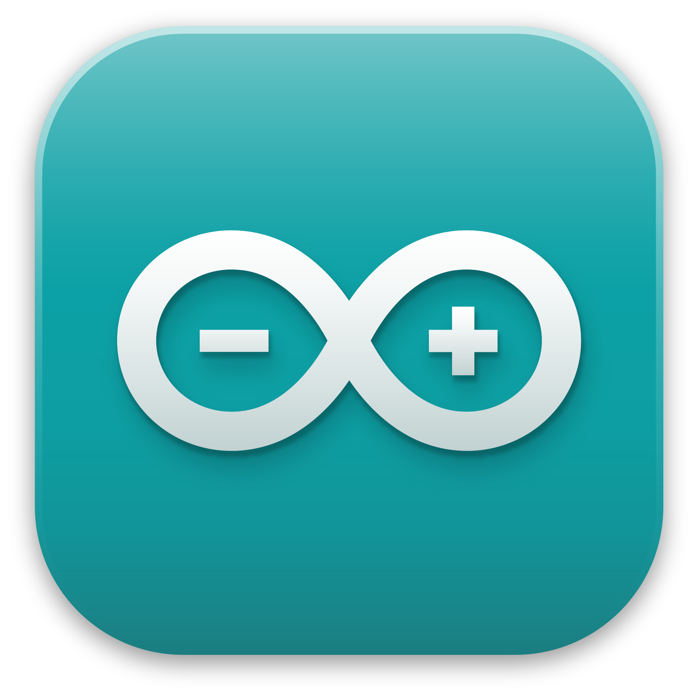

</Meta>

</MetaGrid>

### Overview

<Row>

<Col span={7}>

Tailored for professionals such as designers, doctors, and rehabilitation specialists, ArthoGlove serves as a versatile tool for research, user testing, and in-depth exploration of the impact of hand-related conditions on daily life.

ArthoGlove is an exoskeleton-type device which designed to simulate the pain and discomfort associated with hand joint arthritis, offering users a firsthand experience of the challenges faced by individuals with hand-related ailments.

</Col>

<Col span={5}>

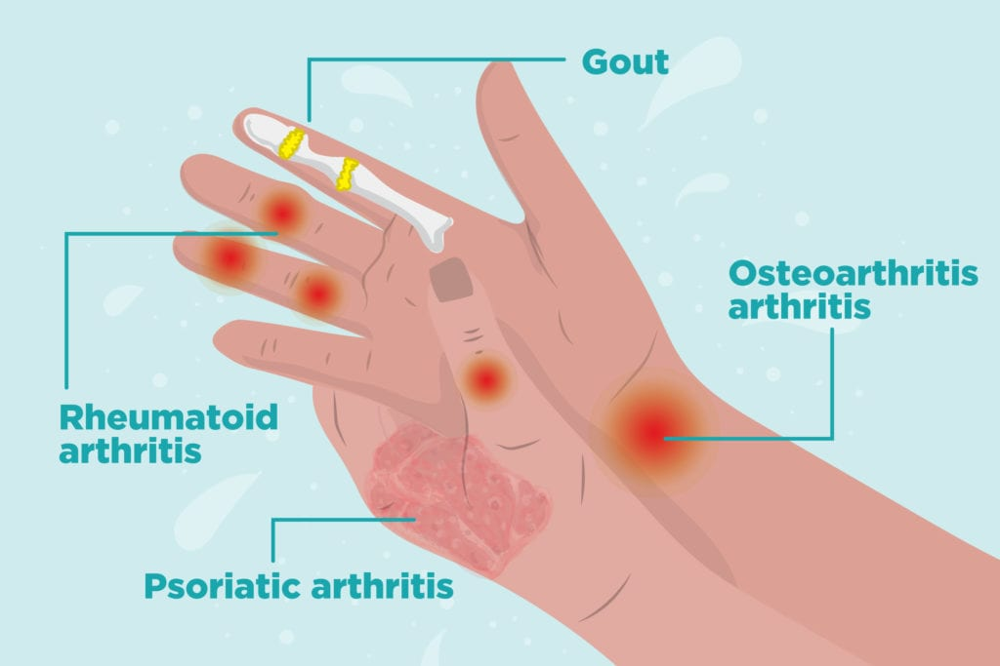

</Col>

</Row>

<Section bg="#1f272a" dark>

<Divider id="product">📱Main Features</Divider>

<Row>

<Col span={4}>

### 01. A Wearable Device

#### Easy to Wear and Fit All Hand Sizes

This glove leverages common sensors and motors to authentically mimic the pain associated with hand joint arthritis.

To make sure it fits different hand sizes, I clip a flat structure with three wrist straps to provide adjustment rather than directly applying hardwares on closed gloves.

</Col>

<Col span={8}>

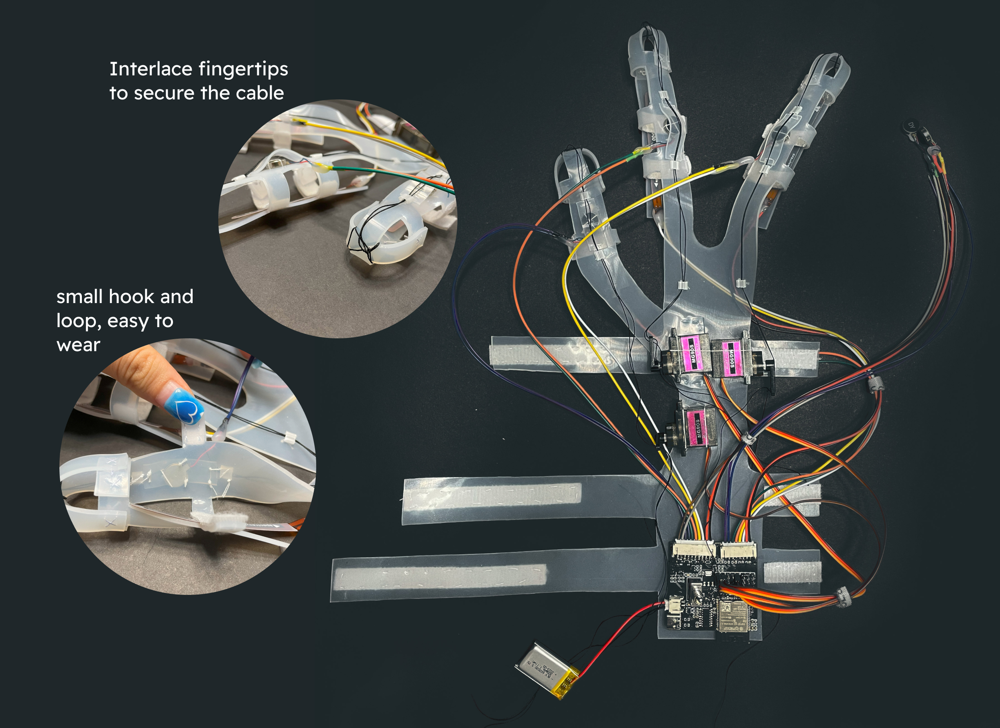

</Col>

</Row>

<Row>

<Col span={7}>

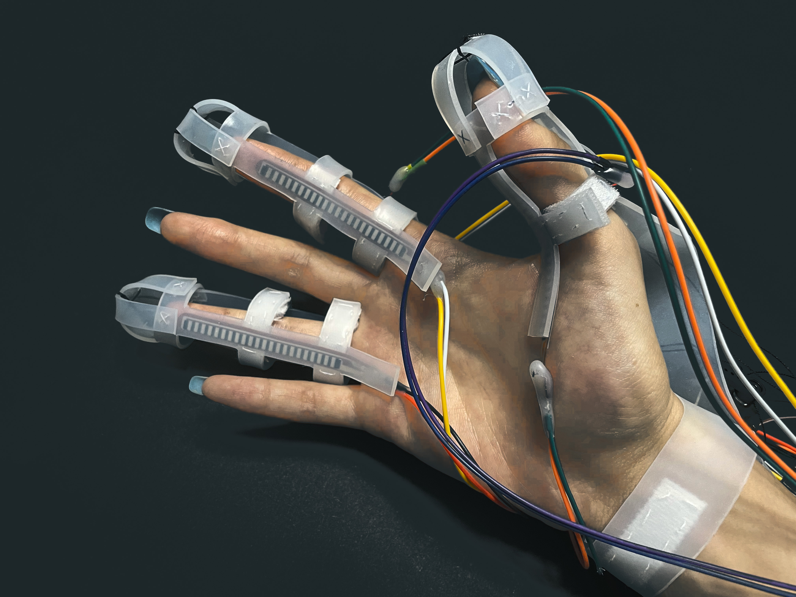

</Col>

<Col span={5}>

### 02. Bend Sensor

#### Detection of the Finger Movement

The bend sensor embedded in ArthoGlove adeptly detects and precisely records finger movements in degree, enabling an authentic simulation of joint constraints and pain associated with hand arthritis.

The loose and empty structure make sure it won’t adds additional limitation on hand mobility.

</Col>

</Row>

<Row>

<Col span={4}>

### 03. Vibration Motor

#### Haptic Precision

The discreet yet powerful vibration motor on the glove responds to specific sensor thresholds, providing haptic feedback by discreetly vibrating when joints reach predetermined values, ensuring an immersive and nuanced simulation experience while remaining inconspicuously integrated into joint areas.

</Col>

<Col span={8}>

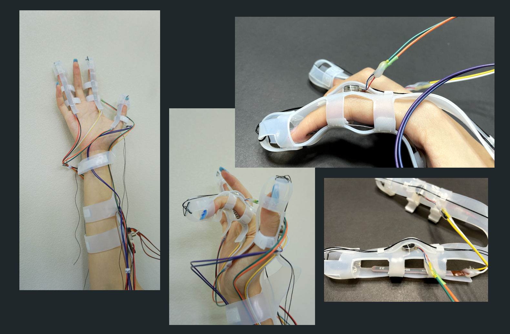

</Col>

</Row>

<Row>

<Col span={8}>

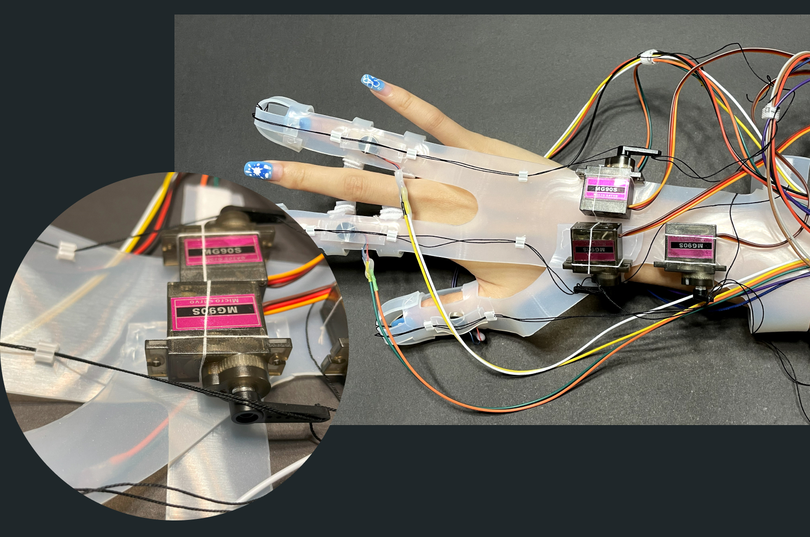

</Col>

<Col span={4}>

### 04. Restriction from Micro Servo Motors

#### Mobility Simulation

The glove employs MG90S micro servo motors to rotate 90 degrees, effectively shortening the path of strings, simulating finger stiffness and providing users with a tactile experience that authentically mimics the challenges posed by restricted hand movement in conditions like arthritis.

</Col>

</Row>

</Section>

<Divider id="background">👋Background</Divider>

### The Gap Between Customers & Designers

#### Inspiration

As an industrial designer, I considered it crutial to start by analyzing the hand motion of users. However, looking for proper persona to do interview and testing is always hard, either because of the lack of medical knowledge or pool communication skills.

In my first year study in ID department, the final project requires every student to design a tangible product for a marginalized group of people. During the user interview and usability testing processes, we found a difficulty time getting useful data.

<Row>

<Col span={6}>

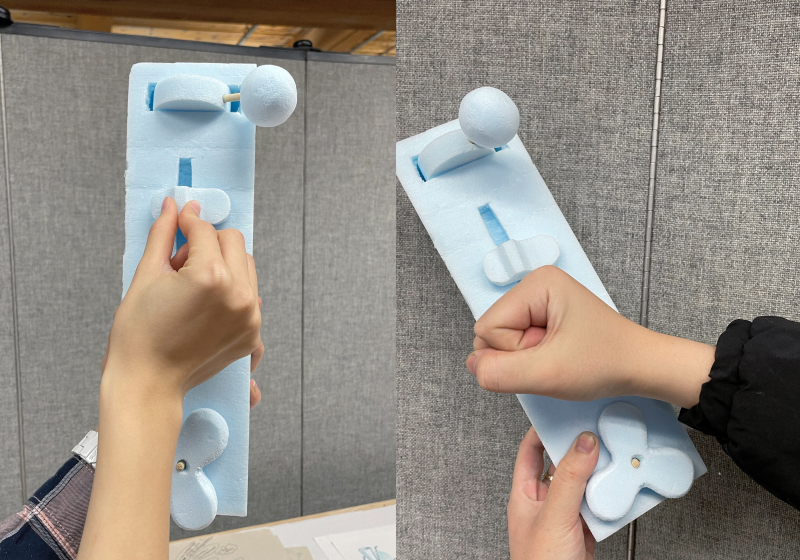

So we usually develop a “smart way” to validate our design. I invite people to cover their eyes to mimic customers who have visual impairments.

</Col>

<Col span={6}>

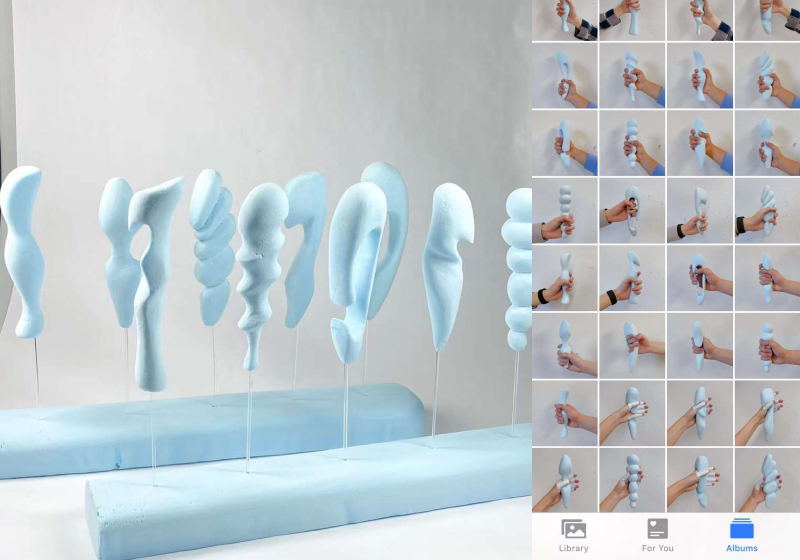

My classmates also develop various of methods, but we all feellack of integrity and the final design are ridiculously not user-centered at all.

</Col>

</Row>

#### Stereotype & Marginalization

In the field of multicultural psychology, considering the cognitive processes that shape perceived diversity, design for marginalized people is a type of prejudice to reinforce their stereotypes, especially during the user testing part.

<Grid cols={7} bg="rgba(240, 211, 194, 0.3)">

<Cell>

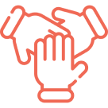

aim to design for inclusivity

</Cell>

<Cell>


</Cell>

<Cell>

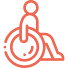

look for special groups of people

</Cell>

<Cell>


</Cell>

<Cell>


define pain points superficially

</Cell>

<Cell>


</Cell>

<Cell>

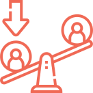

reinforce bias and discrimination

</Cell>

</Grid>

<Divider id="research">🔎Research</Divider>

### Arthritis - One of the Most Common Diseases of Hand Pain

#### Opportunity

Every product needs the use of hands and designers are highly require on the functionality of their hands. But hand pain is a common problem that lack of consideration.

#### Population & Effect

<Grid cols={3}>

<Cell>


</Cell>

<Cell>

<Lead>14.6M</Lead>

In 2014, 14.6 million adults reported severe joint pain due to arthritis (NHIS).

</Cell>

<Cell>

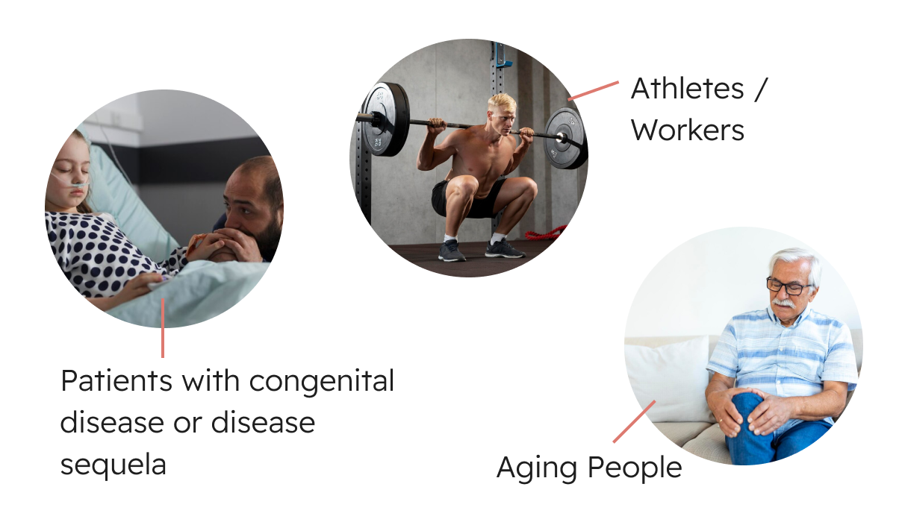

</Cell>

<Cell>

<Lead>78.4M</Lead>

By 2040, an estimated 78.4 million (25.9%) US adults aged 18 years or older are projected to have doctor-diagnosed arthritis.

</Cell>

</Grid>

### Academic Research

There are many institutions studied on exoskeletons for more advanced rehabiliation or simulation. I researched on academic papers to explore the potential deficiency.

First of all, I found that most of the studies have realized the serious side effect of arthritis on other body parts, which include:

<Row>

<Col span={8}>

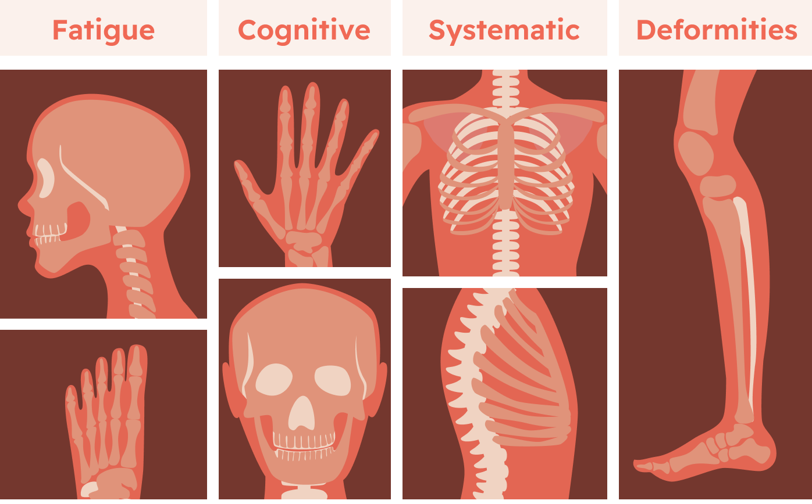

</Col>

<Col span={4}>

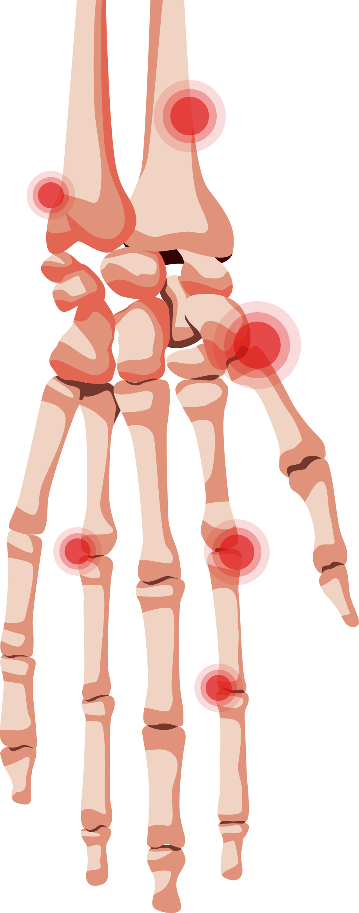

</Col>

</Row>

The main deficiencies of hand exoskeleton with five-finger extension and holding assistance in treatment, orthotics, and recovering include:

<Row>

<Col span={4}>

#### The Feasibility


(i.e. acceptability, adherence, usability, effectiveness) of integrating hand exoskeletons with five-finger extension and grip assistance into therapy programs with in-clinic and at-home components.

</Col>

<Col span={4}>

#### The OrthoticEffect


(i.e. device-assisted performance) that hand exoskeletons provide during patient-specified goals and functional tasks after continued use.

</Col>

<Col span={4}>

#### The Restorative Effect


(i.e. unassisted performance) after using hand exoskeletons during in-clinic and at-home components of rehabilitation programs that incorporate everyday objects.

</Col>

</Row>

### Related Product Analysis

Highlighting the substantial disparity between the promotional claims and actual user experience of everyday products, I focus on researching user-related issues in the ergonomic aspects of existing daily-use hand-related products.

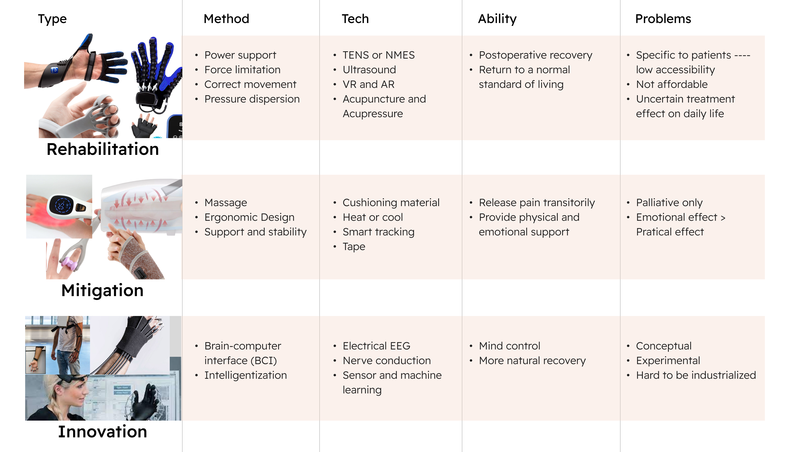

### Interviews

By interviewing with doctors who worked at orthopedics department before and now worked for Internet medical treatment to bring health care to more rare areas, I got more information about the gap between patients and therapy.

<Grid cols={3}>

<Cell bg="#f3d5c4">

01

Theory vs. Practical


The statistical assurance offered by rehabilitation devices, indicating patients are on the path to recovery, does not necessarily signify a complete return to the pre-existing norm.

</Cell>

<Cell bg="#f3d5c4">

02

Medical vs. Non-Medical


The stark gap between medical and non-medical devices, accentuated by certification differences, results in distinct purposes, with medical devices prioritizing safety and efficacy, while non-medical devices focus more on consumer features.

</Cell>

</Grid>

<Divider id="definition">📌Definition</Divider>

### Pain Points

<Row>

<Col span={3}>

#### People who suffer from hand pain

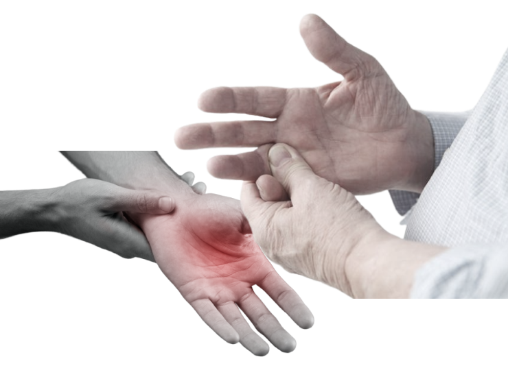

1\. Reduced dexterity, limited mobility, and loss of independence<br />2. Lack of appropriate protection or recovery products<br />3. Frustration with treatment and related emotional stress

</Col>

<Col span={3}>

#### Doctor, Hospital worker, Physiotherapist


1\. Patient compliance and incompatibility<br />2. Diagnosis uncertainty and different understanding of symptoms<br />3. The gap between rehab evaluation and actually getting back to routine

</Col>

<Col span={3}>

#### Designer, Researcher, people working in health care industry


1\. Data collection challenges<br />2. Complex to balance the need for rigorous research with ethical considerations<br />3.Regulatory Compliance

</Col>

<Col span={3}>

#### Other people (families, friends, etc.)


1\. Balance of work and caregiving<br />2. Financial burden and emotional stress<br />3. Hard to handle overloaded information and negative impact on other family members

</Col>

</Row>

### Design Goal

To better understand the specific touchpoints from medical exmaination to daily recovery, I summarzie the people, things, and effects from various perspectives for different stakeholders and beneficiers.

<Row>

<Col span={7}>


</Col>

<Col span={5}>

#### Insights & Touchpoints

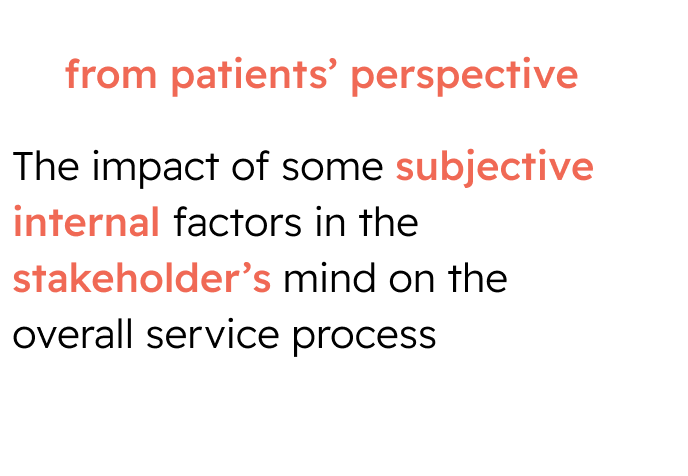

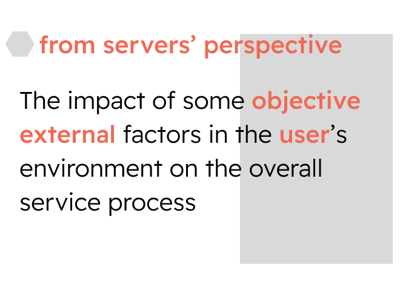

</Col>

</Row>

<Divider id="brainstorm">🧠Brainstorm</Divider>

### Ideation & Evaluation

I conceptualize the solution in various directions during the exploratory phase of brainstorming and idea development, such as simulating user experience, implementing advanced recording mechanisms, and pioneering innovative designs, with a keen focus on pushing the boundaries of wearable technology in the context of hand joint arthritis simulation.

A product that can quantify pain becomes the best choice by evaluating different designs criteria. Plan A wins.

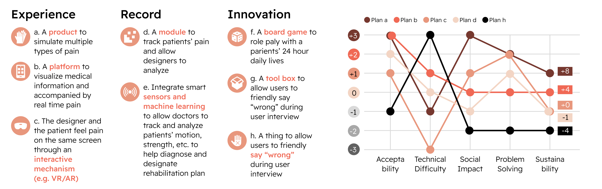

### Concept Development

I carefully planned hardware utilization to closely resemble real-life experiences of hand joint arthritis during the idea revision process, classifying pain according to its intensity, length, and specific symptoms to ensure a more complex and genuine user experience with the glove.

<Row>

<Col span={7}>

#### Pain Category

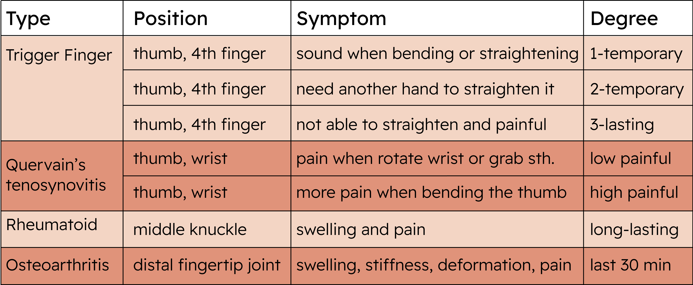

</Col>

<Col span={5}>

#### Concept Sketch

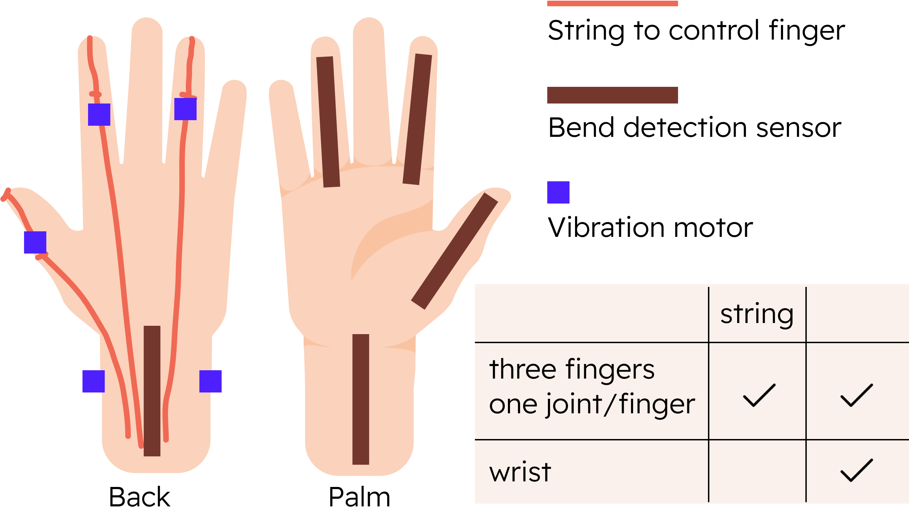

</Col>

</Row>

<Divider id="design">🎨Design</Divider>

### Prototype

#### Hardware Simulation

<Row>

<Col span={5}>

The hardware simply consists by bend sensors, vibration motors, and MG90S micro servo motors. Instead of using Arduino’s modular circuit board, we decided to print by ourselves to save cost.

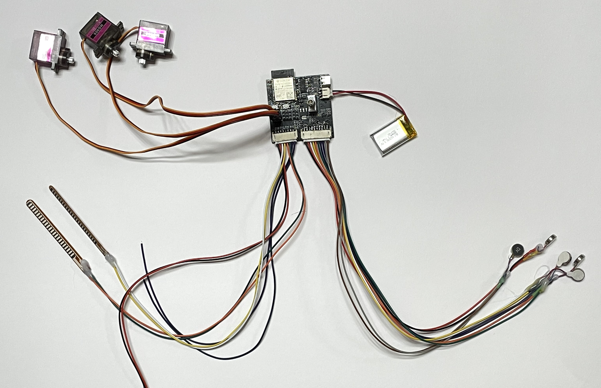

</Col>

<Col span={7}>

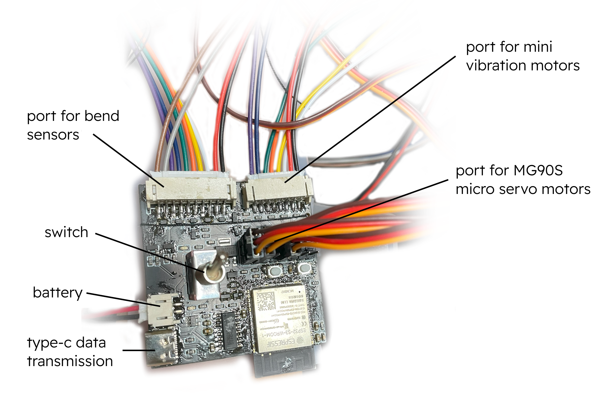

</Col>

</Row>

#### Material & Structure

To make it skin-friendly and avoid the risk of adding other sources of pain, I decided to use 1.5mm thick silica sheet and hook and loop fastener, securing the hardware with stitches.

<Row>

<Col span={3}>

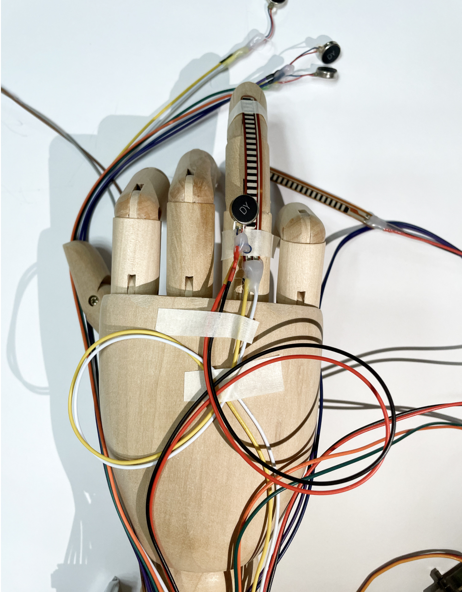

</Col>

<Col span={3}>

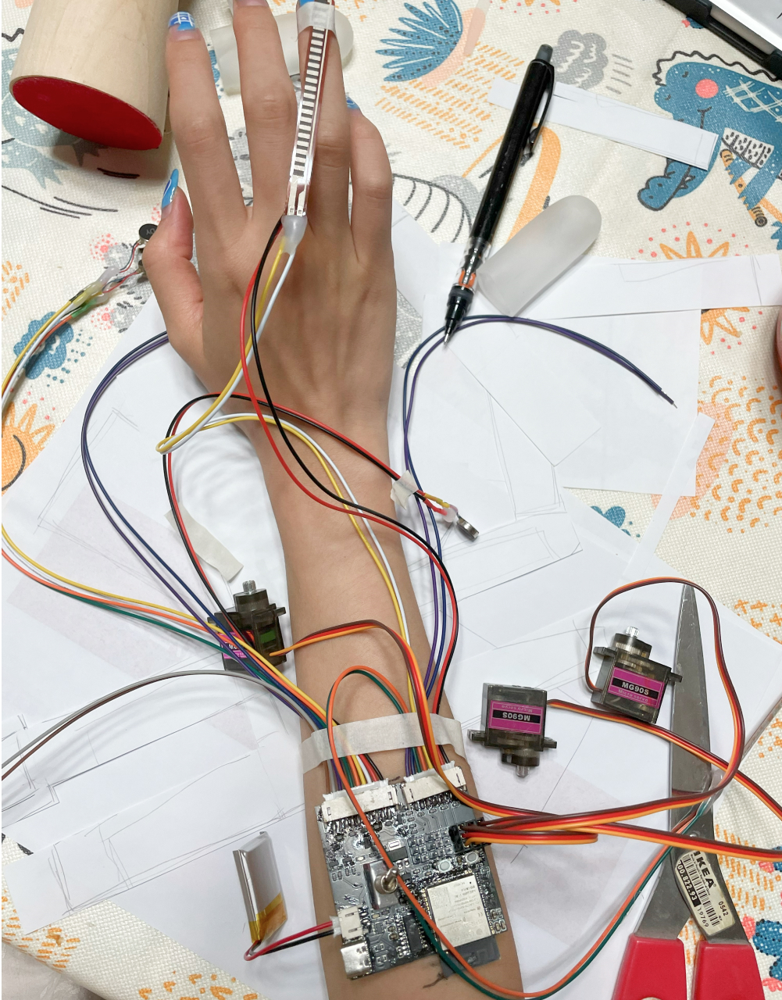

</Col>

<Col span={6}>

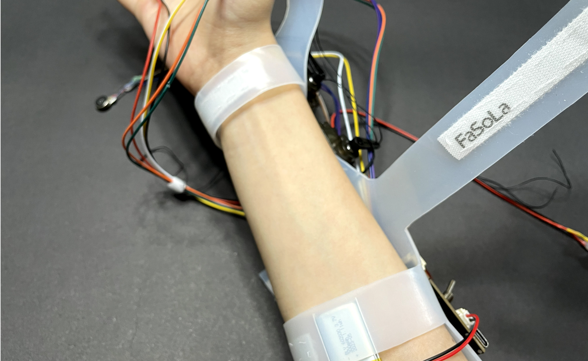

</Col>

</Row>

### Coding

<Row>

<Col span={4}>

The collaborative development of the final design is intricately worked with engineers, as our roles serve as the primary customers driving the refinement and optimization of this product.

Code is collaborately written by Xinyu Guo and Kunpeng Liu, powered by Arduino IDE.

</Col>

<Col span={4}>

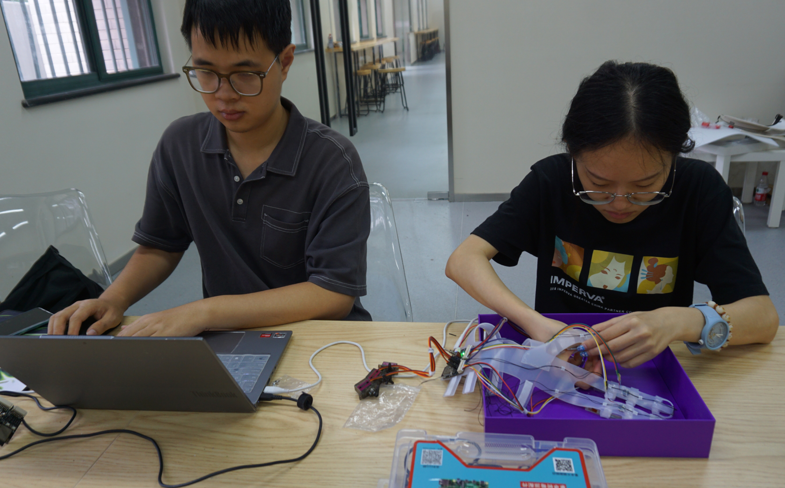

</Col>

<Col span={4}>

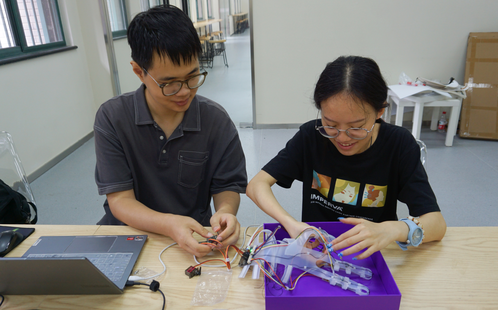

</Col>

</Row>

<Accordion title="View the Code">

```cpp
#include <ESP32Servo.h>
#include <Arduino.h>
#include <analogWrite.h>

int Sensor_Limit_Max[]={2500,2500,2500,3000};
int Sensor_Limit_Min[]= {2300,2300,2300,0};

int Servo_Value[]= {180,180,180,180,180,180,180,180};

int Servo_Value_Mode1[]= {0,180,180};

int Servo_Value_Mode2[]= {90,90,90};

int Servo_Value_Mode3[]= {180,0,0};

int Mode = 2;

int marix[] = {5,6,7,4};

int verb_marix[] = {0,0,0,0};

int tmp[10];
Servo myservo;  // create servo object to control a servo

Servo myservo2;  // create servo object to control a servo
Servo myservo3;  // create servo object to control a servo
Servo myservo4;  // create servo object to control a servo
Servo myservo5;  // create servo object to control a servo
Servo myservo6;  // create servo object to control a servo
Servo myservo7;  // create servo object to control a servo
Servo myservo8;  // create servo object to control a servo
// 16 servo objects can be created on the ESP32
int pos = 0;  // variable to store the servo position
int servoPin = 42;
void setup() {
  Serial.begin(9600);
  // Allow allocation of all timers
  //::allocateTimer(0);
  //ESP32PWM::allocateTimer(1);
  //ESP32PWM::allocateTimer(2);
  //ESP32PWM::allocateTimer(3);
  pinMode(35,OUTPUT);
  pinMode(36,OUTPUT);
   
  pinMode(37,OUTPUT);
  pinMode(38,OUTPUT);
  pinMode(39,OUTPUT);
  pinMode(40,OUTPUT);
  pinMode(41,OUTPUT);
  pinMode(42,OUTPUT);
  myservo.setPeriodHertz(50);  // standard 50 hz servo
  myservo.attach(35, 500, 2500);
  myservo2.setPeriodHertz(50);  // standard 50 hz servo
  myservo2.attach(36, 500, 2500);
  myservo3.setPeriodHertz(50);  // standard 50 hz servo
  myservo3.attach(37, 500, 2500);
  myservo4.setPeriodHertz(50);  // standard 50 hz servo
  myservo4.attach(38, 500, 2500);
  myservo5.setPeriodHertz(500);  // standard 50 hz servo
  myservo5.attach(39, 500, 2500);
  myservo6.setPeriodHertz(50);  // standard 50 hz servo
  myservo6.attach(40, 500, 2500);
  myservo7.setPeriodHertz(50);  // standard 50 hz servo
  myservo7.attach(41, 500, 2500);
  myservo8.setPeriodHertz(50);  // standard 50 hz servo
  myservo8.attach(42, 500, 2500);
   
  pinMode(4,OUTPUT);
  pinMode(5,OUTPUT);
   
  pinMode(6,OUTPUT);
  pinMode(7,OUTPUT);
  pinMode(8,OUTPUT);
  digitalWrite(4,0);
  digitalWrite(5,0);
  digitalWrite(6,0);
  digitalWrite(7,0);
  digitalWrite(8,0);
  
  pinMode(10,INPUT);
  pinMode(11,INPUT);
  pinMode(12,INPUT);
  pinMode(13,INPUT);

  myservo.write(Servo_Value[0]);  // tell servo to go to position in variable 'pos'
  myservo2.write(Servo_Value[1]);  // tell servo to go to position in variable 'pos'
  myservo3.write(Servo_Value[2]);  // tell servo to go to position in variable 'pos'
  myservo4.write(Servo_Value[3]);  // tell servo to go to position in variable 'pos'
  myservo5.write(Servo_Value[4]);  // tell servo to go to position in variable 'pos'
  myservo6.write(Servo_Value[5]);  // tell servo to go to position in variable 'pos'
  myservo7.write(Servo_Value[6]);  // tell servo to go to position in variable 'pos'
  myservo8.write(Servo_Value[7]);  // tell servo to go to position in variable 'pos'
  Serial.println("Welcome to XXXX！Please input the type you want to simulate：\n1：A\n2:B\n3:C");
}
void loop() {
  if (Serial.available() > 0) {
    // read the incoming byte:
    char user = (char)Serial.read();    
      if (user == '0') {
  myservo.write(Servo_Value[0]);  // tell servo to go to position in variable 'pos'
  myservo2.write(Servo_Value[1]);  // tell servo to go to position in variable 'pos'
  myservo5.write(Servo_Value[4]);  // tell servo to go to position in variable 'pos'
  //Serial.println("您选择了疾病类型1:A");
      } else if (user == '1') {
  myservo.write(Servo_Value_Mode1[0]);  // tell servo to go to position in variable 'pos'
  myservo2.write(Servo_Value_Mode1[1]);  // tell servo to go to position in variable 'pos'
  myservo5.write(Servo_Value_Mode1[4]);  // tell servo to go to position in variable 'pos'
  
  Serial.println("You choose the type 1:A");
      } else if (user == '2') {
  myservo.write(Servo_Value_Mode2[0]);  // tell servo to go to position in variable 'pos'
  myservo2.write(Servo_Value_Mode2[1]);  // tell servo to go to position in variable 'pos'
  myservo5.write(Servo_Value_Mode2[4]);  // tell servo to go to position in variable 'pos'
  Serial.println("You choose the type 2:B");
      }else if (user == '3') {
  myservo.write(Servo_Value_Mode3[0]);  // tell servo to go to position in variable 'pos'
  myservo2.write(Servo_Value_Mode3[1]);  // tell servo to go to position in variable 'pos'
  myservo5.write(Servo_Value_Mode3[4]);  // tell servo to go to position in variable 'pos'
  Serial.println("You choose the type 3:C");
      }
      else{
      }
  }
  /*
Serial.println("10:");
Serial.println(analogRead(10));
Serial.println("11:");
Serial.println(analogRead(11));
Serial.println("12:");
Serial.println(analogRead(12));
Serial.println("13:");
Serial.println(analogRead(13));
  delay(200);
  
  int tempvar = 0;
  */
  for(int i =0;i < 4;i++)
  {
    tmp[i] = analogRead(10 + i);
    if(tmp[i] < Sensor_Limit_Min[i])
    {
      if( Sensor_Limit_Min[i] - tmp[i] <255)
        verb_marix[i]=Sensor_Limit_Min[i] - tmp[i];
      else
        verb_marix[i]= 254;
    }
    else if(tmp[i] > Sensor_Limit_Max[i])
    {
      if(tmp[i]- Sensor_Limit_Max[i] <255)
        verb_marix[i]=tmp[i]-Sensor_Limit_Max[i] ;
      else
        verb_marix[i]= 254;
    }
    else
        verb_marix[i]= 0;

  }
    switch(Mode)
      {
        case 0:
          for(int i =0;i < 4;i++)
            analogWrite(marix[i], verb_marix[i]);
          delay(200);
          break;
        case 1:
          for(int i =0;i < 4;i++)
            analogWrite(marix[i], verb_marix[i]);
          delay(500);
          for(int i =0;i < 4;i++)
            analogWrite(marix[i], 0);
          delay(500);
          break;
        case 2:
          for(int i =0;i < 4;i++)
            analogWrite(marix[i], verb_marix[i]);
          delay(200);
          for(int i =0;i < 4;i++)
            analogWrite(marix[i], 0);
          delay(200);
          for(int i =0;i < 4;i++)
            analogWrite(marix[i], verb_marix[i]);
          delay(200);
          for(int i =0;i < 4;i++)
            analogWrite(marix[i], 0);
          delay(200);
          break;
        case 3:
          for(int i =0;i < 4;i++)
            analogWrite(marix[i], verb_marix[i]);
          delay(800);
          for(int i =0;i < 4;i++)
            analogWrite(marix[i], 0);
          delay(200);
          break;
  
  }
  
/*
  for (pos = 0; pos <= 180; pos += 1) {  // goes from 0 degrees to 180 degrees
    myservo.write(pos);  // tell servo to go to position in variable 'pos'
    myservo2.write(pos);  // tell servo to go to position in variable 'pos'
    myservo3.write(pos);  // tell servo to go to position in variable 'pos'
    myservo4.write(pos);  // tell servo to go to position in variable 'pos'
    myservo5.write(pos);  // tell servo to go to position in variable 'pos'
    myservo6.write(pos);  // tell servo to go to position in variable 'pos'
    myservo7.write(pos);  // tell servo to go to position in variable 'pos'
    myservo8.write(pos);  // tell servo to go to position in variable 'pos'
    delay(15);           // waits 15ms for the servo to reach the position
  }
  delay(1000);
  for (pos = 180; pos >= 0; pos -= 1) {  // goes from 180 degrees to 0 degrees
    myservo.write(pos);  // tell servo to go to position in variable 'pos'
    myservo2.write(pos);  // tell servo to go to position in variable 'pos'
    myservo3.write(pos);  // tell servo to go to position in variable 'pos'
    myservo4.write(pos);  // tell servo to go to position in variable 'pos'
    myservo5.write(pos);  // tell servo to go to position in variable 'pos'
    myservo6.write(pos);  // tell servo to go to position in variable 'pos'
    myservo7.write(pos);  // tell servo to go to position in variable 'pos'
    myservo8.write(pos);  // tell servo to go to position in variable 'pos'
    delay(15);                           // waits 15ms for the servo to reach the position
  }
  delay(1000);
  
if(analogRead(12) < 10)
{
  myservo.write(0);
    analogWrite(1, 0);
}else
{
  
  myservo.write(100);
    analogWrite(1, 244);
}
  for (pos = 0; pos <= 180; pos += 1) {  // goes from 0 degrees to 180 degrees
    myservo.write(pos);  // tell servo to go to position in variable 'pos'
    delay(15);           // waits 15ms for the servo to reach the position
  }
  delay(3000);
  for (pos = 180; pos >= 0; pos -= 1) {  // goes from 180 degrees to 0 degrees
    myservo.write(pos);                  // tell servo to go to position in variable 'pos'
    delay(15);                           // waits 15ms for the servo to reach the position
  }
  delay(3000);
  
  for (pos = 0; pos <= 255; pos += 1) {  // goes from 0 degrees to 180 degrees
    
    analogWrite(1, pos); // 通道0输出， PWM输出0~100%（0~2^10=1024）
    delay(15);           // waits 15ms for the servo to reach the position
  }
  pos=0;
  delay(3000);
  */
}
```

</Accordion>

### User Scenario

#### Basic - for student designers


#### Advanced - for professionals & companies

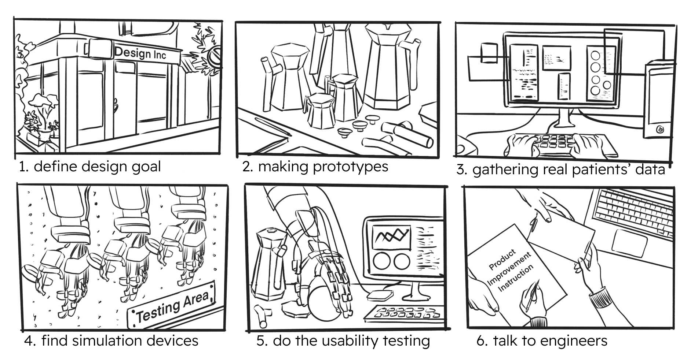

<Divider id="conclusion">💡Conclusion</Divider>

### Tests & Results

#### Lab setting - A series of actions on same product

<Grid cols={3}>

<Cell>

I personally tested the gloves, simulating user interactions with a water bottle design, performing actions related to drinking and washing. I then compared observed limitations with data gathered from online patient surveys.

</Cell>

<Cell>

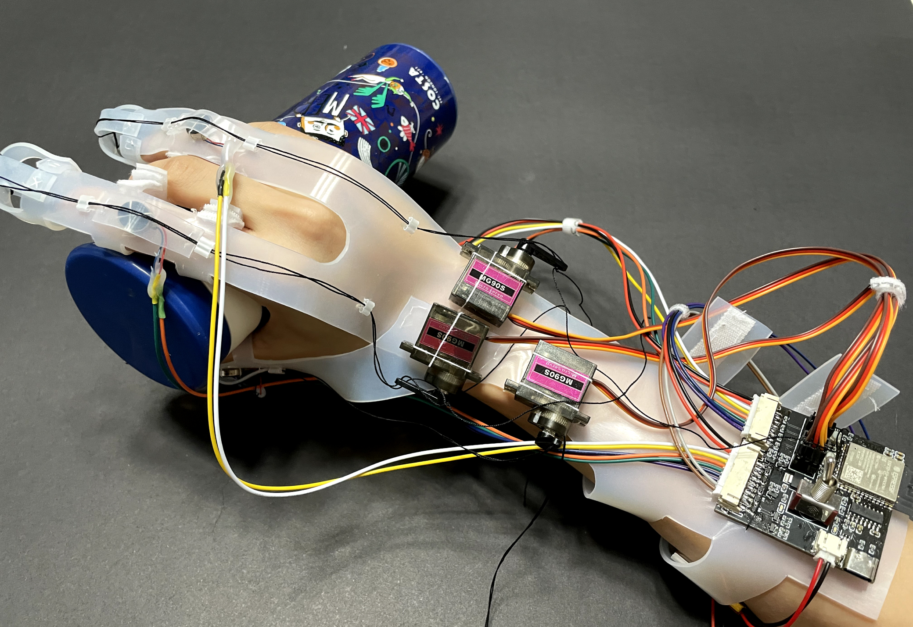

</Cell>

<Cell>

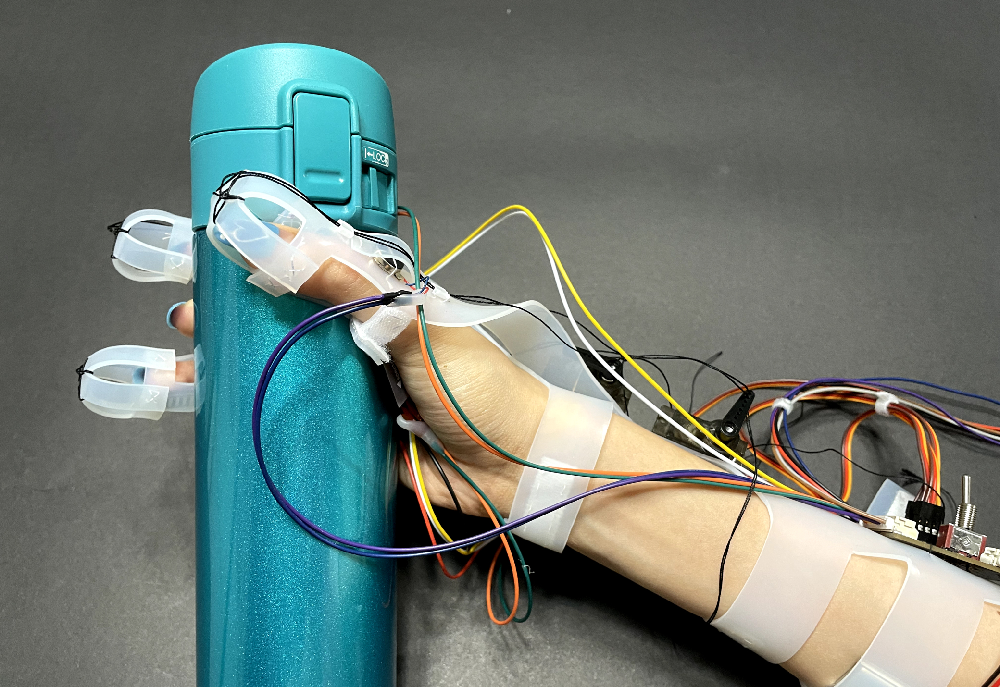

</Cell>

<Cell>

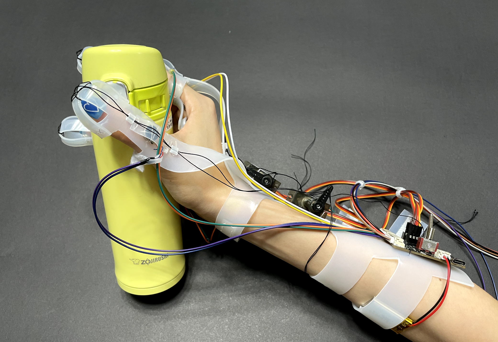

</Cell>

<Cell>

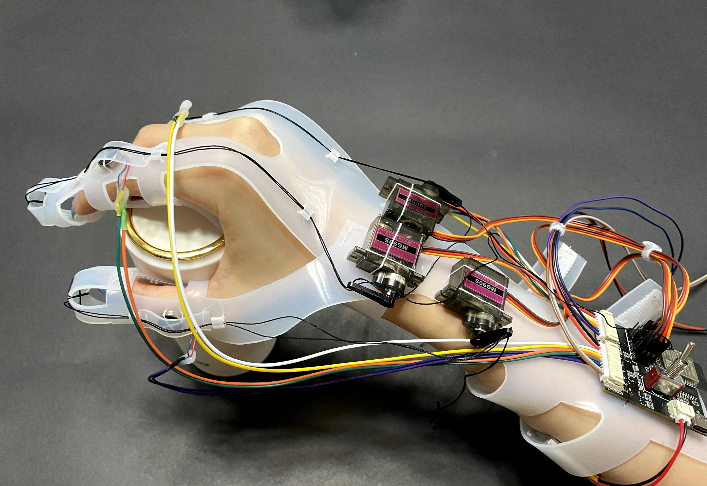

</Cell>

</Grid>

#### Real life setting - A series of actions of different daily tasks

I had individuals with intermittent arthritis wear the gloves to perform daily tasks, including holding a pot, opening heavy doors, twisting towels, and peeling fruits, as part of empirical evaluation.

<Row>

<Col span={4}>

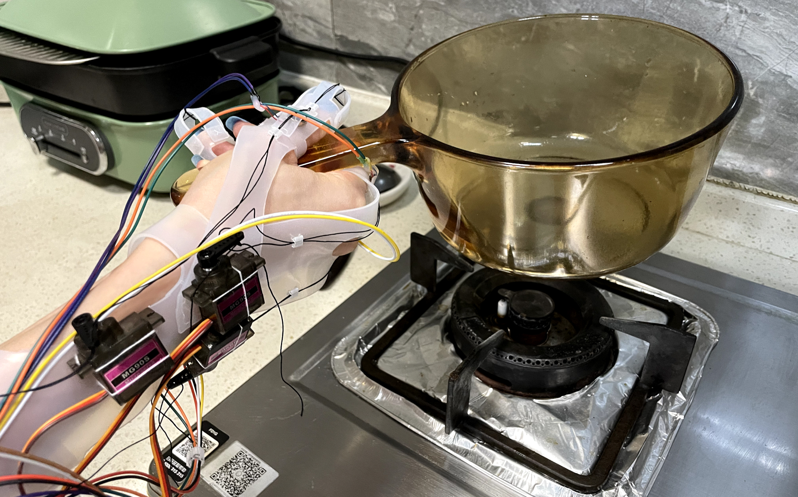

</Col>

<Col span={4}>

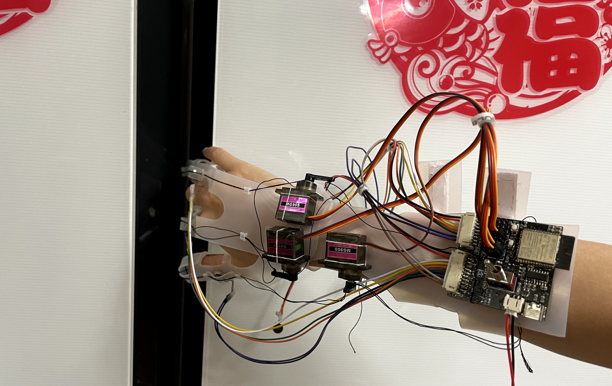

</Col>

<Col span={4}>

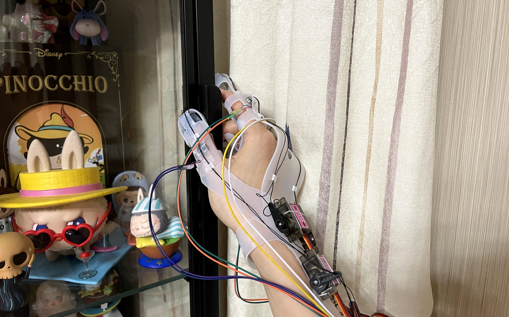

</Col>

</Row>

#### Result

The success of the physical prototyping and simulation design is affirmed through the comparison of scientific data and real-patient experiences.

<Row>

<Col span={2}>

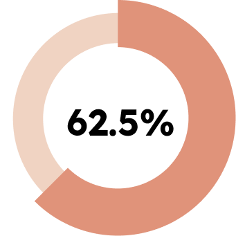

</Col>

<Col span={2}>


</Col>

<Col span={4}>

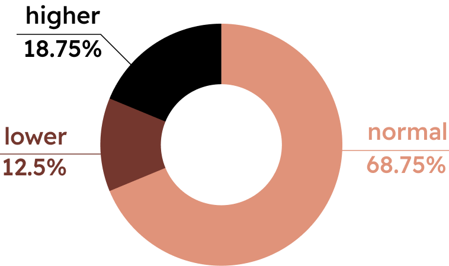

</Col>

<Col span={4}>

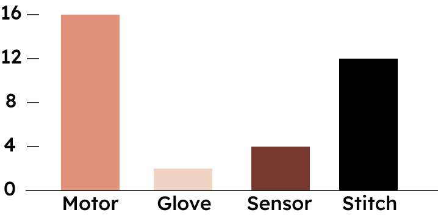

</Col>

</Row>

<Row>

<Col span={2}>

Accuracy of Pain Localization

</Col>

<Col span={2}>

Matches the duration from memory

</Col>

<Col span={4}>

Pain Intensity Rating

</Col>

<Col span={4}>

Source of pain

</Col>

</Row>

### Future Plan

<Row>

<Col span={6}>

#### Academically

This final iteration is a prototype with preliminary user testing. I aim to enhance it through nuanced data setting adjustments, sensor substitution, rigorous testing, and formalization into an academic report.

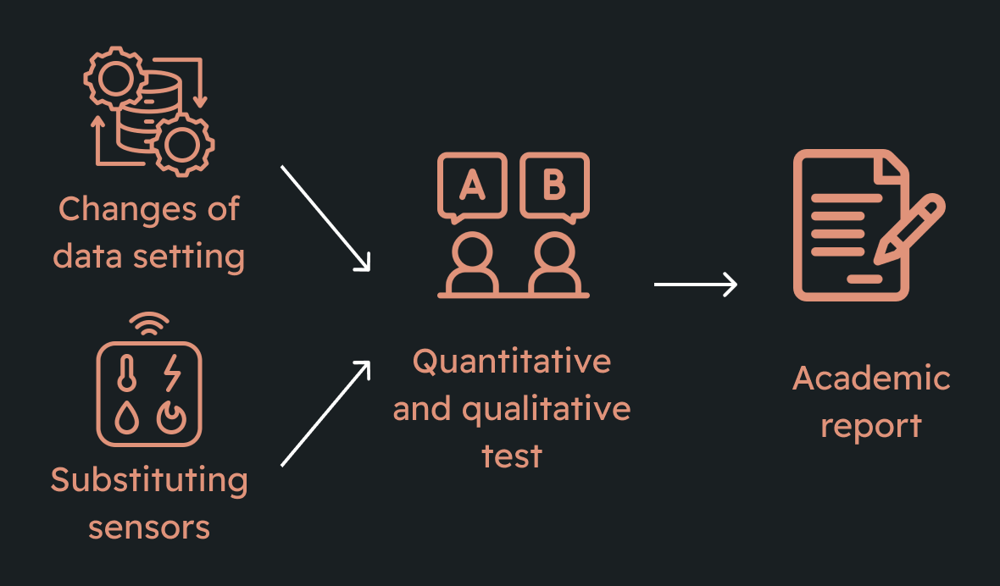

</Col>

<Col span={6}>

#### For the Product

I intend to transform the product into an educational and user-testing tool with user-friendly features, enabling non-professionals to choose specific illnesses, access educational materials, and generate comprehensive data reports.

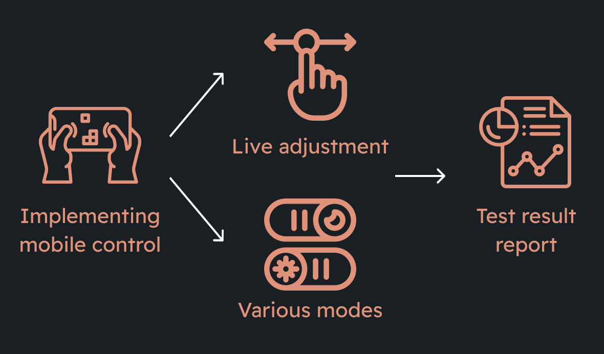

</Col>

</Row>

### Key Takeaways

<Grid cols={3}>

<Cell>

#### Implication of Hardware Integration in Experiential Learning

This is the first time I've worked on physical prototyping and coding. By pushing the boundaries of hardware capabilities, our team successfully transformed conceptual ideas into a tangible product, showcasing the potential of sophisticated technology to enhance experiential learning and research in the medical fields.

</Cell>

<Cell>

#### Empathetic Design

Considering empathy from a different perspective other than customers provide unique insights. Our empathetic design transcends traditional user empathy by deeply analyzing the intricate relationship between users and the product, recognizing the multifaceted roles they play in the simulation process, and acknowledging the emotional toll their engagement may incur.

</Cell>

<Cell>

#### Team Collaboration

The interplay of specialized skills within the team fostered an environment where creativity, problem-solving, and shared commitment flourished, culminating in the successful realization of ArthoGlove. Allowing engineers to understand and participate in concept development process make the project better landing.

</Cell>

</Grid>
