<Intro>

<Text as="p" align="center">In this project, I utilized the Grasshopper plugin in Rhino with the objective of designing a series of innovative and futuristic products. Through iterative adjustments within Grasshopper and KeyShot, I created a futuristic elixlizer machine, a flying vehicle, and a musician headphone envisioned for extraterrestrial use.</Text>

<MetaGrid>

<Meta label="Timeline">

09/2023 - 12/2023

</Meta>

<Meta label="Role">

3D modeling

</Meta>

<Meta label="Credit">

Instructed by Brian James Advanced CAD

</Meta>

<Meta label="Tools">

</Meta>

</MetaGrid>

</Intro>

<Block pt={60} pb={60}>

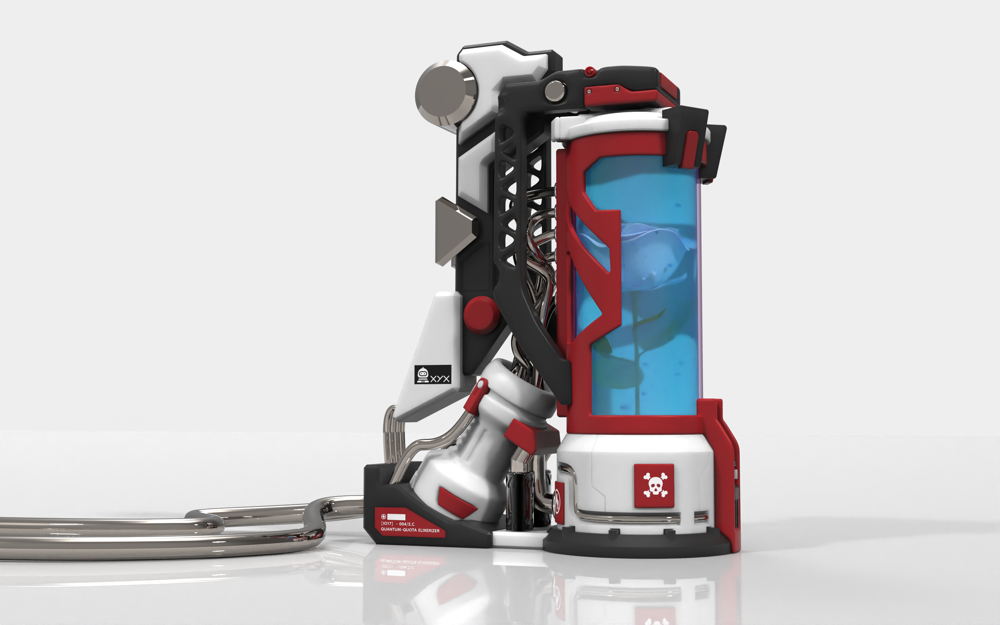

<Grid cols={2} pad="20px 0px 20px 0px">

<Cell>

<Fit w={494}>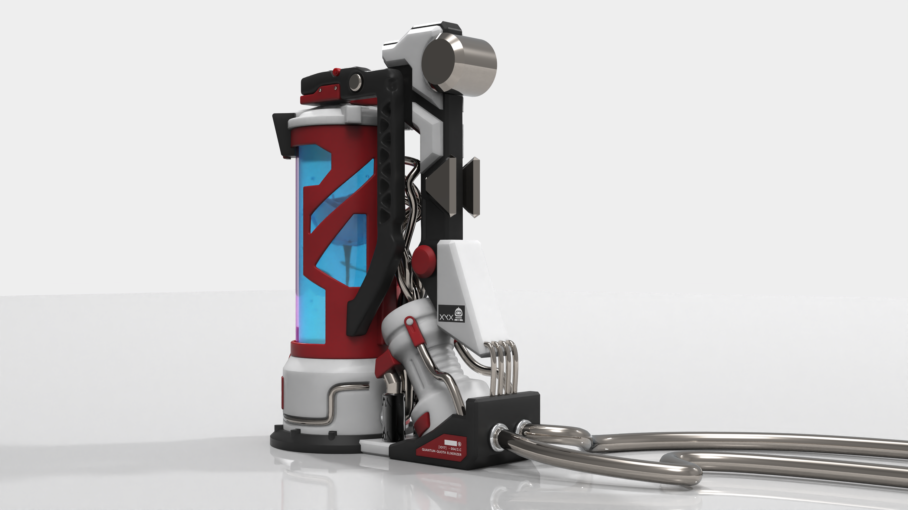</Fit>

</Cell>

<Cell>

<Fit w={494}>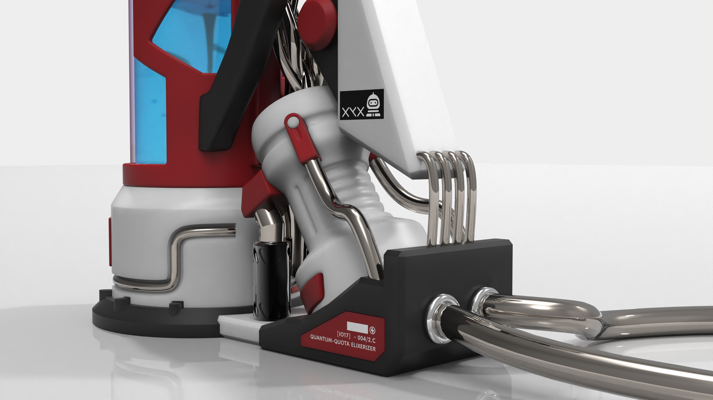</Fit>

</Cell>

<Cell>

<Fit w={494}>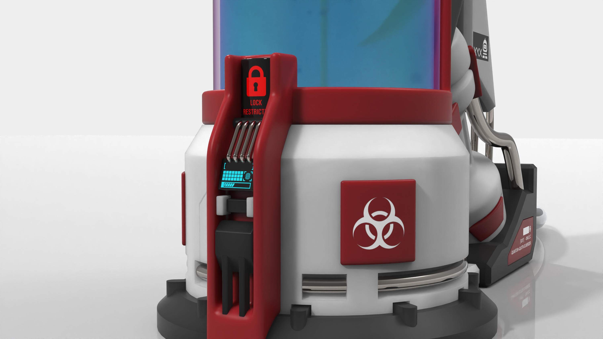</Fit>

</Cell>

<Cell>

<Fit w={494}>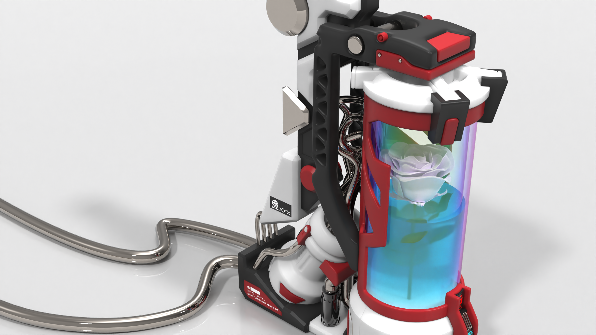</Fit>

</Cell>

</Grid>

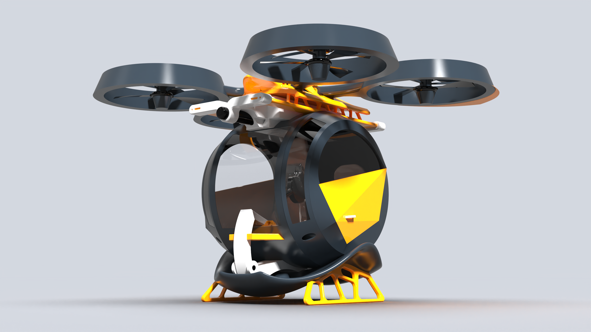

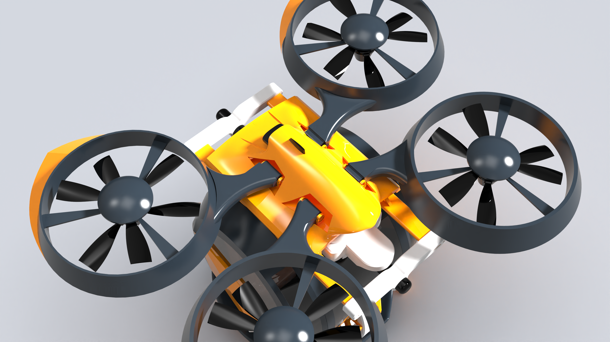

<Grid cols={2} pad="20px 0px 20px 0px">

<Cell>

<Fit w={494}>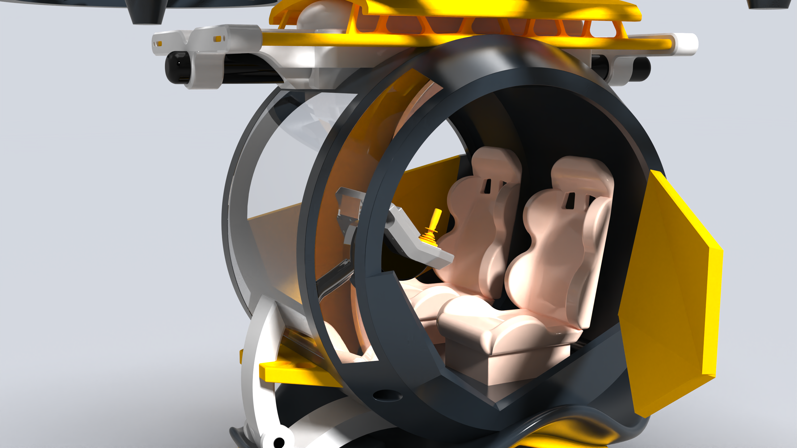</Fit>

</Cell>

<Cell>

<Fit w={494}>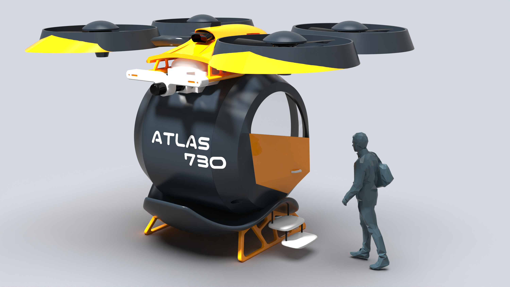</Fit>

</Cell>

</Grid>

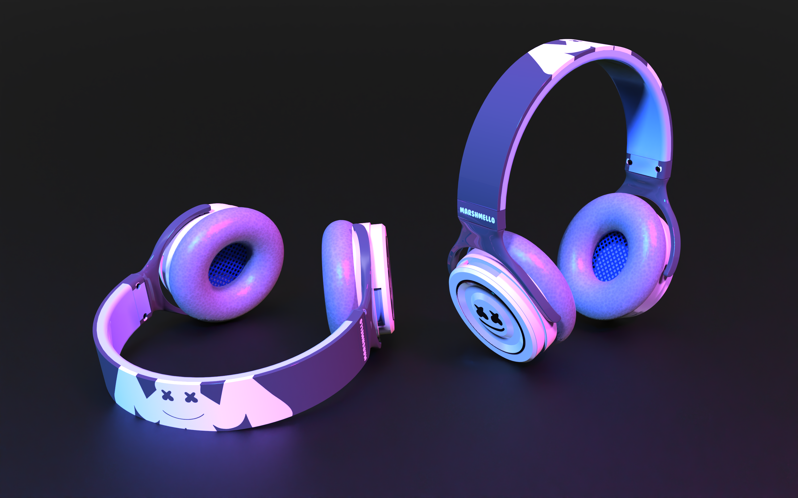

<Grid cols={2} pad="20px 0px 20px 0px">

<Cell>

<Fit w={494}>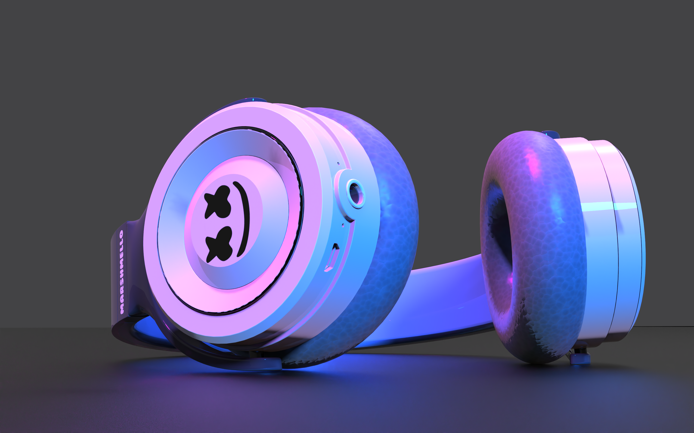</Fit>

</Cell>

<Cell>

<Fit w={494}>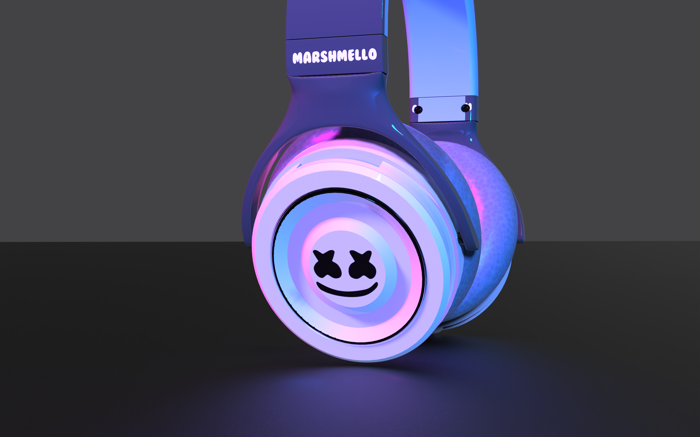</Fit>

</Cell>

<Cell>

<Fit w={494}>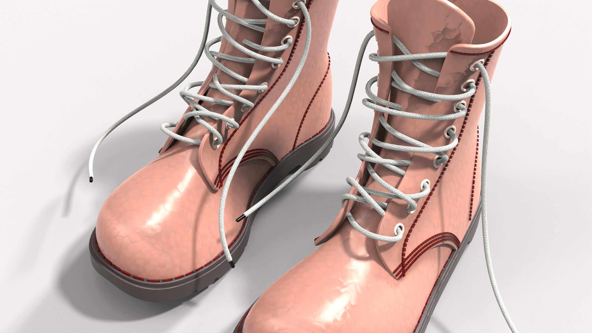</Fit>

</Cell>

<Cell>

<Fit w={494}>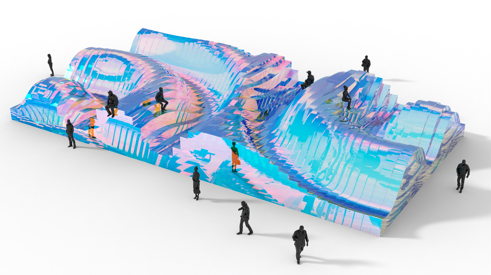</Fit>

</Cell>

</Grid>

</Block>
