<Lead>Route Map is reimagining shopping experience for trip tours in forms of changing the "display".</Lead>

<MetaGrid>

<Meta label="Timeline">

06/2023 - 08/2023

</Meta>

<Meta label="Role">

UX design UI design

</Meta>

<Meta label="Team">

Full-time UX Designer (2) UX Research (2) Product Manager (2) Design Leader (1)

</Meta>

<Meta label="Tools">

</Meta>

</MetaGrid>

### Route Map Project Overview

<Row>

<Col span={7}>

In the landscape of travel technology, I led the design initiative for Fliggy's groundbreaking project focused on map visualization for routes. This strategic undertaking aimed to enhance the user experience by transforming information into a visually intuitive format on the map. The primary objective was to streamline decision-making processes for users, particularly in the realm of POI-related bookings, while exploring opportunities to extend the functionality to other industries.

The teamwork focuses on the iterative design process, user journey considerations, and collaborative decision-making that shape the evolution of Fliggy's map visualization for routes. And I am mainly responsible for visual design for final distribution.

</Col>

<Col span={5}>

</Col>

</Row>

### Final Impact

<Row>

<Col span={6}>

#### 20% Increase in Turn Over Rate

Launched in route product system, improving turn over rate by 20% - Handed this off to developers at the end of the internship, and it has been launched in Aug of 2023.

</Col>

<Col span={6}>

#### Component Reusable 50k+ Times

Integrated 5 variations of design pattern into design system, estimated to be used 50k+ times for 5000 routes in Fliggy's library.

</Col>

</Row>

<Divider id="product">📱Main Features</Divider>

<Grid cols={3}>

<Cell>

Add one POI for route recommendation

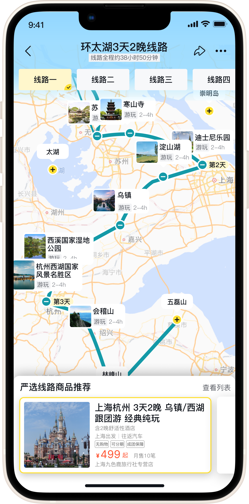

</Cell>

<Cell>

Click specific POI to see its own information

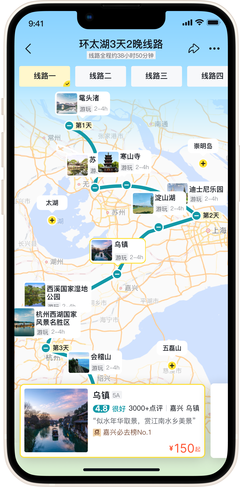

</Cell>

<Cell>

### 01. Route Product Visulization

#### Smart match by clicking POIs

Users can add or remove locations from a predetermined route product, browse individual destinations, and the system will make recommendations based on these actions.

This is my final design pages for internship but not exactly the one launched in Aug,2023. Our team revised some detailes after I left.

</Cell>

</Grid>

But the general ideas are:

<Row>

<Col span={6}>

<Box bg="rgba(141, 143, 255, 0.3)">

#### Intelligent Routing Search

Based on the user's selected destination, the system will automatically generate travel routes tailored to their preferences.

</Box>

</Col>

<Col span={6}>

<Box bg="rgba(141, 143, 255, 0.3)">

#### Increased Usage and Sales

The generated routes match the 5000+ travel packages offered by the platform, thereby increasing conversion and sales rates.

</Box>

</Col>

</Row>

<Row>

<Col span={6}>

<Box bg="rgba(141, 143, 255, 0.3)">

#### Recommend Nearby POIs

When pinpointing your current location, the system automatically displays cards for nearby POIs. Users can click on the cards to access more detailed information.

</Box>

</Col>

<Col span={6}>

<Box bg="rgba(141, 143, 255, 0.3)">

#### Integrate Theme Promotion

Rather than placing tags on map for theme promotion, fliggy provided a new section of “Route Treasure Library” to enrich content based on popular trend.

</Box>

</Col>

</Row>

<Row>

<Col span={4}>

### 02. Design System

#### Quicker Prototyping

I created the reusable components listed right using Fliggy's design framework to make it easier and faster for the team to construct prototypes.

</Col>

<Col span={8}>

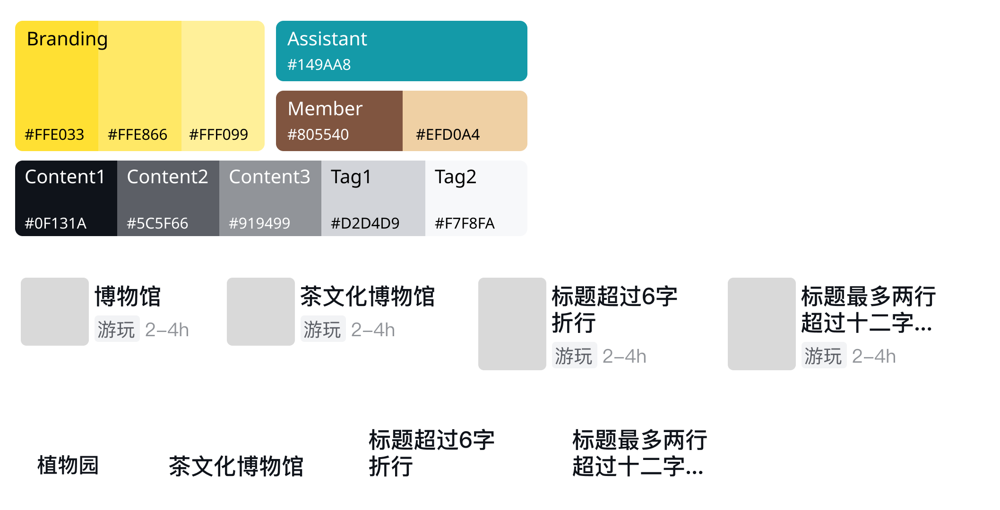

</Col>

</Row>

### 03. Other Launched Pages

To get a clear understand of user journey, here are more integrated features for map visulization.

<Row>

<Col span={4}>

#### Route Product

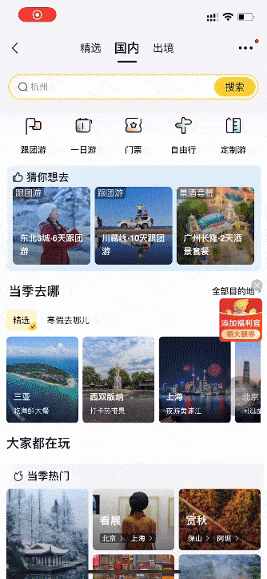

Every route product now has map visulizaion in its detail page

</Col>

<Col span={4}>

#### Neighboring Recommendation

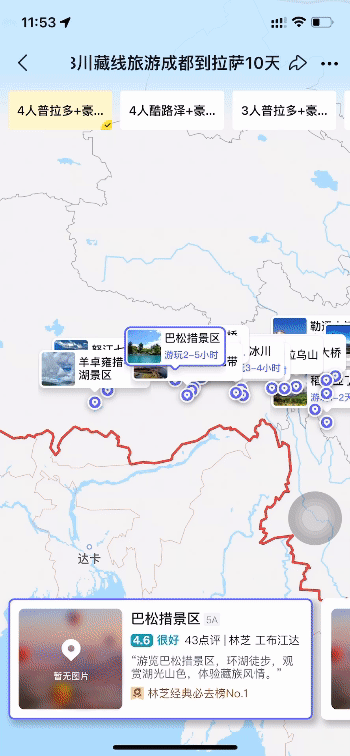

When clicking card for specific sceneary, users are able to see neighboring recommendations

</Col>

<Col span={4}>

#### Map Library

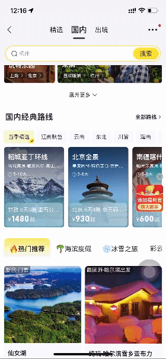

Within in the "Travel" category, Fliggy has promotion library based on users' top choices

</Col>

</Row>

#### And more...

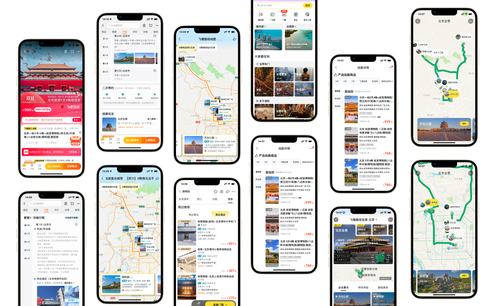

### Welcome to download the app :)

This feature is now live and available for exploration. You can download it from the App Store to discover its full functionality.

<Divider id="background">👋 Background</Divider>

### Value & Customers

<Grid cols={4}>

<Cell>

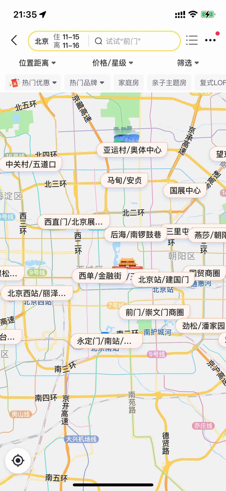

</Cell>

<Cell>

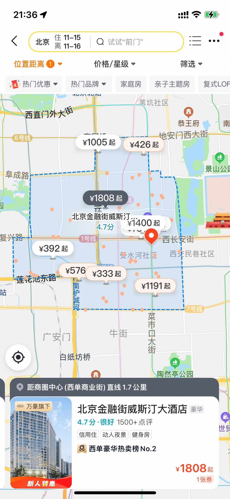

</Cell>

<Cell>

Fliggy improved map visualization, transitioning from list to tiled mode, which significantly boosted decision-making speed in hotel bookings. The successful outcome has prompted the company to explore applying this enhanced functionality to streamline decision-making across various industries for trip-related purchases.

</Cell>

<Cell>

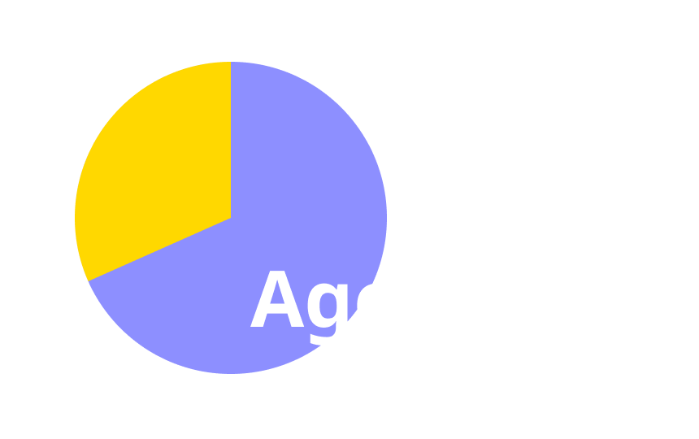

#### Younger

</Cell>

<Cell>

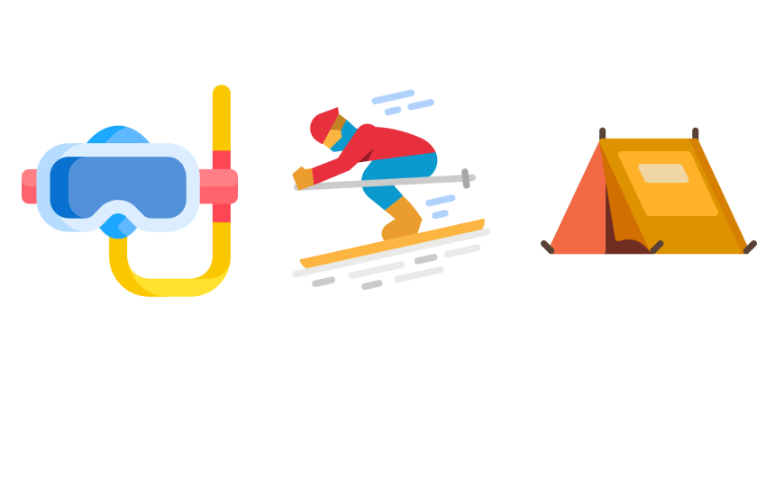

#### Dynamic & Diverting

</Cell>

</Grid>

### POI Principles

<Row>

<Col span={6}>

The principle of 'Point of Interest' (POI) posits that a higher level of specificity enhances turnover rates. This relationship is closely intertwined with map hierarchy, wherein elevated hierarchy levels demand the display of more detailed information to aid users in exploring and defining their points of interest.

</Col>

<Col span={6}>

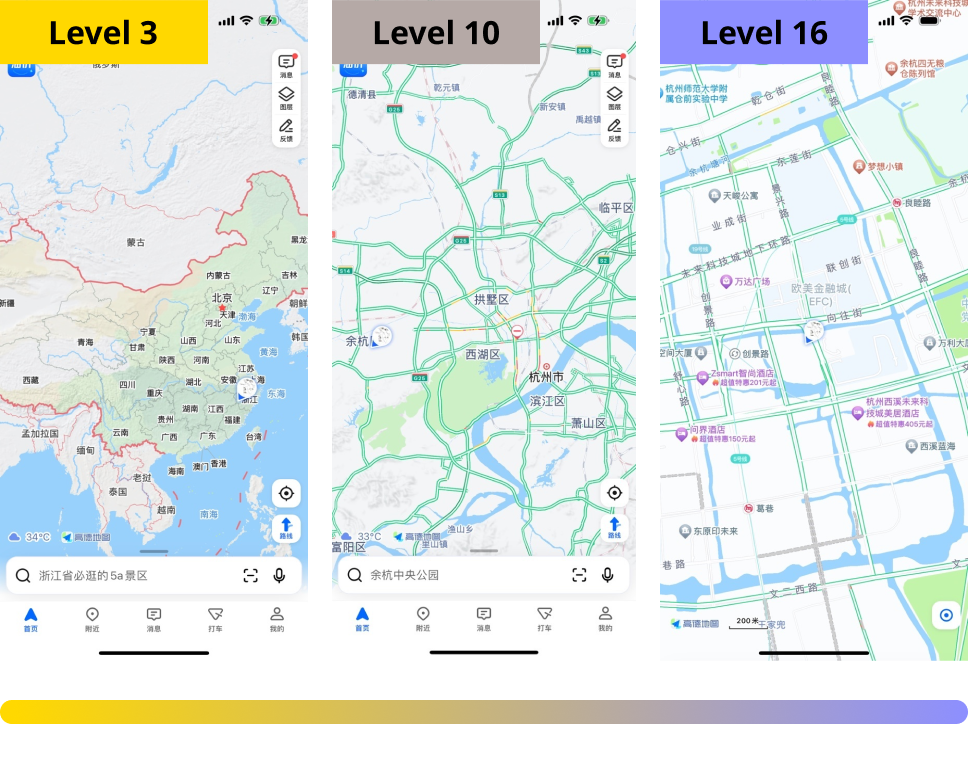

</Col>

</Row>

### Business Objectives

#### Challenge & Success Metrics

<Row>

<Col span={5}>

In the current Fliggy app version, map features are compartmentalized with varying appearances, and users express a need for additional functionalities. Analysis by PM and UX teams indicates a user desire for a more efficient app that facilitates informed decisions, cost savings, and time conservation. Recognizing the correlation between increased map usage and business objectives, I lead the development of the exploration map.

</Col>

<Col span={7}>

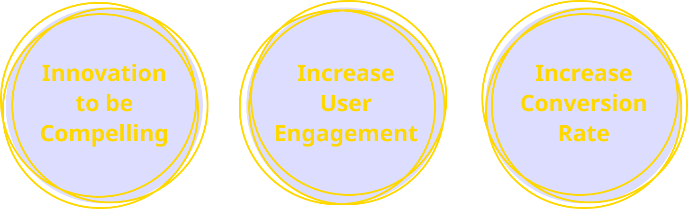

</Col>

</Row>

#### Unmet User Needs

As furnished by the Product Management team and User Research team, a potential but unfinished list of reasons and directions has been provided to guide the development of the map visualization product.

<Grid cols={4}>

<Cell bg="rgba(141, 143, 255, 0.3)">

#### Time-consuming Map Switching

inefficient and repetitive to switch between different categories' maps

</Cell>

<Cell bg="rgba(141, 143, 255, 0.3)">

#### Route Generation Falls Short

can't generate a travel routes based on the POIs that users interested in

</Cell>

<Cell bg="rgba(141, 143, 255, 0.3)">

#### Inability to Custiomize Route

users have varied travel preferences but routes can’t be customized

</Cell>

<Cell bg="rgba(141, 143, 255, 0.3)">

#### Insufficient Information for Users

current maps not provide enough info to create a complete travel plan

</Cell>

</Grid>

<Quote title="Design Question">

Focusing on featuresGoals

“HMW shift Fliggy’s product display from shelf views to a map-based interface, increasing engagement and improving turnover rates through an interactive experience?”

</Quote>

<Divider id="analysis">🔬 Analysis</Divider>

### Competitive Analysis

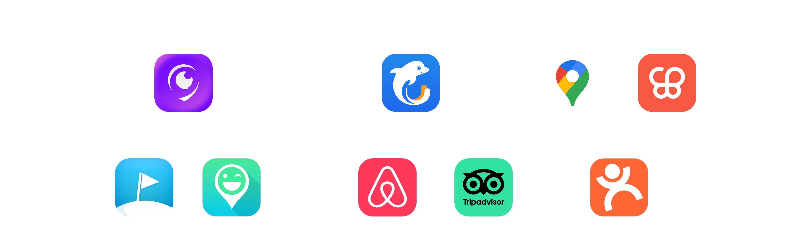

In order to comprehend the intricacies of compelling design and the effective utilization of maps for information visualization, I undertook a thorough examination of competitive applications within the map and travel domains. This involved a detailed analysis of innovative features and interactive modes employed by these apps, with a focus on identifying opportunities that can serve as valuable references.

<Row>

<Col span={6}>

#### Innovation Point

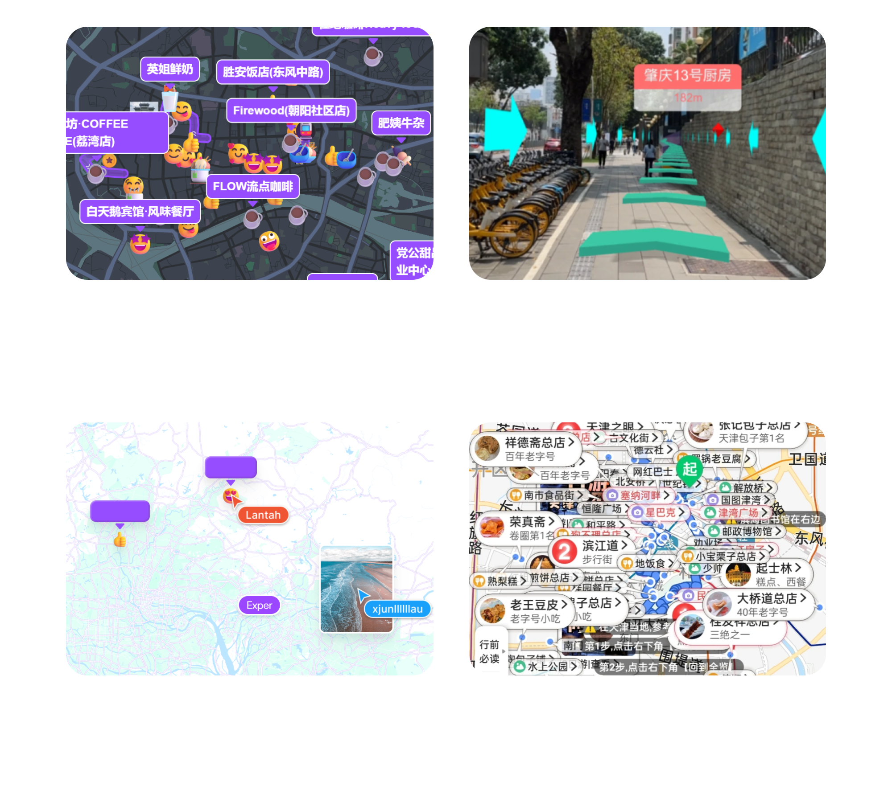

</Col>

<Col span={6}>

#### Interactive Mode

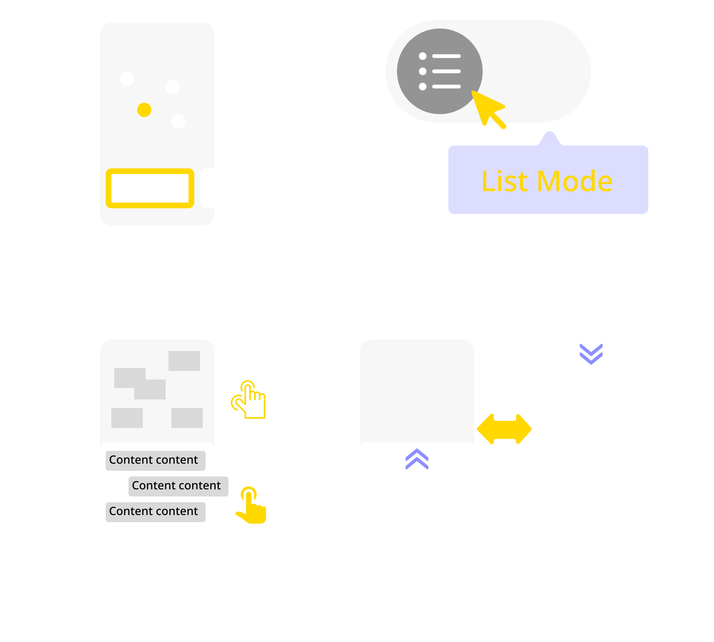

</Col>

</Row>

### Design Goal

During discussions with team members, I identified a lack of emphasis on user journey. Consequently, I created a user journey map, drawing insights from our collective experiences as customers to elucidate the functionalities we aim to incorporate.

<Row>

<Col span={6}>

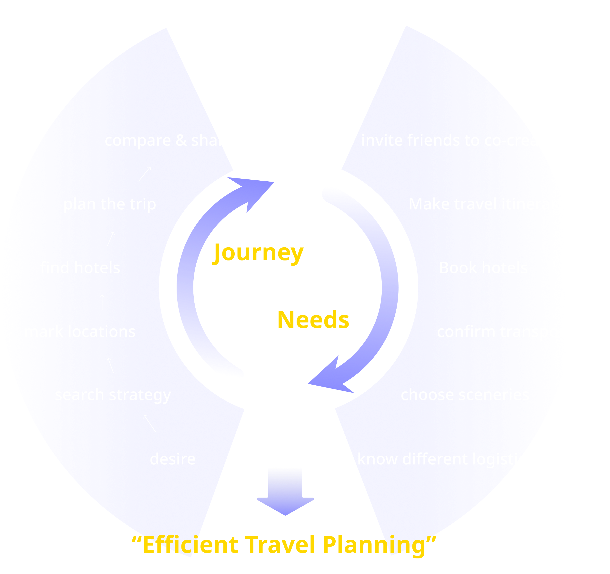

</Col>

<Col span={6}>

#### Hierechy of Pain Points

After constructing the user journey, I conducted a hierarchical analysis of pain points to systematically identify and prioritize areas requiring attention and improvement. Shorterning the journey of "Discover POIs" is the main concern.

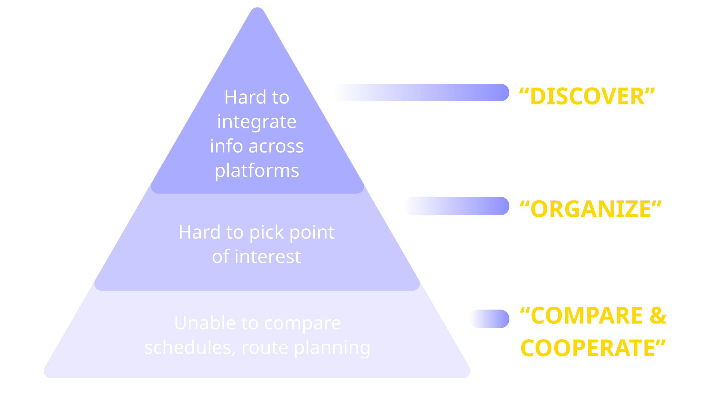

</Col>

</Row>

<Divider id="brainstorm">🧠 Brainstorm</Divider>

### Inspiration from Previous Academic Project

<Row>

<Col span={10}>

As I embarked on the brainstorming process for user journey and functionalities, I revisited one of my academic projects, 'Aroute'. This travel planning app aims to visualize information on a map, enabling professional travelers and agencies to sell their routes directly or offer cloneable versions for further customization.

</Col>

<Col span={2}>

<LinkButton href="/projects/aroute">View "Aroute"</LinkButton>

</Col>

</Row>

<Grid cols={2}>

<Cell>

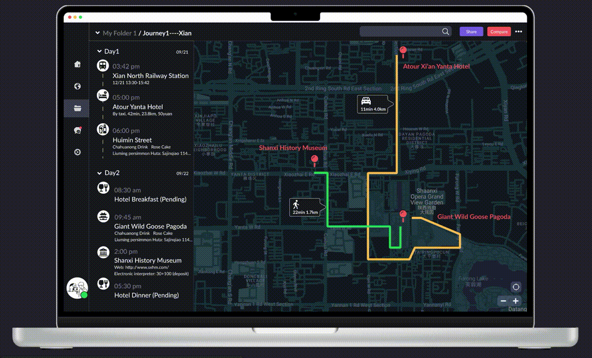

</Cell>

<Cell>

The innovative approach of distinguishing between community exploration and personal plan files allows the incorporation of both function-based tools and promotion-based features.

</Cell>

<Cell>

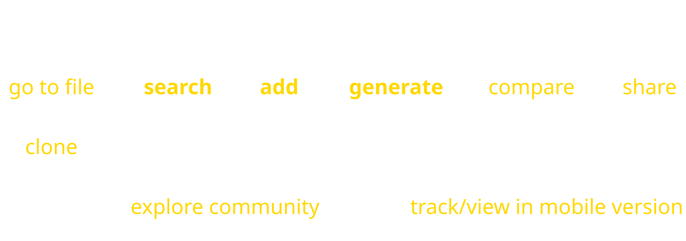

</Cell>

</Grid>

To address the distinct business values associated with each, I worked with team members and developed dual designs, facilitating collaborative decision-making with the product team.

### Method 1: Function-based for Existing Users

Users are going to explore POIs on “super map” and organize them on “my map”. It incoperates route and iteneary plan with team collaboration to increase the efficiency of decision-making.

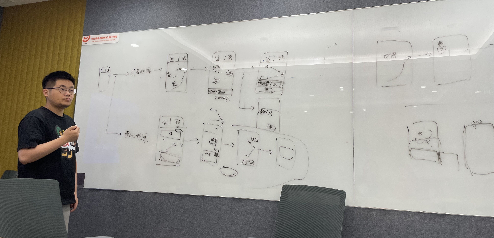

To understand it more clearly, I translated the information architecture to English below:

<Row>

<Col span={6}>

#### Public

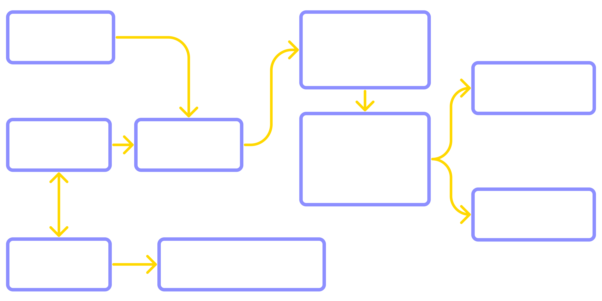

</Col>

<Col span={6}>

#### Private

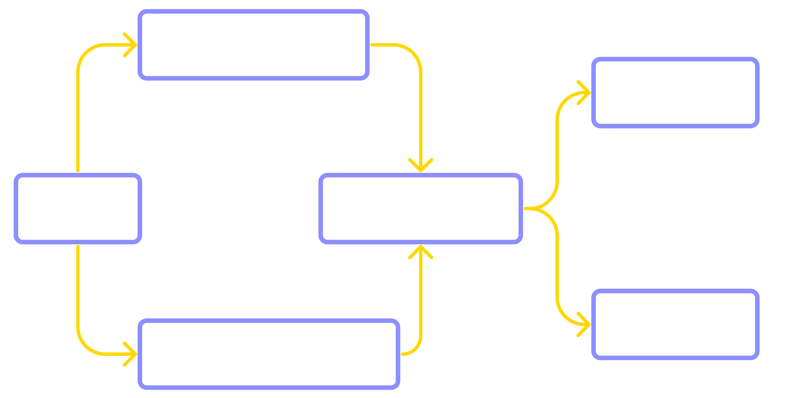

</Col>

</Row>

### Method 2: Theme-based to Attract New Users

Aligned with the evolving preferences observed on social media, contemporary decision-making, particularly among the youth, is guided by factors like weather, temperature, transportation, and activities. Categorizing this information facilitates easier trend-following and attracts new users.

#### Inspirations

Theme maps, like the ones below, have been extensively disseminated for promotion on the popular Chinese social media platform "Little Red Book". Those posts group routes, points of interest, and sites into many categories according to factors like weather, activities, and seasons, instead than just listing prominent destinations.

<Row>

<Col span={3}>

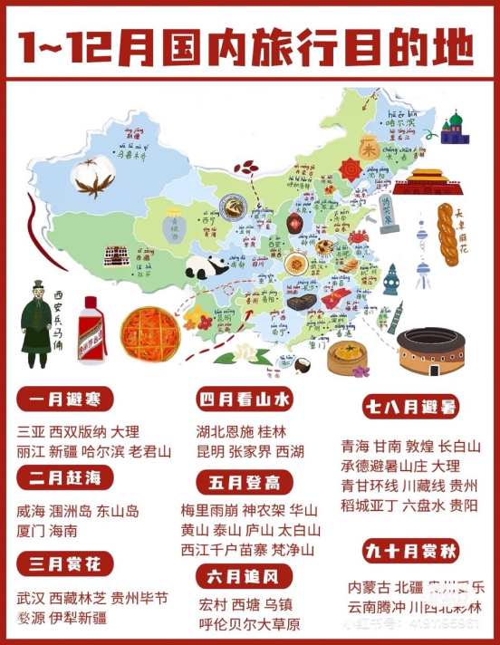

</Col>

<Col span={3}>

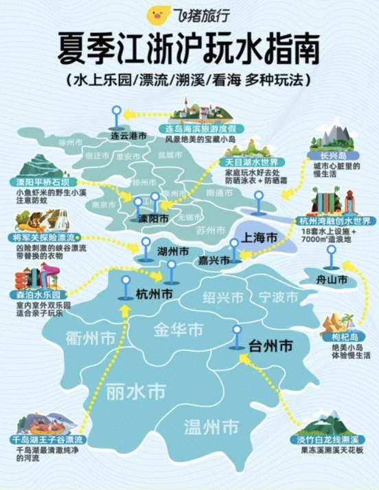

</Col>

<Col span={3}>

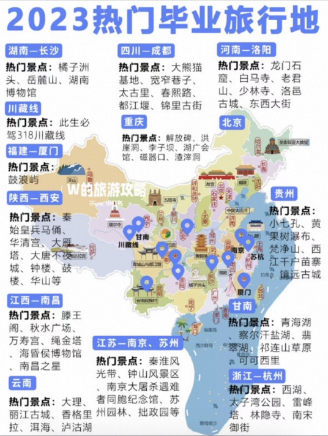

</Col>

<Col span={3}>

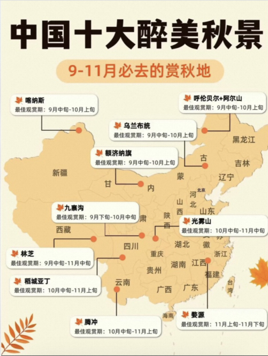

</Col>

</Row>

#### Functions Needed

<Row>

<Col span={3}>

#### Content

POI (Point of Interest) Route detail Transportation method Distance

</Col>

<Col span={3}>

#### Theme Category

Seasons (24 Solar Terms) National holidays Crowd Pop Culture (Activities)

</Col>

<Col span={3}>

#### Route Plan

Recommendation DIY Product entry Secondary creation

</Col>

<Col span={3}>

#### Interaction Mode

Zoom in & out Card swap  ‍

</Col>

</Row>

#### Information Architecture

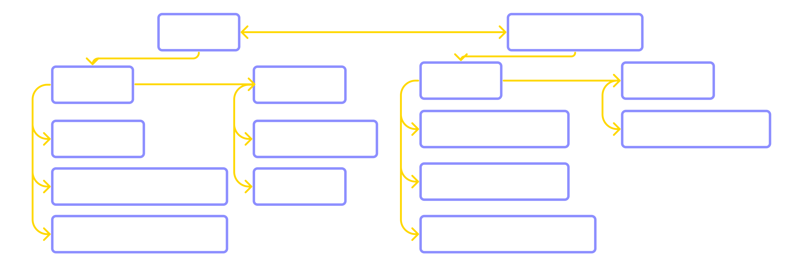

<Divider id="prototype">🧩 Prototypes</Divider>

### Function-based

<Row>

<Col span={6}>

#### Super Map with Smart Mode

Fliggy boasts a comprehensive library of over 5,000 routes, easily sortable by selecting Points of Interest (POIs).

Users have the option to activate the smart sort mode, enabling them to discover routes aligned with their potential interests. Alternatively, they can explore scenic spots and hotels around POIs directly on the map.

</Col>

<Col span={6}>

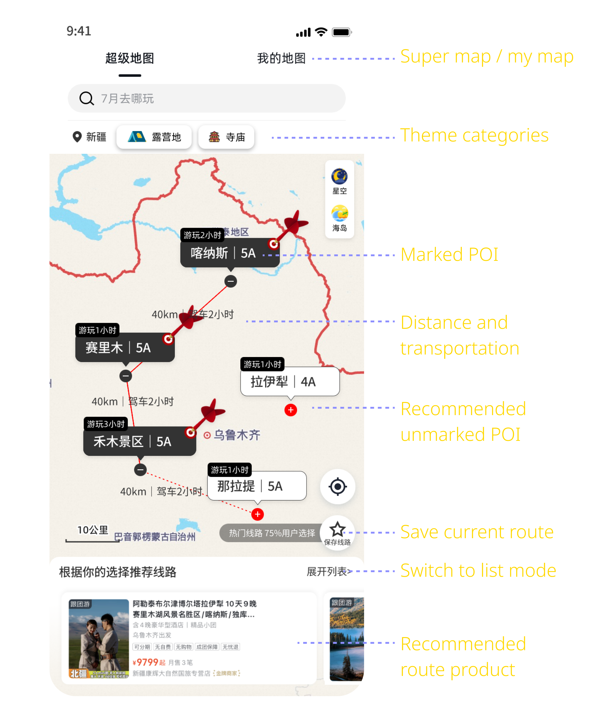

</Col>

</Row>

<Row>

<Col span={3}>

Located in City Level

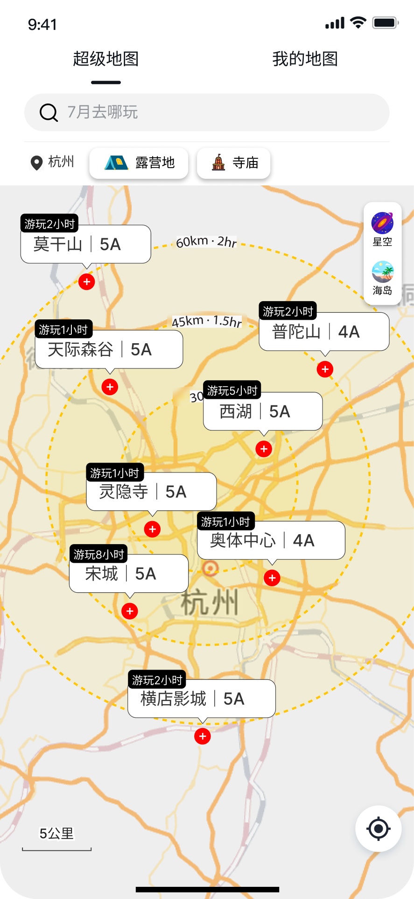

</Col>

<Col span={3}>

Zoom out to Country Level

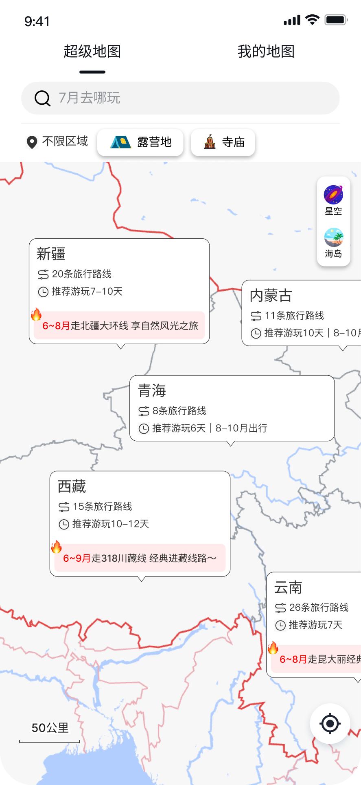

</Col>

<Col span={6}>

#### Different Level of Information

The “super map” begins with popular scenic spots based on the current location. As users zoom out for a wider view, the interface seamlessly transitions to display recommended routes on cards.

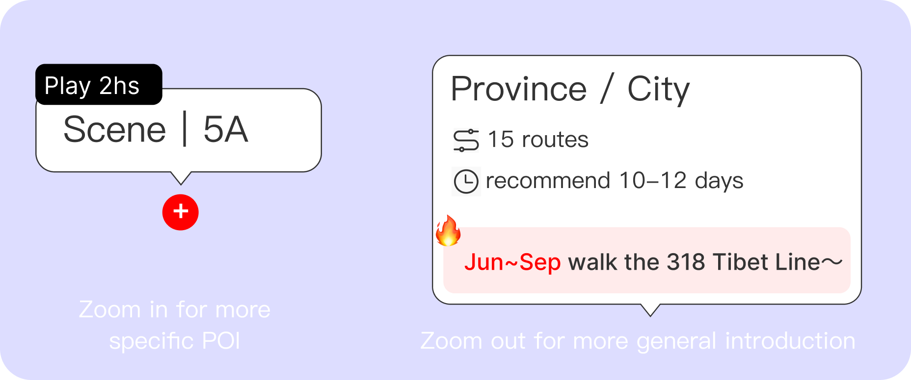

</Col>

</Row>

<Row>

<Col span={3}>

#### Personal File for Customization

My Map' functions as a dedicated save folder, allowing users to plan their itineraries by exclusively displaying scenic spots and hotels of their chosen interest.

</Col>

<Col span={3}>

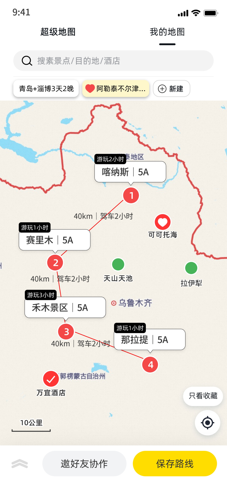

</Col>

<Col span={3}>

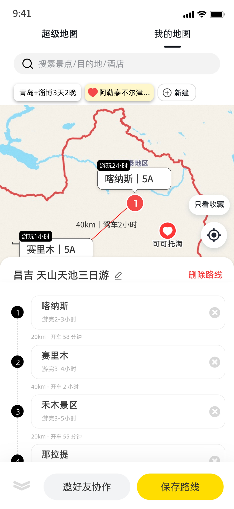

</Col>

<Col span={3}>

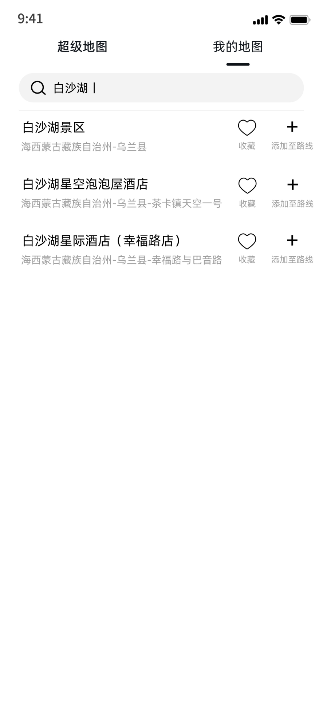

</Col>

</Row>

### Theme-based

Maps feature distinct sections: a promotion part based on overall ranking and a theme part reflecting popular trends. Users can easily switch between these sections using theme tags, starting from their current location.

<Row>

<Col span={6}>

#### 01. General - Promotion Based on Ranking

The general map indicates locations that are 30 km, 45 km, and 60 km away from the current position. Various card types are used to display different sorts of scenery, itineraries, and accommodations based on their popularity.

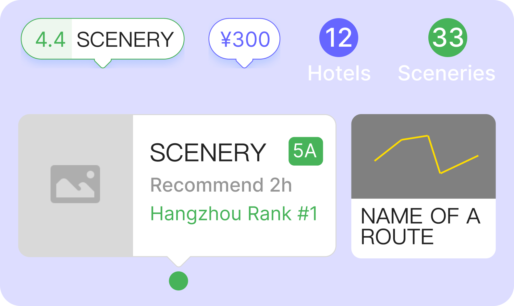

</Col>

<Col span={6}>

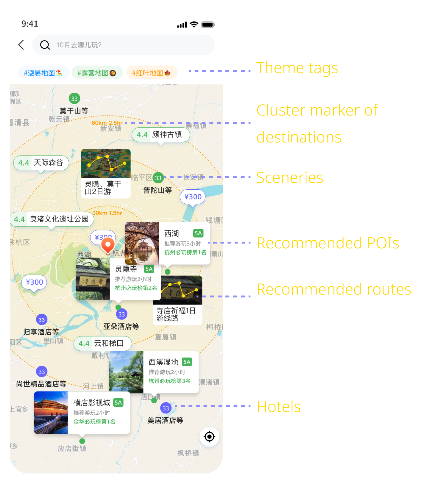

</Col>

</Row>

<Row>

<Col span={10}>

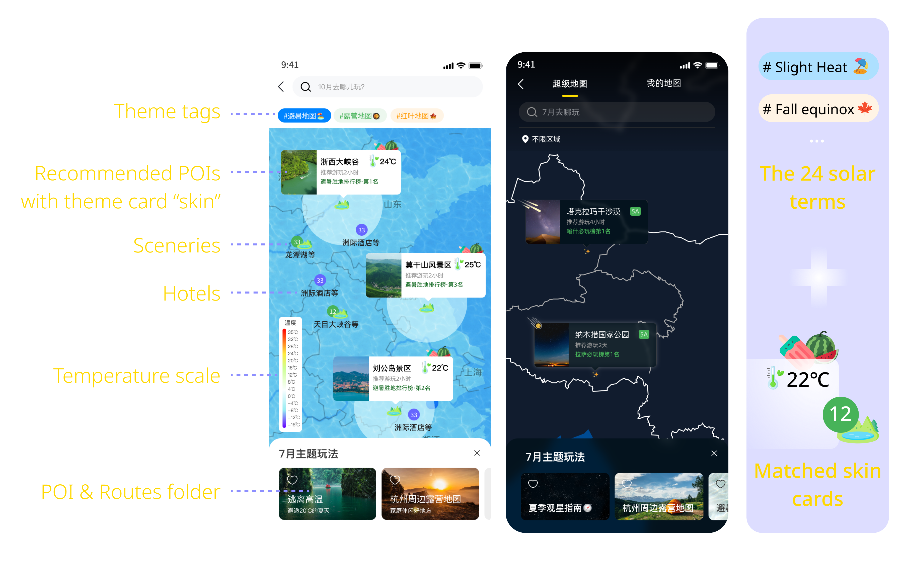

</Col>

<Col span={2}>

#### 02. Theme Skin Card

Maps and cards will alter their appearance depending on the content when theme tags are entered. The summer cool map, for example, will have water on it and be arranged according to temperature.

</Col>

</Row>

### Team Evaluation

We struggled to decide on the initial design draft for the launch date of August 30. There was iteration in the solution between theme-based and function-based approaches. The PM team chose to add this functionality for route product first in order to ensure that it satisfies the fundamental business goal of raising turnover rate. At that time, it was the best way to reduce costs and eliminate risk.

<Grid cols={3}>

<Cell bg="rgba(255, 255, 255, 0.1)">

#### Super Map

How to keep user rentention?

</Cell>

<Cell bg="rgba(141, 143, 255, 0.3)">

#### Function - Based

?

</Cell>

<Cell bg="rgba(141, 143, 255, 0.3)">

#### Theme - Based

</Cell>

<Cell bg="rgba(255, 255, 255, 0.1)">

#### Content Driven

Where the content from?

</Cell>

<Cell>

#### Pros

\- Functions meet users’ demands - Build upon existance

</Cell>

<Cell>

#### Pros

\- Immersive visual experience - Differentiate from our competitors

</Cell>

<Cell bg="rgba(141, 143, 255, 0.4)">

#### Route Product

Data Visulization

</Cell>

<Cell>

#### Cons

\- Lack of creativity - Distinguishing Minutely from others - New entry

</Cell>

<Cell>

#### Cons

\- Highly reley on content (High labor cost) - Hard to meet business goals

</Cell>

<Cell bg="rgba(255, 255, 255, 0.1)">

#### Smart Tool

How to change user habits?

</Cell>

</Grid>

### Revision - Redefine Mission

After discussions with the entire team and PM, we have confirmed the detailed product direction, which is emphasizing on functionality, but with a smart integration with theme-based creativity.

<Grid cols={3}>

<Cell bg="#ffd800">

<Quote>

An "super map" that assists people make more detailed travel plan efficiently and collaboratively

</Quote>

</Cell>

<Cell>

</Cell>

<Cell>

</Cell>

<Cell>

</Cell>

<Cell bg="rgba(141, 143, 255, 0.3)">

Preserving some theme-based features within the map

</Cell>

<Cell bg="rgba(141, 143, 255, 0.3)">

Emphasizing on visualizing routes and route planning

</Cell>

<Cell bg="rgba(141, 143, 255, 0.3)">

Allowing travel planning customization and team collaboration

</Cell>

</Grid>

The user flow of the updated design was overseen by other members as my role in this project is mostly centered on visual representation. Additionally, I was executing rather than designing for the remainder of this "Route Map" project due to time management issues with the career website project having a greater priority at the same time.

[Back to See Final Design](#product)

<Divider id="conclusion">💡Conclusions</Divider>

### Reflections

Engaging in four distinct projects at Alibaba-Fliggy design team during the summer of 2023, I gained a profound appreciation for the transition from student-oriented thinking to a professional mindset. This experience has enhanced my proficiency in effectively applying creativity to achieve business objectives as a UX designer.

<Grid cols={2}>

<Cell>

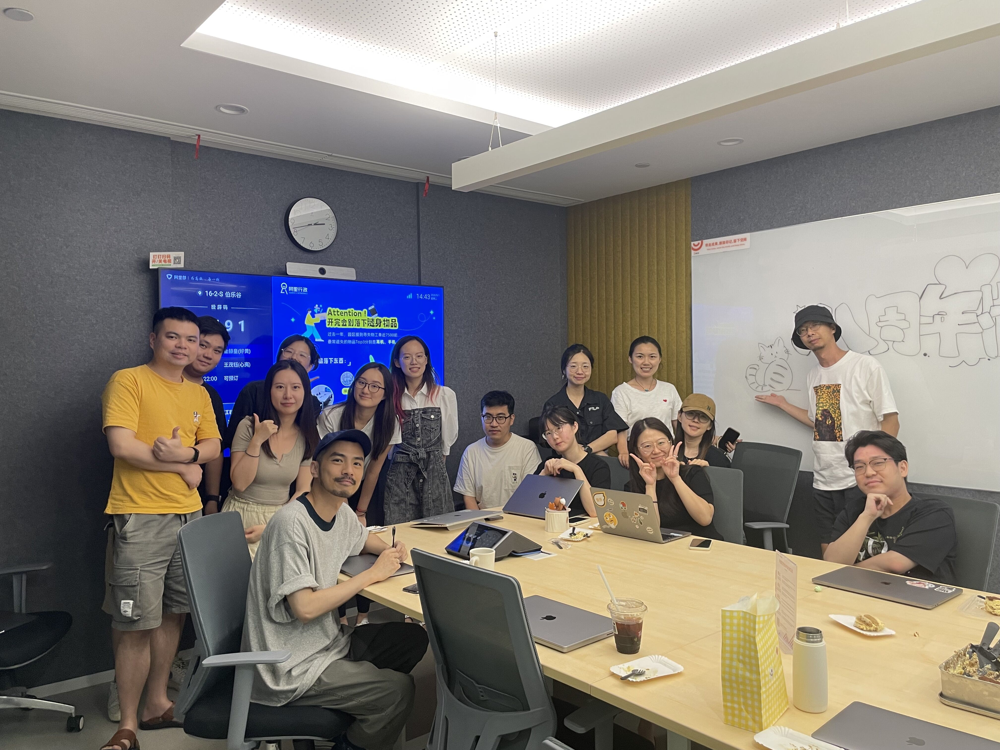

</Cell>

<Cell>

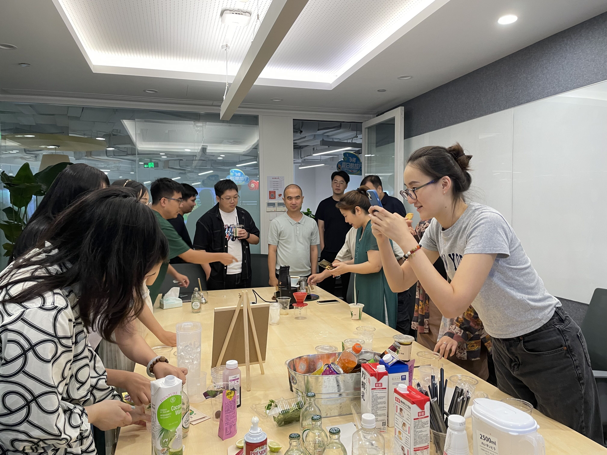

</Cell>

<Cell>

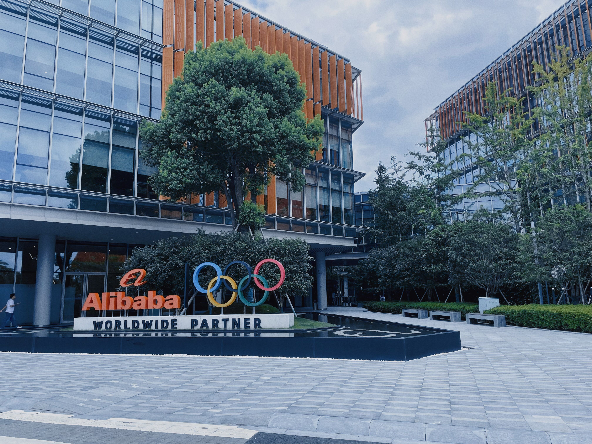

</Cell>

<Cell>

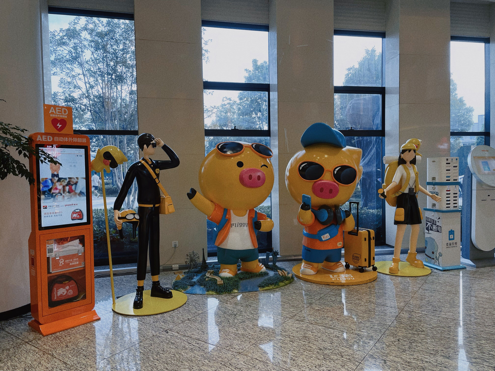

</Cell>

</Grid>

### Challenges I Faced

<Row>

<Col span={6}>

#### Lots of Uncertainty

Throughout the entire process, we had an undefined user group, a wide variety of functions we wanted to add, and changes in metrics. Continuous adaptation was required to navigate changing user expectations and factors. This iterative method, although difficult at times, was helpful in strengthening my abilities, building resilience, and accepting uncertainty as a necessary part of the design process.

</Col>

<Col span={6}>

#### Complex Content

Since this project has to build upon existing features and journey of discover POIs is long that fulfilled with abundant information, distilling this complexity into user-friendly interfaces required strategic thinking. This task made me realize how important accuracy and clarity are, and it helped me approach content architecture from a methodical yet artistic perspective.

</Col>

</Row>

### Key Takeaways

<Row>

<Col span={4}>

#### Business & Design Metrics

The mutually beneficial interaction between business and design metrics is a crucial lesson to be learned from this project. By coordinating design choices with broad business goals, I discovered how to use metrics as a foundation. This methodology not only enabled well-informed design decisions but also highlighted the strategic significance of design in accomplishing quantifiable business objectives.

</Col>

<Col span={4}>

#### Problem to Solution vs. Solution Driven Method

This project started with a predetermined solution, which is different from usual project paradigms where problem discovery kickstarts the design process. The switch from list to map display was a purposeful beginning. This non-traditional approach to incremental design works better than other projects I worked on at Fliggy since it focused on improving and expanding the tested solution into new domains.

</Col>

<Col span={4}>

#### Structured Communication

Clearly defined prototypes become the means of expressing, honing, and coordinating concepts with broad goals. This technique of structured communication was helpful in driving project in addition to helping team members develop a common understanding. Prototype-based iterative conversations became a key component of productive teamwork, encouraging consensus-building and, eventually, the achievement of clearly stated project goals.

</Col>

</Row>
