<Lead color="#333333">A product that informs & eases houseplant care while fostering emotional connection for frequent travelers.</Lead>

<MetaGrid>

<Meta label="Timeline">

02/2024 - 05/2024

</Meta>

<Meta label="Role">

Design research UX design Product design

</Meta>

<Meta label="Team">

Ivy (Xinzhu) Wang - Designer Aquila Simmons -Engineer Pagie Forester - Engineer Asha Wills - Product Manager Danaé Hirsch - Product Manager Hiro Ogasawara - Researcher

</Meta>

<Meta label="Tools">

</Meta>

</MetaGrid>

### Overview

<Row>

<Col span={7}>

Our Nimbus plant sensor and app revolutionize plant care by integrating real-time insights, expert knowledge, and a delightful gamified app experience, to help foster emotional bonds. We want to create a interactive product for plant enthusiasts and frequent traveler to (1) monitor plant health; (2) provide reliable information; (3) foster emotional connections.

The project was formed by 7 students from Industrial Design @ RISD, MBA @ MIT, and Mechanical Engineering @ MIT. It was a 10 week product & design development challenge by executing Agile Development (Scrum). The project was successfully chosen to present at final and won first place at the end of the course.

</Col>

<Col span={5}>

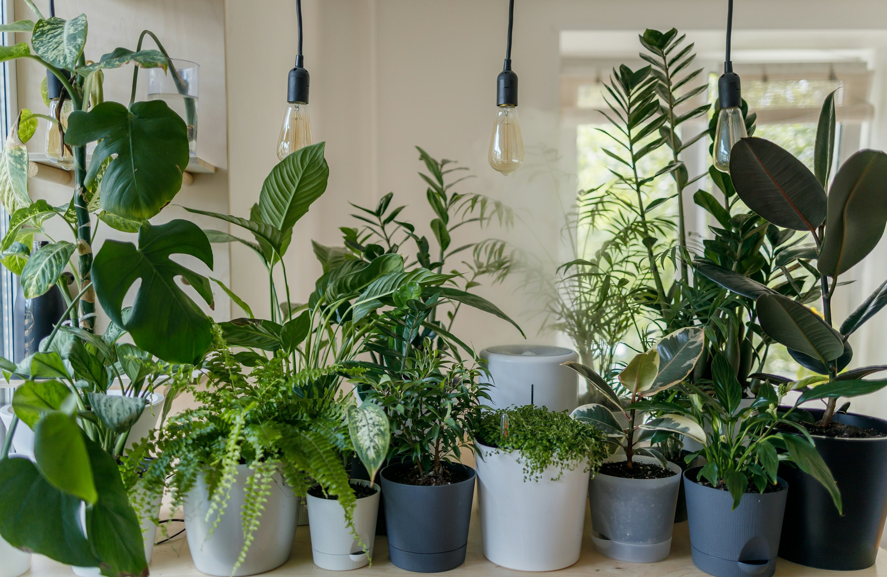

</Col>

</Row>

<Divider id="main-feature">📱 Main Features</Divider>

<YouTube id="6HoKMjBOA1c" />

<Row>

<Col span={9}>

<YouTube id="yORPjb8DEr4" />

</Col>

<Col span={3}>

### Hardware

#### Moisture & Sunlight

There are panels above both plants and they are measuring WETNESS in the first column, LIGHTLEVEL in the second column. We are using Adafruit's Dev Board and senosrs.

</Col>

</Row>

<Row>

<Col span={3}>

### Software

#### Gamification

The app connects with the sensor, has design features: (1) real-time notification (2) ability to co-parent (3) historical log (4) games and rewards (5) specific care information

</Col>

<Col span={9}>

<YouTube id="8o8fvLgZgxQ" />

</Col>

</Row>

<Row>

<Col span={9}>

<YouTube id="RxV408jF1c4" />

</Col>

<Col span={3}>

### Usability

#### Hearing what users say

We were constantly reach out to targeted users for feedback. Let's hear what they say for the final MVP prototype we have here.

</Col>

</Row>

<Divider id="background">👋 Background</Divider>

### Product Design Development

<Row>

<Col span={4}>

In this multi-faculty collaboration, 80 students from MIT & RISD were randomly paired into 11 teams, aiming to complete the development of the selected product MVP within 10 weeks.

</Col>

<Col span={8}>

<Grid cols={4}>

<Member name="Aquila Simmons">

MS MechE @ MIT Mechanical Engineer

</Member>

<Member name="Danaé Hirsch">

MBA @ MIT Product Manager

</Member>

<Member name="Selina Guo">

ID @ RISD Product Designer

</Member>

<Member name="Hiro Ogasawara">

MS SDM @ MIT Product Manager

</Member>

<Member name="Paige Forester">

MS MechE @ MIT Mechanical Engineer

</Member>

<Member name="Asha Wills">

MBA @ MIT Product Manager

</Member>

<Member name="Ivy Wang">

ID @ RISD Product Designer

</Member>

<Member name="Carrie Deline">

MS SDM @ MIT Teaching Assistant

</Member>

</Grid>

</Col>

</Row>

### Agile Development & Timeline

<Row>

<Col span={8}>

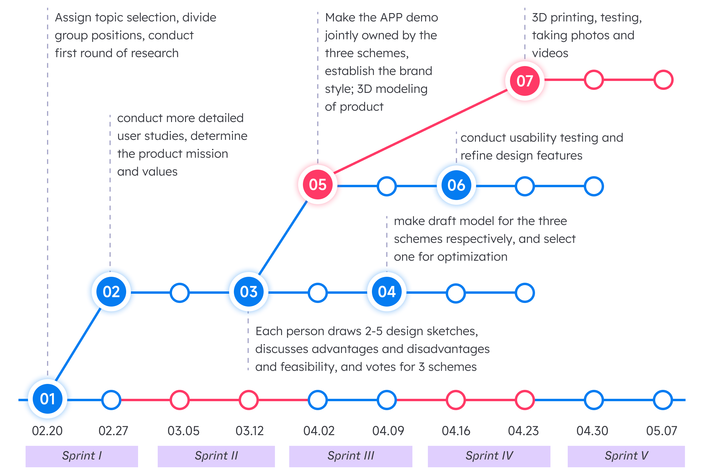

</Col>

<Col span={4}>

This project employs Agile methodology (scrum), utilizing early testing and decision vetoing to minimize rework and enable the team to achieve more with fewer resources.

</Col>

</Row>

<Divider id="Research">🔍 Research</Divider>

### Original Prompt : Better houseplant care during absences

<Box bg="rgba(217, 217, 217, 0.3)">

Many individuals who travel frequently struggle to care for their home plants, leading to neglect and often plant loss. About 66% american family have houseplants but most of them can’t survive their natural life expectancy. Existing solutions like self-watering pots or plant-tracking apps have limitations in terms of efficiency, cost, or accessibility. How to ensure the well-being of indoor plants during extended absences? Initial users to engage with could include frequent travelers, apartment dwellers with limited time for plant care, and individuals interested in sustainable living but lacking related experience.

</Box>

### Target Market - Is it Real?

<Row>

<Col span={4}>

#### Primary Market: Millennials

House plant ownership rose by 50% in last 5 years Millennials account for 37% the demographic 62% Millennials prioritize travel & personal experience

</Col>

<Col span={4}>

#### Secondary Market: Busy Homeowners

$1.7 Billion used for gardening supplies Modern family tend to travel more frquently

</Col>

<Col span={4}>

#### Need: Better Gardening Solution

Automated care Customizable settings for varied plants Simple to set up

</Col>

</Row>

### Benchmarking - Can We Win?

<Row>

<Col span={3}>

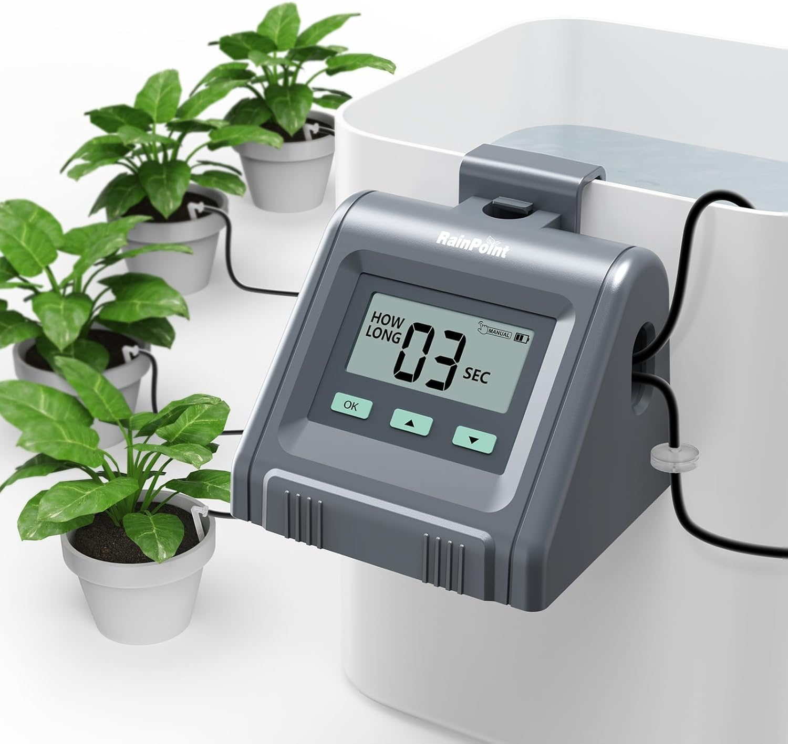

</Col>

<Col span={9}>

#### Existing Product: Automatic Watering System by RAINPOINT

1\. ‘Programmable’ and can set time and frequency of watering 2. Can water 15 pots at the same time 3. Customizable & able to connect to smartphone 4. $40 on Amazon (basic version)

</Col>

</Row>

<Row>

<Col span={6}>

#### Needs Addressed: Automated Home Gardening

1\. Can water plants automatically 2. Users can get data via smartphone 3. Simple/Easy to setup and use 4. Can address multiple pots at the same time 5. Not aesthetically pleasing

</Col>

<Col span={6}>

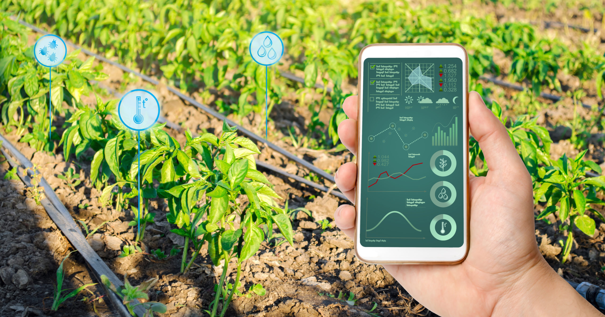

</Col>

</Row>

### Assessment - Is it worth it?

<Row>

<Col span={6}>

#### Potential Improvement 1

1\. Sensors checking the plant condition 2. Watering based on plant condition (humidity) instead of simple timer base 3. User feedback based on plant data is needed

</Col>

<Col span={6}>

#### Potential Improvement 2

1\. Customizable function to receive more detailed information for users to analyze data 2. Better user interface with mobile connection 3. Adding function to 'override' default settings via phone

</Col>

</Row>

### User Research

<Row>

<Col span={4}>

#### Quantitative research: Survey & Market Analysis

Many individuals who travel frequently struggle to care for their home plants, leading to neglect and often plant loss. About 66% american family have houseplants but most of them can’t survive their natural life expectancy.

</Col>

<Col span={8}>

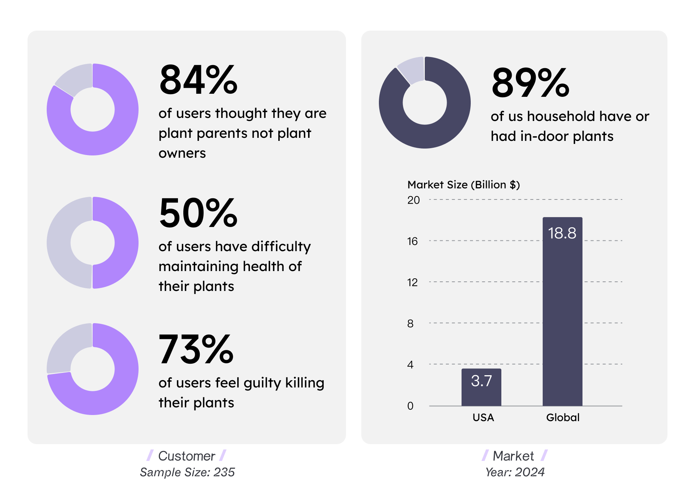

</Col>

</Row>

#### User Interview Quotes about Pain Points & Needs

We selected 6 participants from the survey that have 3-5 indoor plants, reported having difficult maintaining health level about their plants, and had motivation to utilize technology to improve. We've collected the most common pain points and needs from those interviews.

<Box bg="rgba(217, 217, 217, 0.3)" accent="#333333">

<Row>

<Col span={1}>

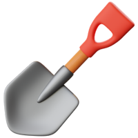

</Col>

<Col span={11}>

<Text as="h4" weight={400}>" I want something that takes the guesswork out of watering and ensures that my plants receive the right amount of water at the right time. "</Text>

</Col>

</Row>

<Row>

<Col span={1}>

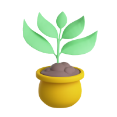

</Col>

<Col span={11}>

<Text as="h4" weight={400}>" I have pets and, whenever I travel, I ask the pet sitter to also water the plants. The difficulty is in knowing whether or not they followed instructions."</Text>

</Col>

</Row>

<Row>

<Col span={1}>

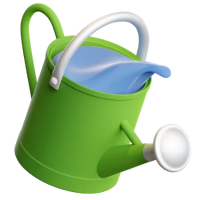

</Col>

<Col span={11}>

<Text as="h4" weight={400}>" I just have a lot going on. I love my plants, but I sometimes forget to water them. Or sometimes, I forget that I did water them, and then I overwater them. "</Text>

</Col>

</Row>

<Row>

<Col span={1}>

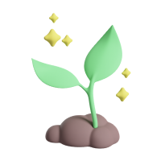

</Col>

<Col span={11}>

<Text as="h4" weight={400}>" Taking care of plants makes me feel peaceful and motherly. Why would I want something \[like a self-watering system\] to do that for me? "</Text>

</Col>

</Row>

</Box>

### Persona

Although we recognize that secondary customers, such as plant enthusiasts or gardeners, also experience challenges in plant care, we have chosen to focus on the category of young professionals. This group represents the primary target in the plant rescue initiative and is the market we can most easily reach out for.

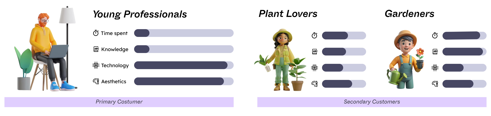

### Competitive Analysis

<Row>

<Col span={7}>

#### The Gardening Tech Market

We conducted research on similar plant monitoring apps, Florasense as a benchmark. From this, we summarized the strengths that could be adopted and the drawbacks that may not be suitable for our product.

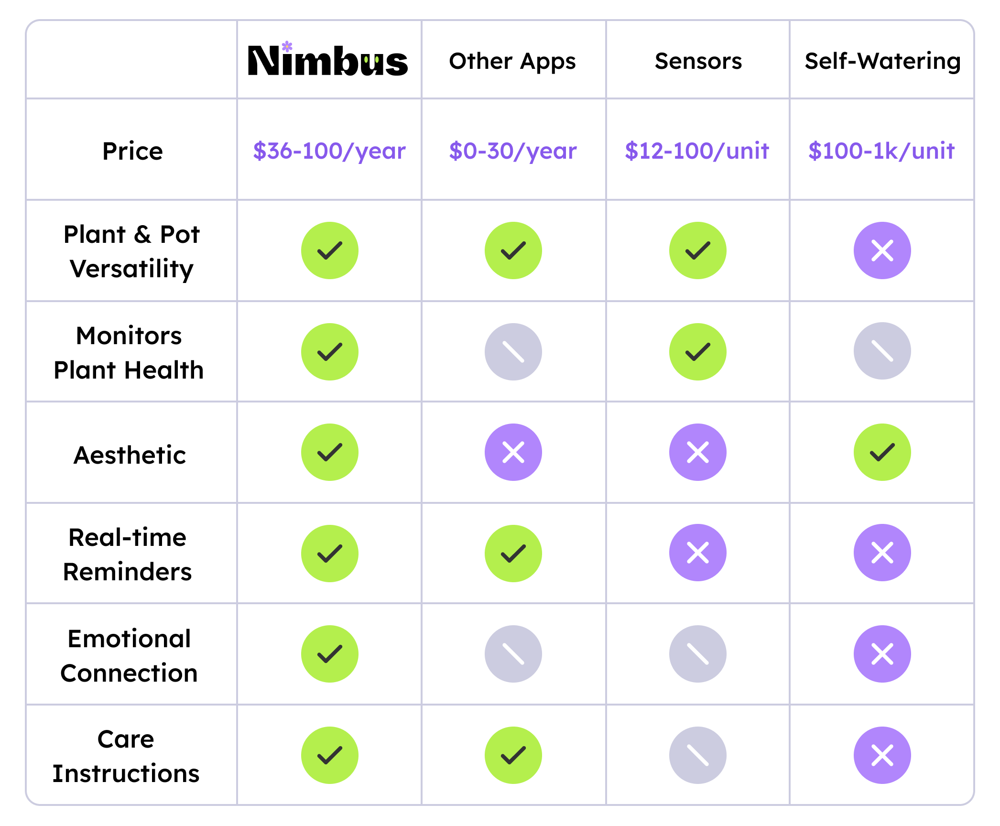

</Col>

<Col span={5}>

#### Interface Design

We conducted research on similar plant monitoring apps, Florasense as a benchmark. From this, we summarized the strengths that could be adopted and the drawbacks that may not be suitable for our product.

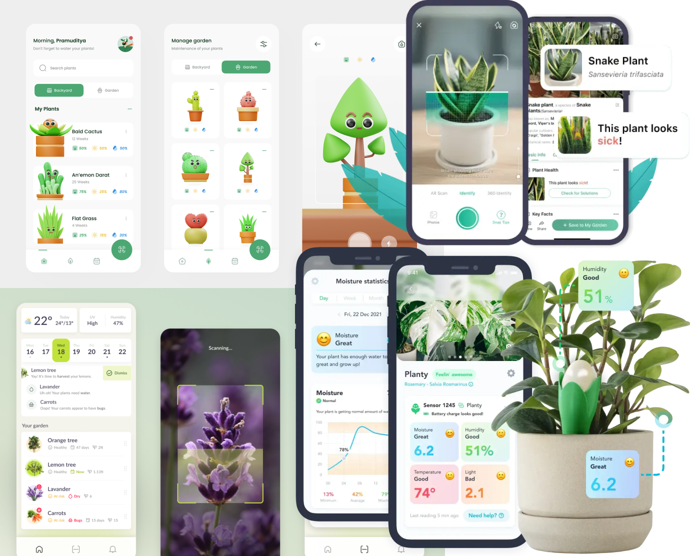

#### Pros

1\. Fresh, nature-inspired colors 2. Clear real-time data 3. AI-powered identification of plant health issues with solutions 4. Interactive engagement with plant avatars

#### Cons

1\. Insufficient connection between sensors and the app 2. Inability to customize plant names 3. Unclear usage of data metrics 4. Lack of machine learning and future predictions

</Col>

</Row>

<Divider id="Define">📌 Define</Divider>

### Design Goal

After conducting user researches, we've realized that having houseplants at home is not only for decorative purposes, it is a sense of accomplishment and maternal love towards non human lives, similar to raise a pet. As a result, we want to focusing on the gap between "frequent death of plants" and "motherhood" aspect as our design goals.

<Row>

<Col span={5}>

<Box bg="#ececf3" hmw>

<Quote size={28} color="#333333">

HMW help plant parents better understand and care for their plants, even while traveling, without sacrificing the “nurturing” aspect of plant ownership?

</Quote>

</Box>

</Col>

<Col span={7}>

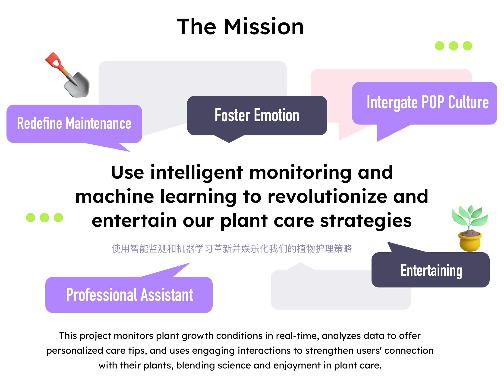

</Col>

</Row>

### Pain Points & Our Solution

I’ve mapped out this hierarchy of pain points and we’ve developed features to solve each problem.

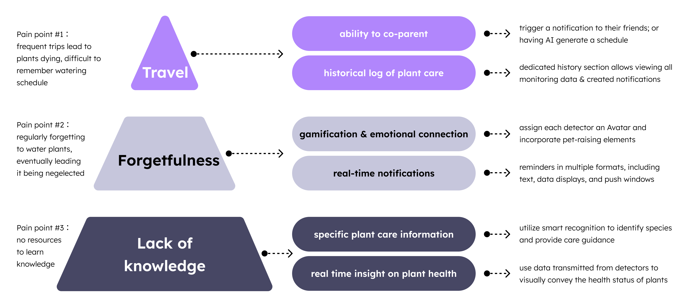

<Divider id="Prototype">🧩 Prototype</Divider>

### User Journey

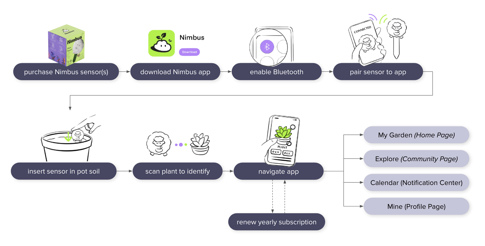

### Branding & Avatar Design

<Row>

<Col span={5}>

The word "Nimbus" carries a sense of airy lightness and playfulness, much like the fluffy clouds in the sky and the common shape of the plant pal design we selected. The name Nimbus encapsulates this playful ethos, while acknowledging the pivotal role clouds play in nurturing our green pals.

</Col>

<Col span={7}>

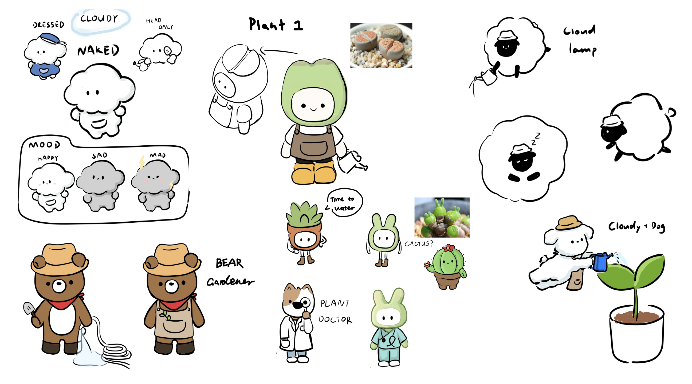

We designed several nimbus shell in shape of cute characters, and finally moved on with cloud animals to match the style of fluffy clouds with companionship.

</Col>

</Row>

### Low-fi Prototype & User Feedback

The low-fi prototype is focusing on the structure of delivering information. After making the following pages, we did a quick formative usability study with the same 6 participants that we interviewed at user research section.

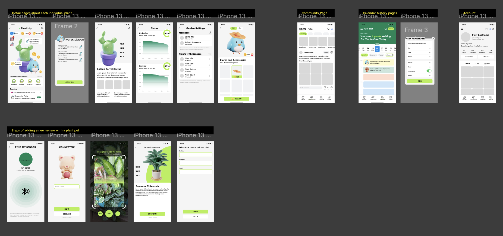

The main usability issues can be categorized as:

<Row>

<Col span={3}>

#### Inconsistent UI style with too many colors

In order to create a garden atmosphere, too many colors were used in the design, and the style of the icon was not uniform, which made users feel too dazzled.

</Col>

<Col span={3}>

#### Graphs not match real world cases

Given that each plant has different water and sun requirements, using percentages as a cue still doesn't solve the problem of "not knowing when to water".

</Col>

<Col span={3}>

#### Limitation on cooperative functions

We inappropriately assumed that all users would voluntarily join the ranks of "download app to co-care", but ignored the existence of "friends who are afraid of trouble", thus making the in-app reminders to friends useless.

</Col>

<Col span={3}>

#### Lack of help and relative documentations

Another major pain point of plant care is "hard to find right helps when it looks unhealthy". Lack of instructions limit the affordance of such smart technologies.

</Col>

</Row>

<Divider id="Final-design">🎨 Final Design</Divider>

### 01. On-Boarding

#### Pair Sensors with AI Plant Species Detector

After user creating a new account, they'll enter a "garden" homepage. They can start adding and matching sensors with plants by clicking the "add" button, turning on bluetooth, pairing the sensor, scanning plants, and customizing it. The "garden" homepage will work as a data management page with weather at current location as caring guides.

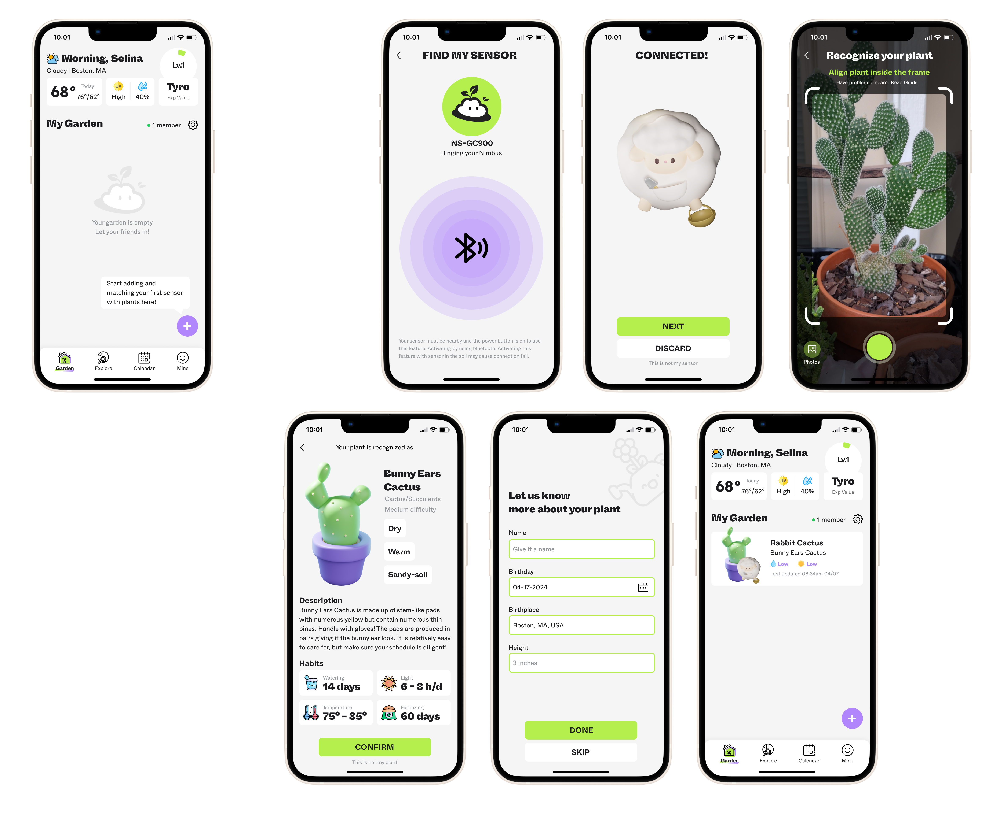

### 02. Detect & Notification

#### Multiply format of notification when sensors detect data in bad range

After entering each "caring" page, it'll display the 3D modeled plant species and sensor pet in a larger scale. The chat bubble represents a detailed notification. Below are statistics and activities. Push notification will be displayed as well.

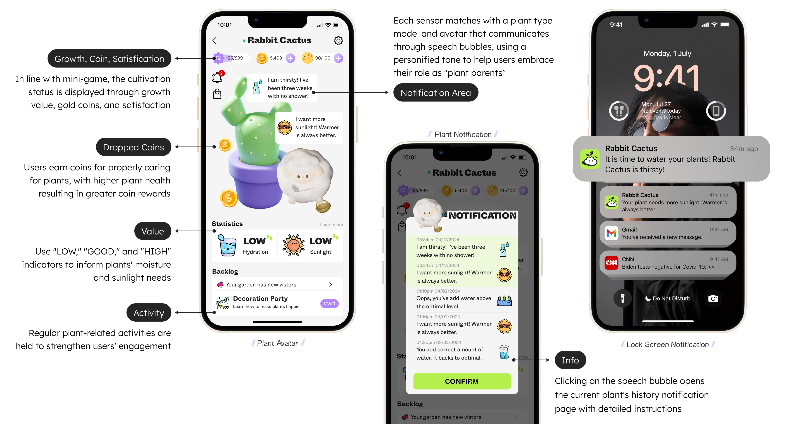

<Row>

<Col span={5}>

### 03. Gamification

#### Collect coins to decorate each avatar

Each sensor pet (i.e. the avatar) are customizable. When users caring the plant in a good level, coins will be dropped and awarded to user. User can use the coins to buy clothes and accessories for decorative and collective purposes.

As shown from the user testing results, this gamification feature really motivate users to check in a daily basis. Overall, it has positive results for user engagement and retention.

</Col>

<Col span={7}>

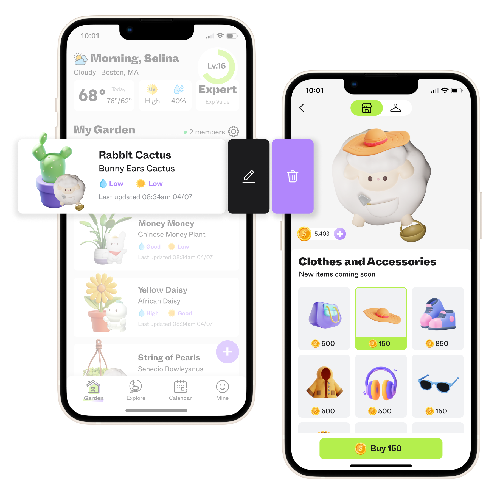

</Col>

</Row>

<Row>

<Col span={7}>

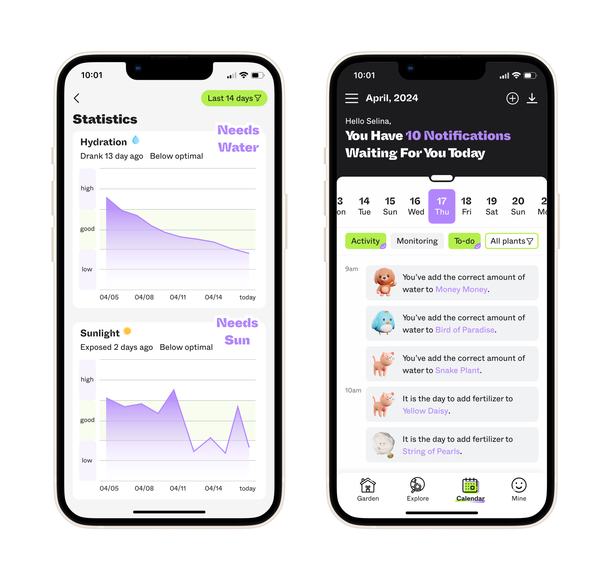

</Col>

<Col span={5}>

### 04. Data Visulization

#### Different Visualization of Statistics

The left is the statistic detail page which was iterated multiple times during testing stage. It finally designed as shown that the y-axis is equally divided to "High""Good""Low". It is intuitive enough for user to understand and reflect on their behaviors with no extra learning cost.

The right is the historical log page which collects all sensor data chronologically.

</Col>

</Row>

<Row>

<Col span={3}>

### 05. Co-Manage

#### Send reminder to friends

The user can either send a reminder message for their friends who also installed the app. Or create an Agenda using the built-in AI suggestion and save as an image for reference.

</Col>

<Col span={9}>

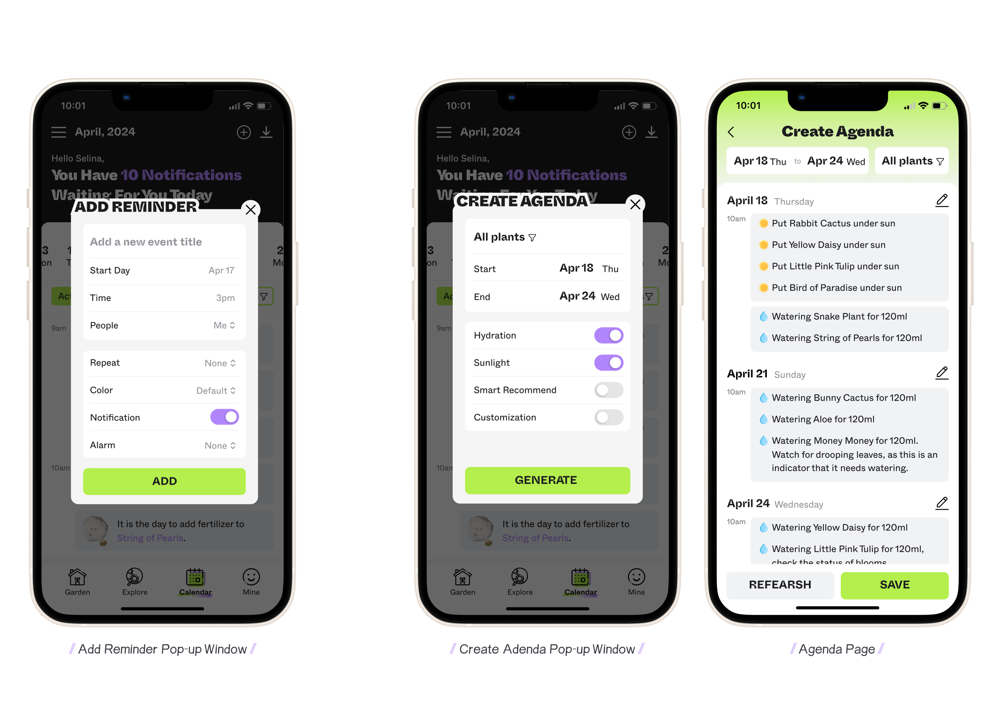

</Col>

</Row>

<Row>

<Col span={8}>

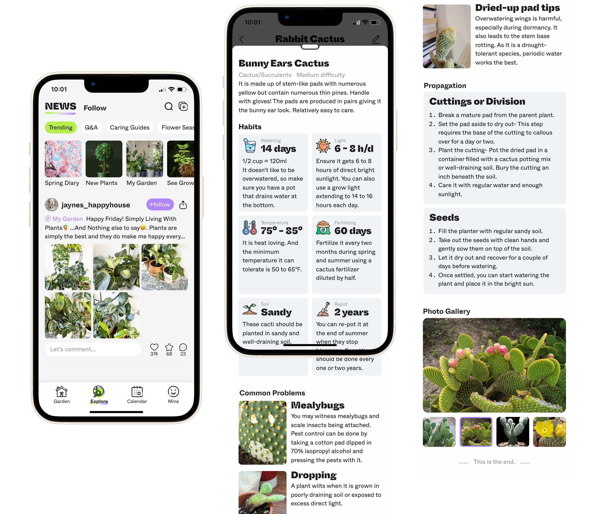

</Col>

<Col span={4}>

### 06. Community

#### To explore

Following the trend of young people’s preference of “socializing” in all kinds of apps, we also built the community for people to explore trends and help each other

For each connected plant, there is also a specific care instruction that has knowledge of habits, common problems, propagation, and photos.

</Col>

</Row>

<Divider id="Market">💰 Market</Divider>

### Membership

#### Bundling Strategy: Encouraging upselling through bundling options

Membership includes access to the Nimbus app, which gives personalized plant-care insights in addition to built-in coaching features and reports. Choose from monthly or annual plans. In order to reduce the sense of "paying extra for the App", we made all the prices to be included with app access and the first Nimbus sensor.

<Box bg="#ececf3">

<Row>

<Col span={4}>

</Col>

<Col span={4}>

</Col>

<Col span={4}>

</Col>

</Row>

</Box>

### Go - To - Market Plan

We considered partnering with garden centers, home improvement stores, and tech retailers, but decided to go with D2C so we could have more control of the end-to-end user experience (from initial brand interaction to post-purchase support) and benefit from larger margins. We want to create a seamless and personalized experience (much like our app). Since we are looking to monetize the data of our users, we are also hoping this approach will allow us to get insights into their preferences, behaviors, and needs (and then be leveraged for product improvements, targeted marketing campaigns, and other strategic decisions).

<Row>

<Col span={8}>

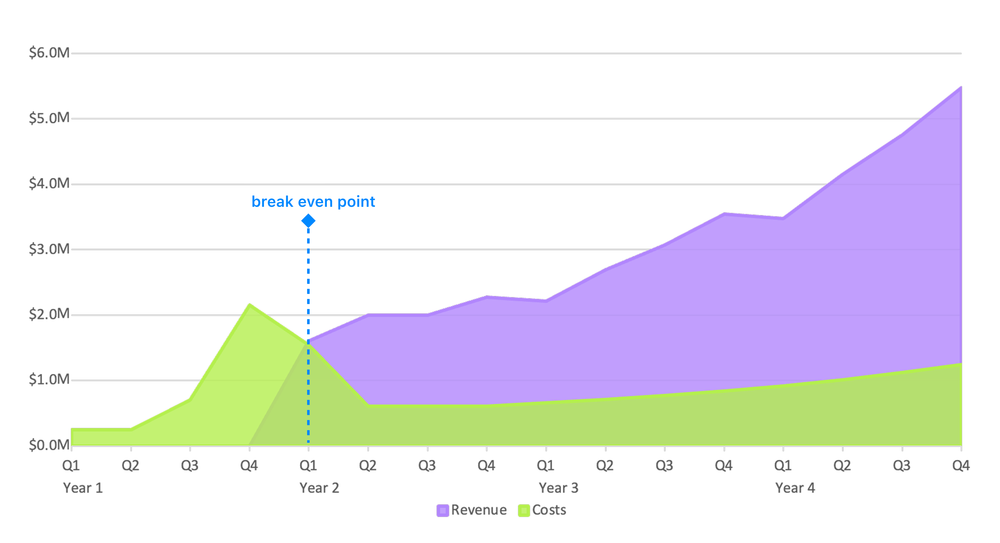

</Col>

<Col span={4}>

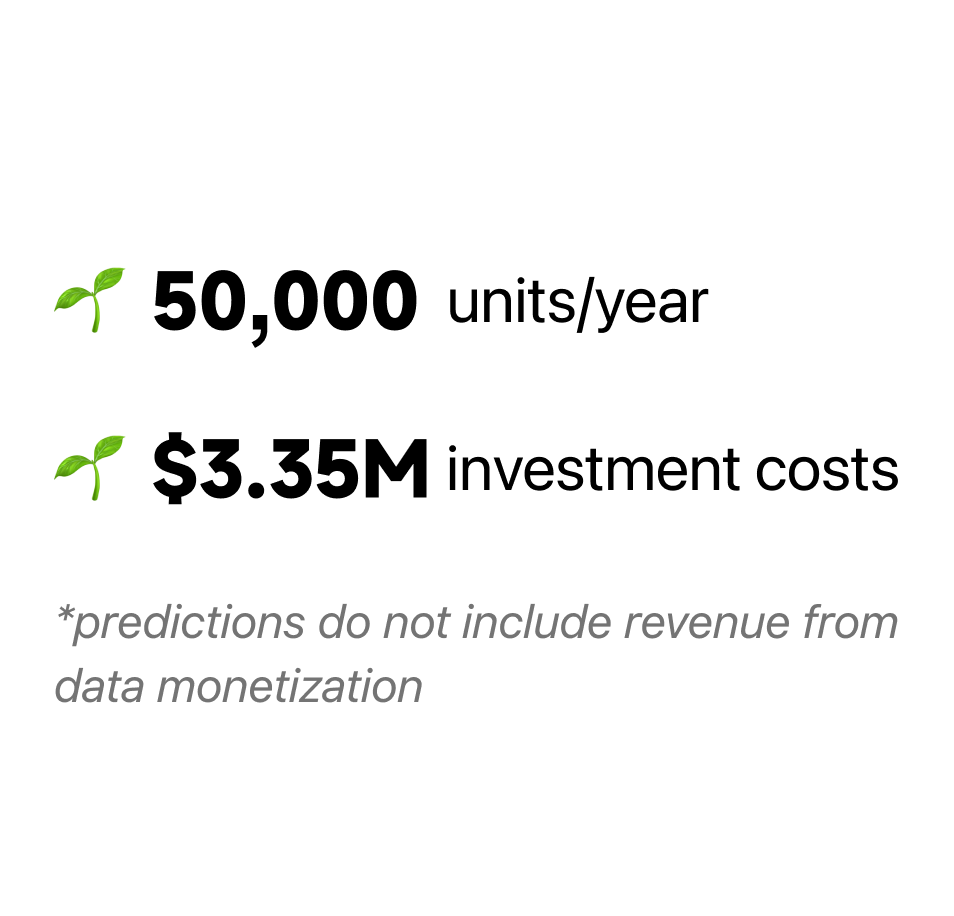

</Col>

</Row>

#### Assumptions

<Row>

<Col span={4}>

Distribution D2C to better capture and monetize user data, and provide end-to-end user experience.

</Col>

<Col span={4}>

Average revenue per customer of $115/year COGS of $20.66/unit

</Col>

<Col span={4}>

Projected sensor production ramp up by 15% every year

</Col>

</Row>

<Divider id="Conclusion">💡 Conclusion</Divider>

### Key Takeaways

<Row>

<Col span={4}>

#### The Value

Designing around certain value to the right targeted users with right targeted market can increase the level of success of a product design.

</Col>

<Col span={4}>

#### Usability Testing

This is the first time I've incorporated an official usability test during prototyping, which unraveled significant issues that help us from a user-centered design.

</Col>

<Col span={4}>

#### Synchronization

Frequent synchronization within small group and large group makes teamwork consistent, especially when multiple sides have to happen at the same time.

</Col>

</Row>
