<Lead color="#c23925">Serendipity Codex is an answer bot for potential C-PTSD patients to mitigate their daily struggles.</Lead>

<MetaGrid>

<Meta label="Timeline">

06/2023 - 08/2023

</Meta>

<Meta label="Role">

Product design UX design

</Meta>

<Meta label="For">

Individual concept project

</Meta>

<Meta label="Tools">

</Meta>

</MetaGrid>

### Overview

<Row>

<Col span={7}>

This is an innovative product designed to help those affected by Complex Post-Traumatic Stress Disorder (C-PTSD) rekindle the love and support they may have missed out on. The delightful, table-top robot features a simple "Answer" button that initiates a five-question dialogue, helping users express their concerns. It then connects users to "The Best Parents' App," a community of experienced parents ready to provide empathetic solutions.

Every parent loves their child deeply, but sometimes they struggle to express it effectively or understand the right methods to offer support. This project aims to bridge this gap by connecting C-PTSD patients with the world's most compassionate parents through a meaningful medium.

</Col>

<Col span={5}>

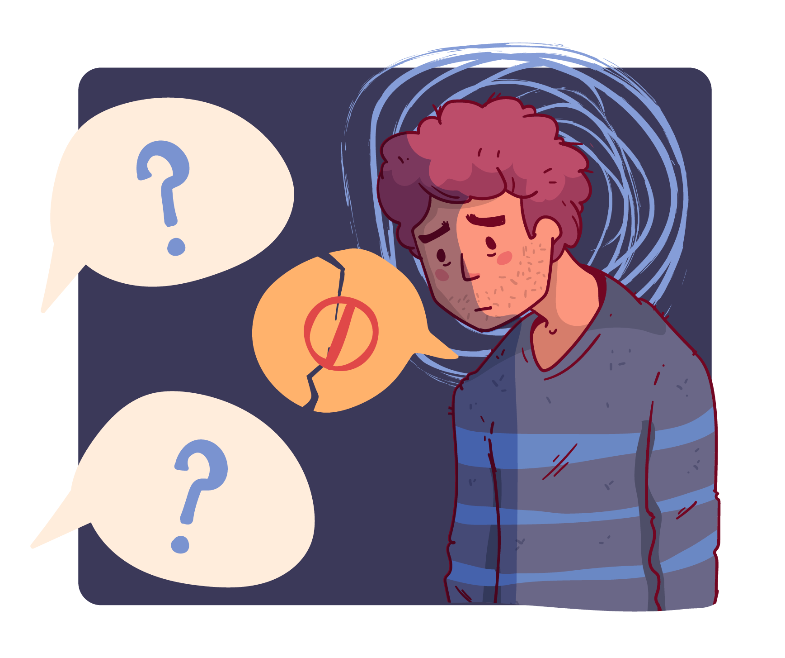

</Col>

</Row>

<Divider id="product">📱Main Features</Divider>

<Row>

<Col span={5}>

### 01. A Cute Bot

#### For Daily Task Healing

Taking on the role of a loyal companion in users' daily lives, the bot resembles a cute robot with adorable little feet. Its screen, masterfully rendered as an amiable face, serves as the entryway for a comforting conversation, its visually appealing and approachable design contributing to the emotional healing process.

</Col>

<Col span={7}>

</Col>

</Row>

<Row>

<Col span={6}>

</Col>

<Col span={6}>

### 02. Diagnosis

#### Answer & Find Therapeutic Method

With the help of five well considered questions, users can embark on a therapeutic exploration that follows a tried-and-true therapeutic approach directly from the parent's App. This allows for a tailored, introspective path toward emotional well-being.

</Col>

</Row>

<Row>

<Col span={6}>

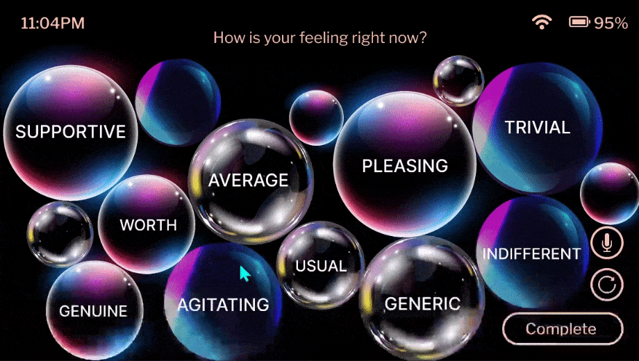

</Col>

<Col span={6}>

### 03. Self-Reflection

#### Record

The interaction form of feedback is by clicking bubbles containing words that can describe current emotion, that word will grow bigger and others will shrink. Or using voice input to record.

</Col>

</Row>

<Row>

<Col span={6}>

### 04. Patient Journal

#### Get an priting receipt

To motivate patients to better implement instructions step by step, each stage will be held and printed accordingly, and they will not be able to start the next one until all stages are fulfilled.

</Col>

<Col span={6}>

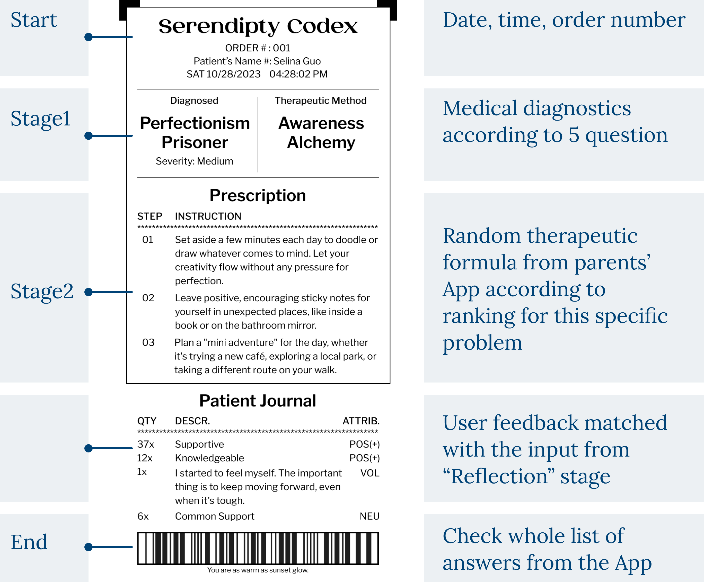

</Col>

</Row>

<Row>

<Col span={3}>

Question Playground

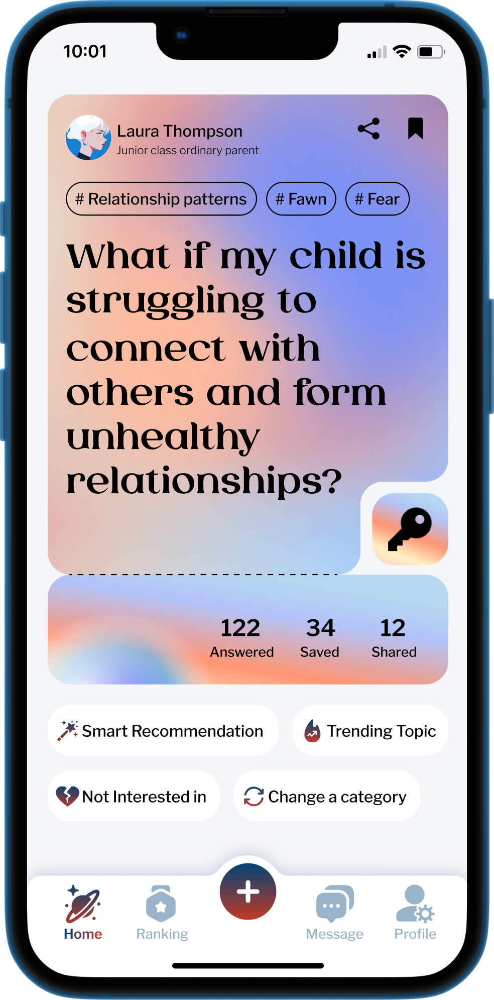

</Col>

<Col span={3}>

New Answer (Empty)

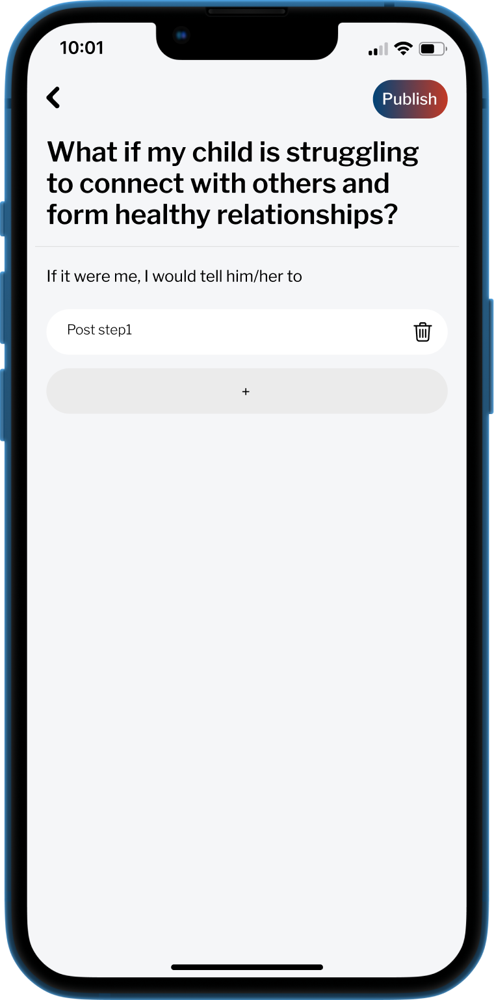

</Col>

<Col span={3}>

New Answer (Step1)

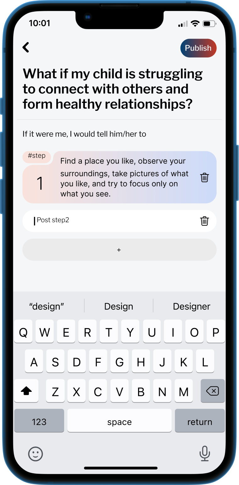

</Col>

<Col span={3}>

### 05. Parents' App - Playground

#### Unlock the withholding answer

The playground encourages diverse responses, withholding access to the list of answers until users have submitted their own opinions.

</Col>

</Row>

<Row>

<Col span={5}>

### 06. Parents' App - Ranking

#### Understand Patients' Needs

The ranking mechanism is intricately linked to the specific responses and their reflections as articulated by the patients.

Users are able to see sepicific answer with its question listed in the "Ranking". And if they have already unlock the question (i.e. provide an answer), they will be able to see the whole list.

</Col>

<Col span={3}>

New Answer (Empty)

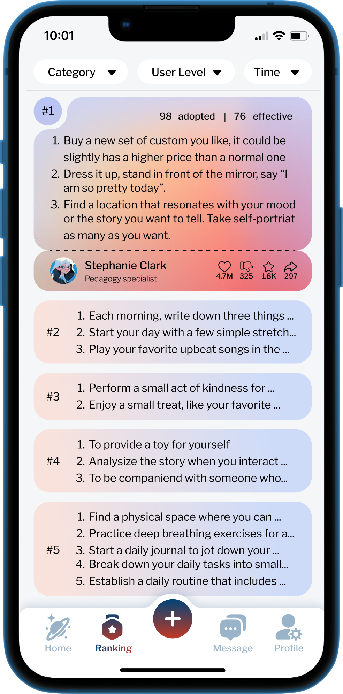

</Col>

<Col span={2}>

See Specific Answer

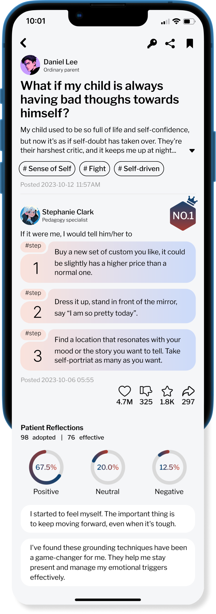

</Col>

<Col span={2}>

See Whole List after Unlocking

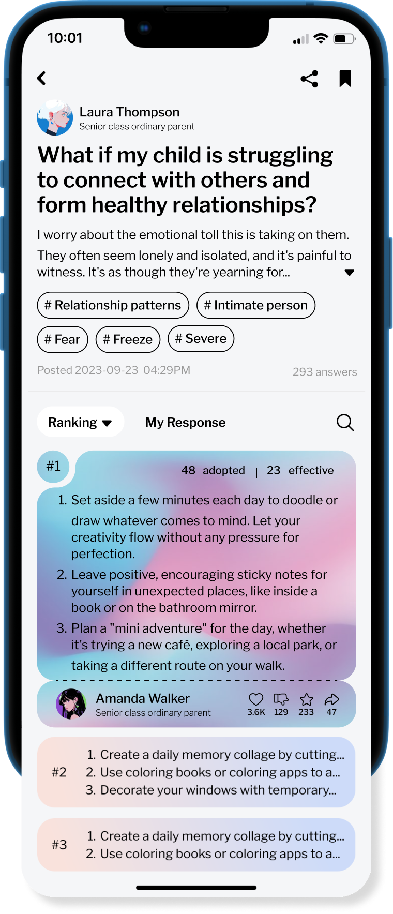

</Col>

</Row>

### 07. Parents' App - Community

#### Share and Communiate

The fostering of a supportive community and the grading system not only facilitate the dissemination of valuable insights and experiences but also afford them an opportunity for self-reflection on their interactions with children.

<Grid cols={5}>

<Cell>

New Question

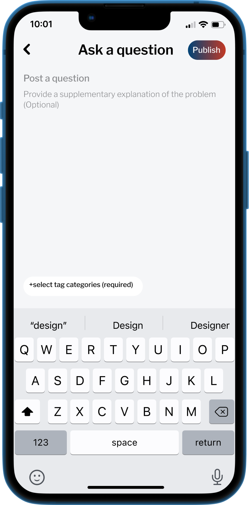

</Cell>

<Cell>

Select Tag

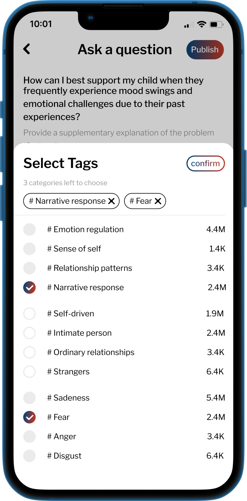

</Cell>

<Cell>

Messages

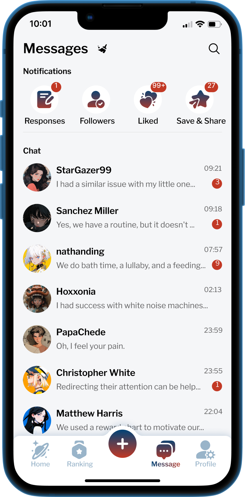

</Cell>

<Cell>

My Profile

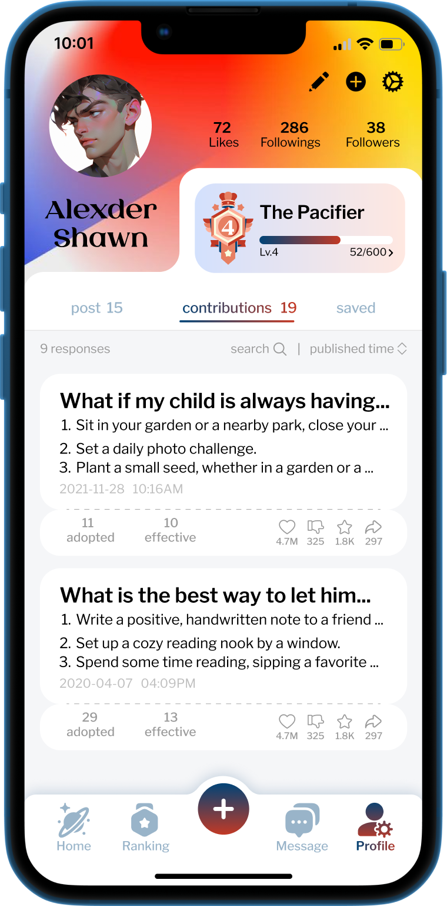

</Cell>

<Cell>

Friend’s Profile

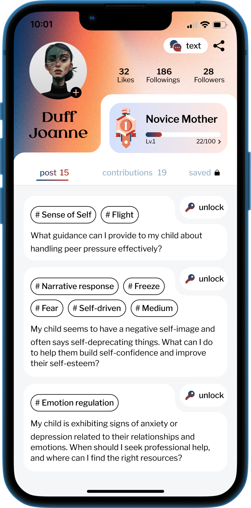

</Cell>

</Grid>

<Divider id="background">👋Background</Divider>

### C-PTSD on Children Who Grew Up In Depressed Education And Family Environment

<Row>

<Col span={7}>

The social anxiety and psychological issues in contemporary young adults do not solely originate from the pressures of life and work. Apart from individuals who deliberately opt for solitude, these concerns may also be intricately linked to the interaction patterns fostered within the suppressive educational culture of China's indigenous families, further compounded by the presence of intergenerational trauma. Consequently, these individuals may already be afflicted with C-PTSD, albeit unbeknownst to themselves.

</Col>

<Col span={5}>

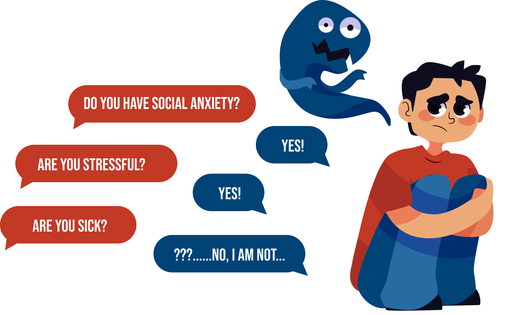

</Col>

</Row>

#### Symptons of C-PTSD

Complex post-traumatic stress disorder (C-PTSD) is caused by ongoing trauma which lasts for months or years and result in borderline personality disorder such as emotional flashbacks, toxic shame, self-abandonment, vicious inner critic, and social anxiety.

### Category - 4F Personality

<Row>

<Col span={3}>

#### Fight ---- "Bully"

Power and control can create safety, assuage abandonment and secure love.

</Col>

<Col span={3}>

#### Flight ---- "Workaholic"

Perfectionist tendency to avoid establishing relationships with others by being busy.

</Col>

<Col span={3}>

#### Freeze ---- "Couch Potato"

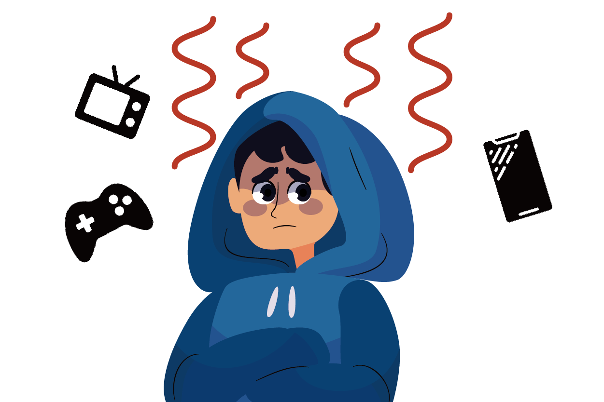

Unconsciously believe that people and danger are synonymous, and that safety lies in solitude.

</Col>

<Col span={3}>

#### Fawn ---- "People Pleaser"

The price of admission to any relationship is the forfeiture of all their needs, rights, preferences and boundaries.

</Col>

</Row>

### Differentiation & Effect

<Grid cols={3}>

<Cell>

#### Low Self-Esteem

Feel worthless and helpless to overcome their troubles or manage their lives, and their self-esteem may be deeply damaged by their past encounters with extreme abuse.

</Cell>

<Cell>

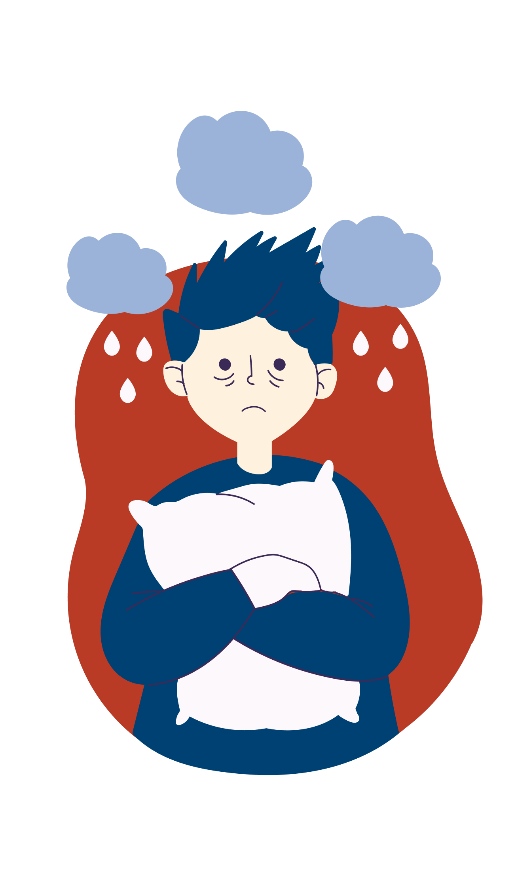

</Cell>

<Cell>

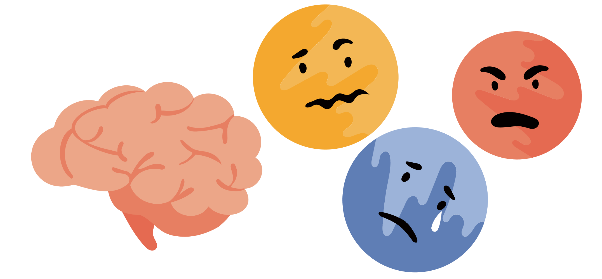

#### Poor Emotional Regulation

Struggle to control their emotions, which are often volatile, fear- or anger-based, and often overwhelming and powerful.

</Cell>

<Cell>

#### Inability to self-argue

Cannot question wrong behaviors, which they tend to listen, agree, and take care of others. It will result in extreme isolation and withdrawal, toxic guilt and shame, chronic mistrust, and dissociation.

</Cell>

</Grid>

### How C-PTSD Formed From Unbeknown Childhood Truma?

<Grid cols={4}>

<Cell>

It begins from

#### 01. Dysfunctional Family

Power and control can create safety, assuage abandonment and secure love.

</Cell>

<Cell>

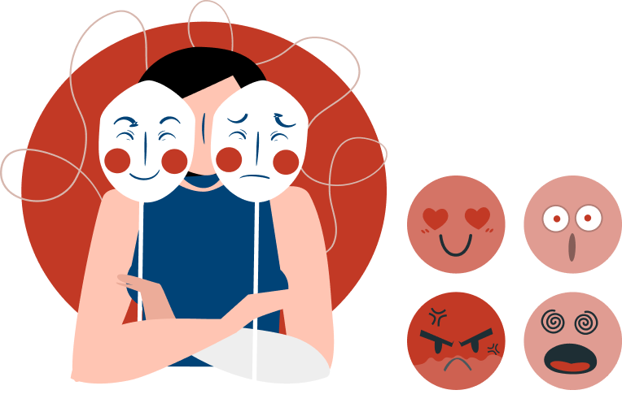

#### 02. Problems of Co-dependency

Children are focused on coping with external family events, leaving them disconnected from their feelings, needs and desires, finally unable to develop a sense of self-esteem.

</Cell>

<Cell>

#### 04. Maliciously Interpreting Neutral Attitude Signals

Defensive behaviors activates the brain's self-protective mode, suddenly perceiving everything as potential threats. The part of the brain responsible for facial recognition tends to view neutral faces as hostile, individuals are becoming more suspicious.

</Cell>

<Cell>

#### 06. Worse Thoughts

Hunger insatiably for love but never feel it is enough.

</Cell>

<Cell>

#### 07. Escape

Consider themselves as friendless; the real world becomes their inner perception, and depression completely prevents them from forming social relationships.

</Cell>

<Cell>

#### 03. Self-criticism

Children in abusive environments may internalize the negative messages and treatment they receive. They begin to believe they are at fault for the abuse or that they are inherently flawed.

</Cell>

<Cell>

#### 05. Negative Interaction Patterns

Focus on bad interactions and withdraw from social circles, treat others by following their parents’ aggressive behavior.

</Cell>

<Cell>

### And Finally...  EXTREME ISOLATION & AVOIDANCE

</Cell>

</Grid>

### Conclusion

#### An environment of repressive parenting

Chinese educational culture has been criticized for its tendency to emphasize competition, pressure, and utilitarianism, those repressive parenting behaviors are one of the main factors leading to the susceptibility of children to CPTSD in adulthood.

#### But ...

However, I have always believed that there are no parents in the world who do not love their children; they simply use inappropriate methods and may not immediately recognize their mistakes.

<Divider id="analysis">🔬Analysis</Divider>

### Potential Patients Who Have Grown Up

The target users are those people suffered from wounded childhood without correct diagnosis and treatment. Although it's frequently stated that unhappy people need a lifetime to heal from their upbringing, is there any way to assist them avoid problems sooner?

<Row>

<Col span={4}>

#### Diagnosis

It is not important to know they are diagnosed as CPTSD patients due to

1\. Heavy psychological burden to gain an illness 2. Difficulty of diagnose medically 3. Low inclusion that the society does not allow people to be sick

</Col>

<Col span={2}>

</Col>

<Col span={4}>

#### Mitigate

But it is important for those potential patients to

1\. Downplay the pain of the flashbacks 2. Reduce the somatic effects of psychological problems 3. Change the character flaws that developed during an unhealthy upbringing

</Col>

<Col span={2}>

</Col>

</Row>

### Interviews

The interview session serves as a vital exploration of personal narratives, revealing the intricate layers of trauma's impact and recovery journey. Through these interviews of potential CPTSD patients (undiagnosed), I had a profound understanding of fostering empathy, the resilience and strength of survivors, and the pain points and needs during their personal recover journey.

<Row>

<Col span={4}>

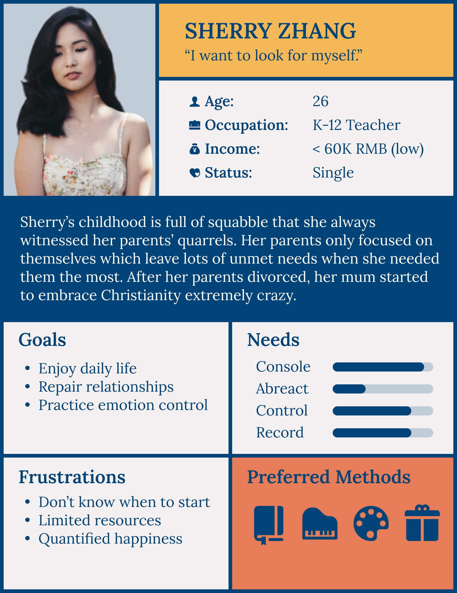

</Col>

<Col span={4}>

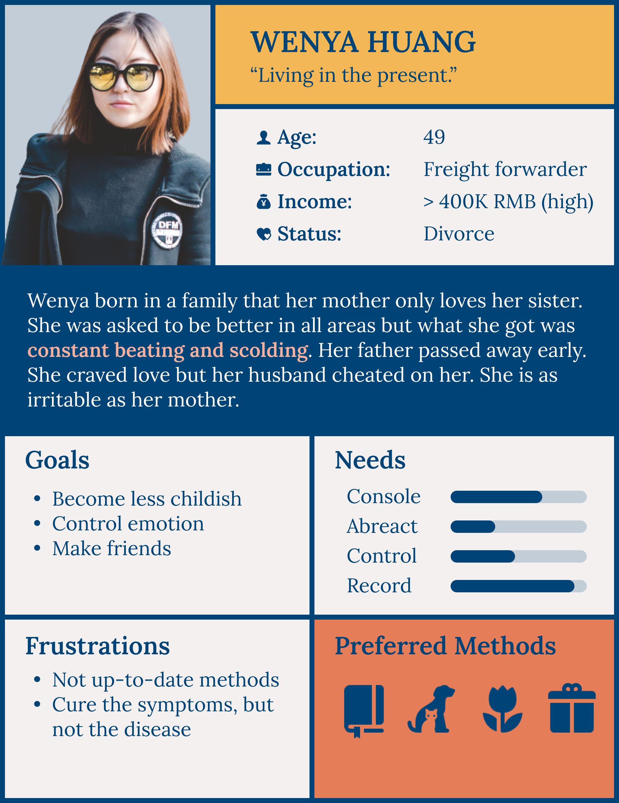

</Col>

<Col span={4}>

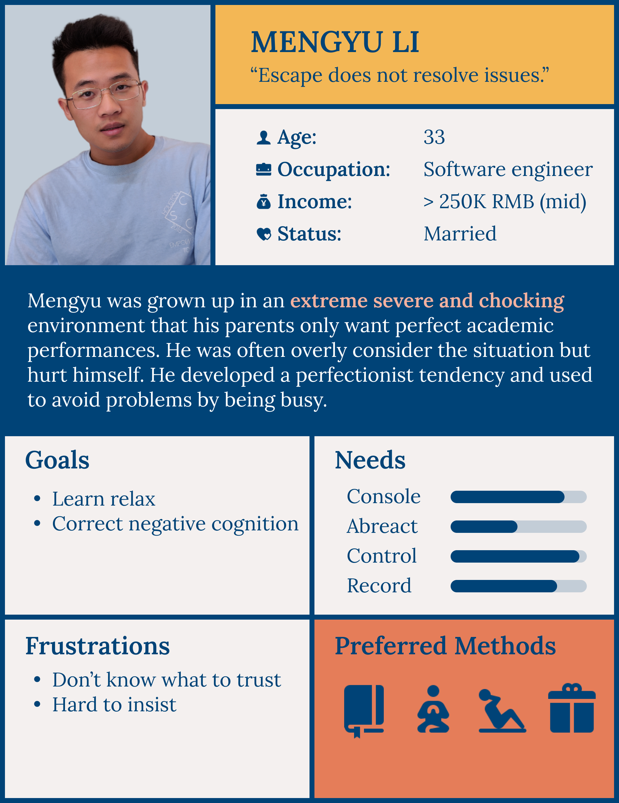

</Col>

</Row>

<Divider id="define">📌Definition</Divider>

### Problem Definition

<Row>

<Col span={2}>

#### Common Needs

</Col>

<Col span={2} />

<Col span={3}>

#### Clinical Cases

</Col>

<Col span={2} />

<Col span={3}>

#### Detailed Insights

</Col>

</Row>

<Row>

<Col span={2}>

Household healing

Multiple ways to abreact

Observe the change

Multiple ways to distract

Correct behavior indication

Emotional control

</Col>

<Col span={2}>

</Col>

<Col span={3}>

<Text as="h4" size={18} color="#004377">Inner Child Therapy</Text>

<Text as="p" size={14}>Through a variety of external actions to achieve the unmet needs of childhood to heal the trauma.</Text>

<Text as="h4" size={18} color="#004377">Cognitive Behavioral Therapy</Text>

<Text as="p" size={14}>Gradually increased exposure to the things they fear and replace the toxic perception of the inner critic with a self-supportive perspective to stop unnecessary self-harm.</Text>

<Text as="h4" size={18} color="#004377">Emotional Disclosure</Text>

<Text as="p" size={14}>Demonstrates to the client the value of being vulnerable and encourages her to risk wading into her own vulnerability.</Text>

</Col>

<Col span={2}>

</Col>

<Col span={3}>

<Text as="p" size={14}>1. They need to analyze childhood injury through questionnaires and guidance</Text>

<Text as="p" size={14}>2. They need to fill the unmet needs of childhood through an object and/or a meaning</Text>

<Text as="p" size={14}>3. They need correct and clear boundaries to gradually behave in better direction</Text>

<Text as="p" size={14}>4. They need some sensory healing to calm down</Text>

<Text as="p" size={14}>5. They require a spiritual or cultural beliefs, goals, or dreams for the future life</Text>

</Col>

</Row>

### Design Goal

The main objective of the design is to support a process of re-nurturing that is focused on the present, making sure that the features and interactions of the product lead users toward a route of emotional recovery and resilience.

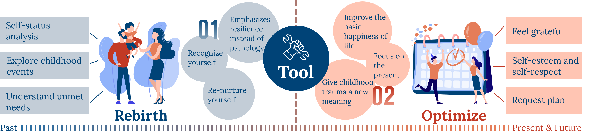

<Divider id="brainstorm">🧠Brainstorm</Divider>

### Ideation

In order to create a complete healing experience, I combine treatment with entertainment during the ideation phase by including therapeutic aspects into an interesting and entertaining structure and carefully using distraction techniques in the product's interactions to favorably reroute attention.

<Grid cols={3}>

<Cell>

<Lead size={74} align="start" color="#333333">01</Lead>

#### Construction Game

</Cell>

<Cell>

<Lead size={74} align="start" color="#333333">02</Lead>

#### Answer Machine

</Cell>

<Cell>

<Lead size={74} align="start" color="#333333">03</Lead>

#### Art Board

</Cell>

<Cell>

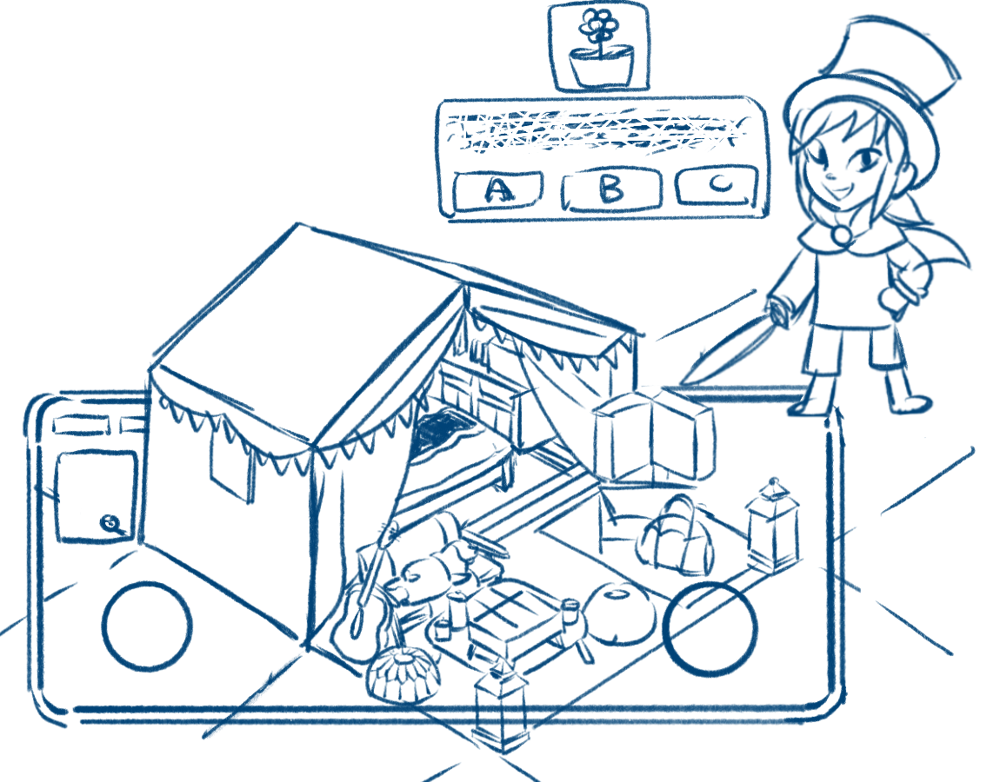

Become your inner child’s mum to exchange objects to build dream house through a mobile game. Npc will provide choices according to CBT therapy.

</Cell>

<Cell>

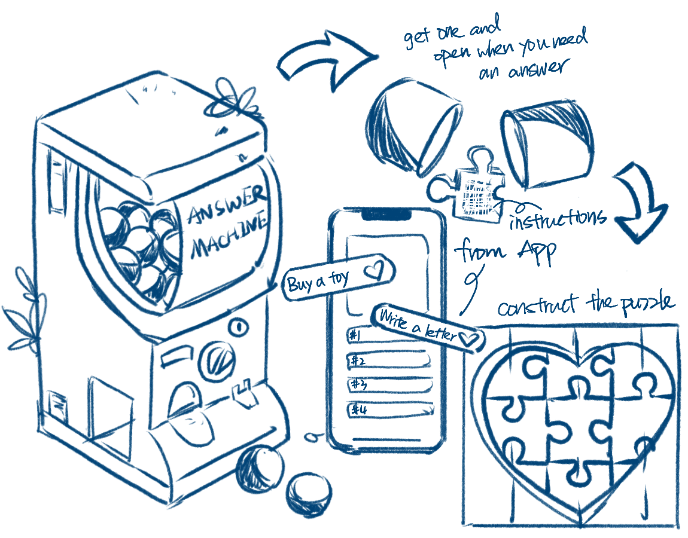

Get a random suggestion from “Best parent” App through an answer machine when you need a suggestion.

</Cell>

<Cell>

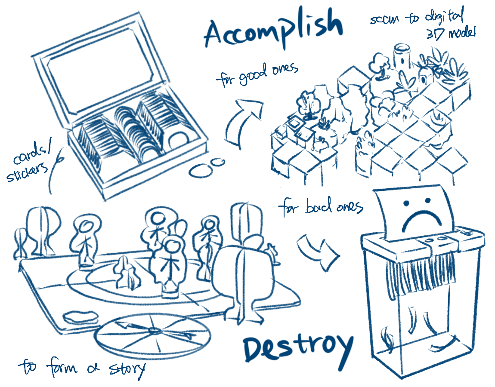

Inspired by Google Arts & Culture’s “The Real Leonardo”, using others’ event fragments to fulfill own story.

</Cell>

</Grid>

### Revised Design

#### Evaluation

<Grid cols={2}>

<Cell>

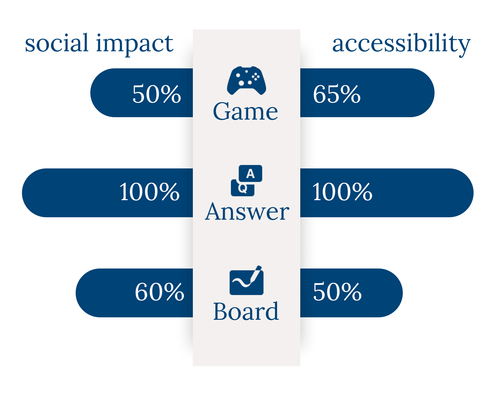

</Cell>

<Cell>

I improved the Answer Bot design using a strict evaluation process that prioritized accessibility and social impact in order to guarantee inclusive access and optimize beneficial contributions to society.

</Cell>

<Cell>

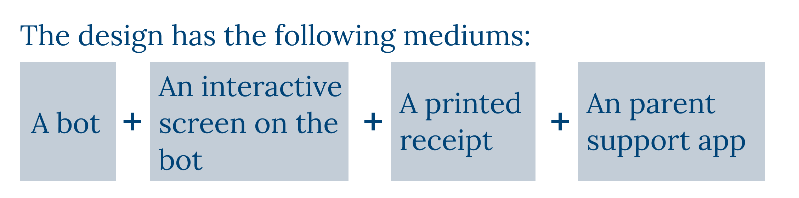

</Cell>

</Grid>

#### Service Blueprint

I made the service blueprint to succinctly outline the holistic user journey, detailing the integration of the bot, parent's app, and therapeutic model within the Serendipity Codex ecosystem.

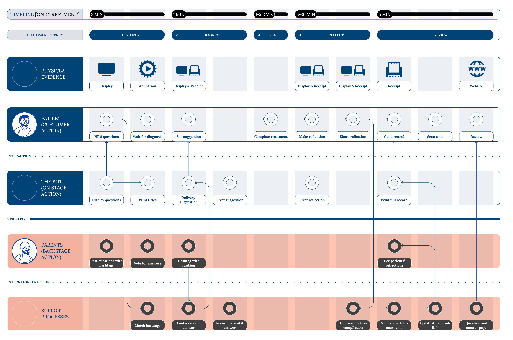

<Divider id="design">🎨Design</Divider>

### Product Design

<Row>

<Col span={7}>

#### Sketches

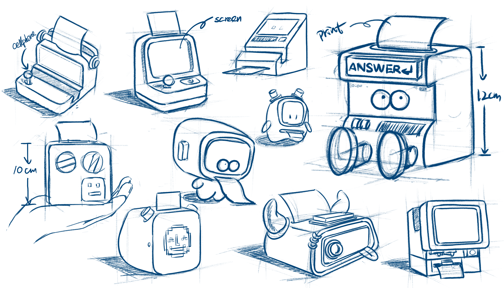

</Col>

<Col span={5}>

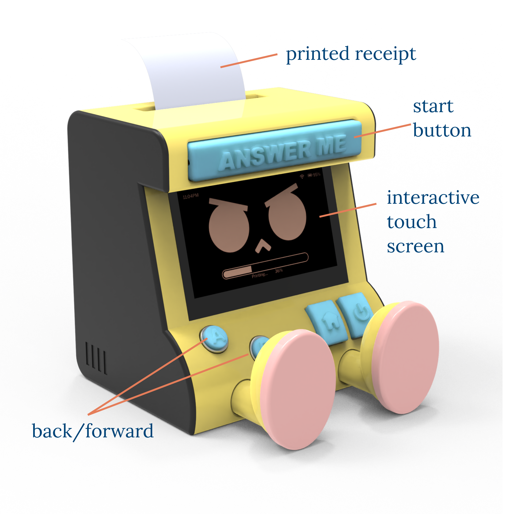

</Col>

</Row>

### Interaction Design & UX Writing

#### Question References / Metaphor Tag Comparison Table

The entire system is inspired by STAIR Narrative Therapy. Just as STAIR therapy seeks to guide individuals towards emotional healing and growth, the design aspires to capture the essence of personal transformation on daily tasks. Each section is thoughtfully curated to reflect the journey of self-discovery.

<Grid cols={3} bg="rgba(195, 205, 215, 0.3)">

<Cell>

#### Significance

The meaning of each question

</Cell>

<Cell>

#### Original Question

The answers are also shown as tags for parents' app

</Cell>

<Cell>

#### contextualized Question

Those questions are always the same as the first step for C-PTSD users

</Cell>

<Cell>

<Lead size={74} align="start" color="rgba(0, 0, 0, 0.2)">01</Lead>

<Text as="h4" size={18} color="#004377">Understand the outcome of the event</Text>

</Cell>

<Cell>

<Text as="h4" size={18} color="#004377">What is the problem you want address?</Text>

a) emotion regulation b) sense of self c) relationship patterns d) narrative response

</Cell>

<Cell>

<Text as="h4" size={18} color="#004377">If you were trapped in a nightmare, which terrifying moment would you face?</Text>

a) a ship navigating stormy seas without areliable compass b) a gun pointed at myself c) a prey ensnared in a toxic spider's web d) A fractured mirror, where distortedimages of my worst childhood loom

</Cell>

<Cell>

<Lead size={74} align="start" color="rgba(0, 0, 0, 0.2)">02</Lead>

<Text as="h4" size={18} color="#004377">Analyze the cause of the event</Text>

</Cell>

<Cell>

<Text as="h4" size={18} color="#004377">Who is showing up in this moment? Who do you think is the chief culprit?</Text>

a) myself b) intimate person c) ordinary relationship d) strangers

</Cell>

<Cell>

<Text as="h4" size={18} color="#004377">Who do you believe is responsible for this gloomy atmosphere surrounding you?</Text>

a) My own shadow, which casts doubt anddespair b) The monster that created and accompaniedme but imprisoned me c) Someone like a beautiful rose withthorns and sweet poison d) Faceless individuals grabbed me, pullingme into the abyss

</Cell>

<Cell>

<Lead size={74} align="start" color="rgba(0, 0, 0, 0.2)">03</Lead>

<Text as="h4" size={18} color="#004377">Understand emotions from a physiological perspective</Text>

</Cell>

<Cell>

<Text as="h4" size={18} color="#004377">What is happening in my body?</Text>

a) sadness b) fear c) anger d) disgust

</Cell>

<Cell>

<Text as="h4" size={18} color="#004377">What is the state of your heart as you traversethis desolate land?</Text>

a) Like dark cloud that never see the sun b) Like the last live people to facemonsters in the world c) Like a ticking timing boom, ready toexplode d) Like stepping into a puddle of murky water,surrounded by a pile of putrid garbage

</Cell>

<Cell>

<Lead size={74} align="start" color="rgba(0, 0, 0, 0.2)">04</Lead>

<Text as="h4" size={18} color="#004377">Understand the actions that lead to results</Text>

</Cell>

<Cell>

<Text as="h4" size={18} color="#004377">What is the problem you want address?</Text>

a) emotion regulation b) sense of self c) relationship patterns d) narrative response

</Cell>

<Cell>

<Text as="h4" size={18} color="#004377">What sinister force might have conjured these unsettling feelings within you?</Text>

a) The blaze of a wildfire awakened b) The perfection and anxiety mixedcompulsion c) The Petrified Gaze of the Medusa d) The Submissive Dance with Shadows

</Cell>

<Cell>

<Lead size={74} align="start" color="rgba(0, 0, 0, 0.2)">05</Lead>

<Text as="h4" size={18} color="#004377">Define the severity of the result</Text>

</Cell>

<Cell>

<Text as="h4" size={18} color="#004377">Why is this emotion coming up now?</Text>

a) fight b) flight c) freeze d) fawn

</Cell>

<Cell>

<Text as="h4" size={18} color="#004377">In this forsaken place, where do your negative emotions take root and how deeply do they torment you?</Text>

a) In a closed room, where sensation ofasphyxia pervades like mist. b) In a desolate crypt, where sorrow restslike an ancient curse. c) In an underground river, where sadness attachedto every lives d) In a cursed forest, where despairlingers like a sinister fog.

</Cell>

</Grid>

#### Background Image Ideas

In order to infuse a sense of “Towards rebirth from the brink of death” into the scene, I use dreamy colors to depict somber elements representing the meaning behind the five questions.

<Tabs>

<Tab label="01. Nightmare">

<Grid cols={1}>

<Cell>

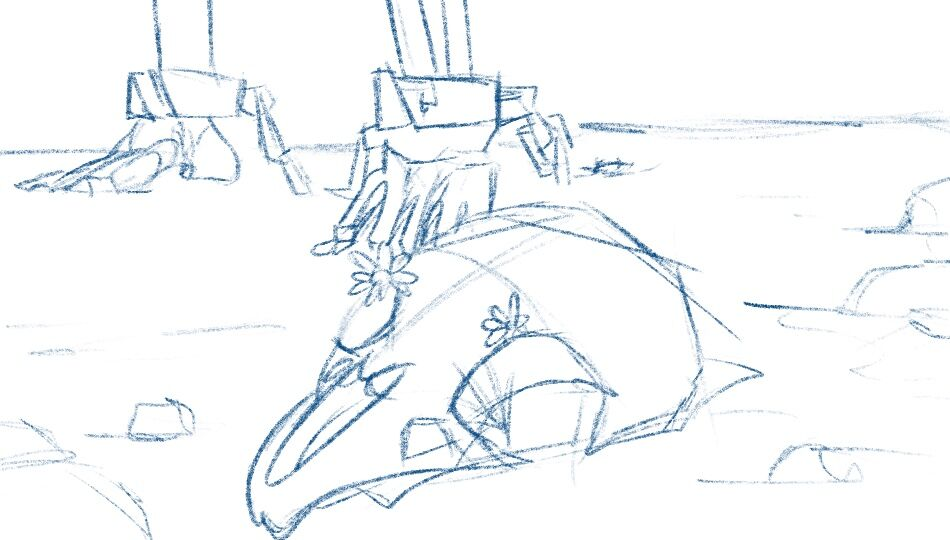

</Cell>

<Cell>

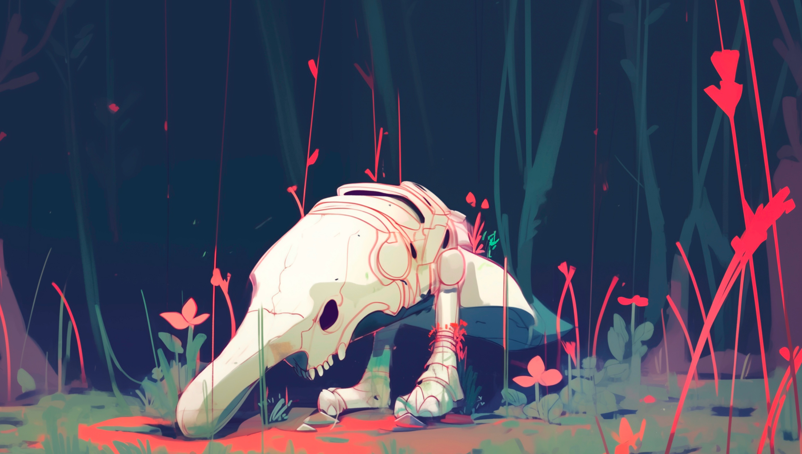

</Cell>

<Cell>

The 'Nightmare' captures the aftermath of the incident with eerie visuals, expressing both the yearning for an escape and its harmful effects.

</Cell>

</Grid>

</Tab>

<Tab label="02. Cute Devil">

<Grid cols={1}>

<Cell>

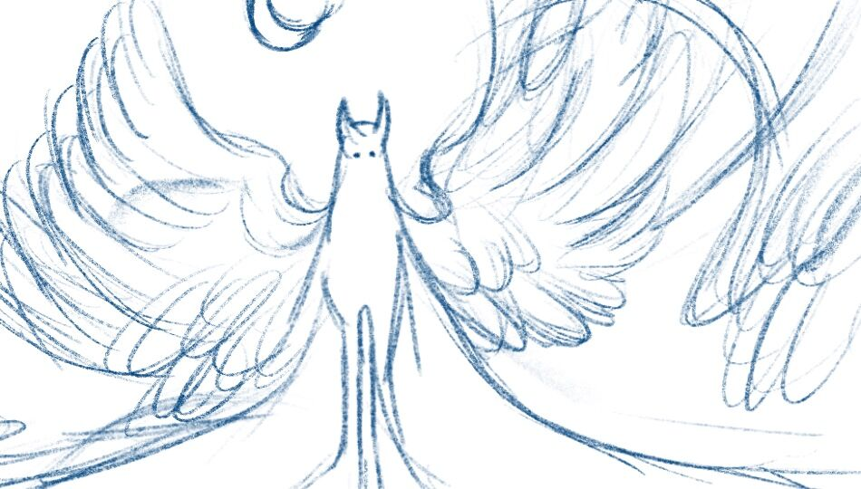

</Cell>

<Cell>

</Cell>

<Cell>

The 'Devil' scene uses a dark illustration to show the underlying reason of the incident and offers a visual metaphor for the user's grief that is both beautiful and terrifying.

</Cell>

</Grid>

</Tab>

<Tab label="03. Injured">

<Grid cols={1}>

<Cell>

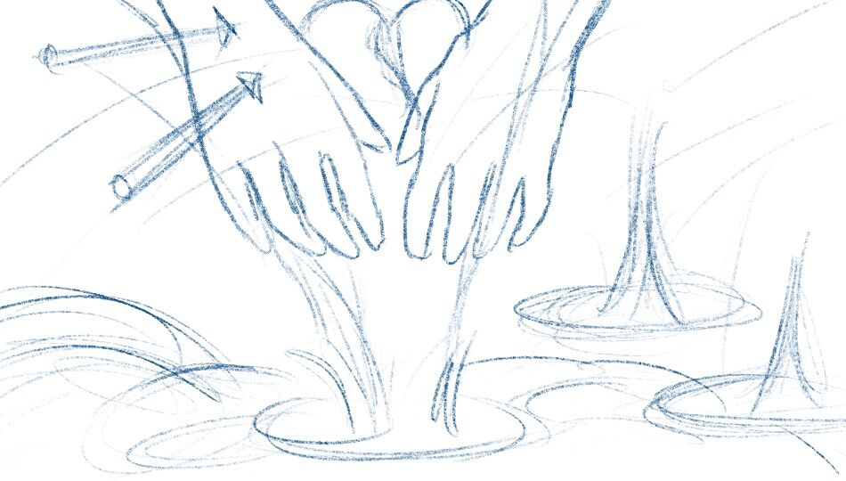

</Cell>

<Cell>

</Cell>

<Cell>

The "Injured" sequence, which depicts the internal wounds caused by the incident, presents a moving image of behavioral difficulties and emotional difficulty. There's pyrotechnics instead of blood, signifying the bilateral effects of pain.

</Cell>

</Grid>

</Tab>

<Tab label="04. Escape">

<Grid cols={1}>

<Cell>

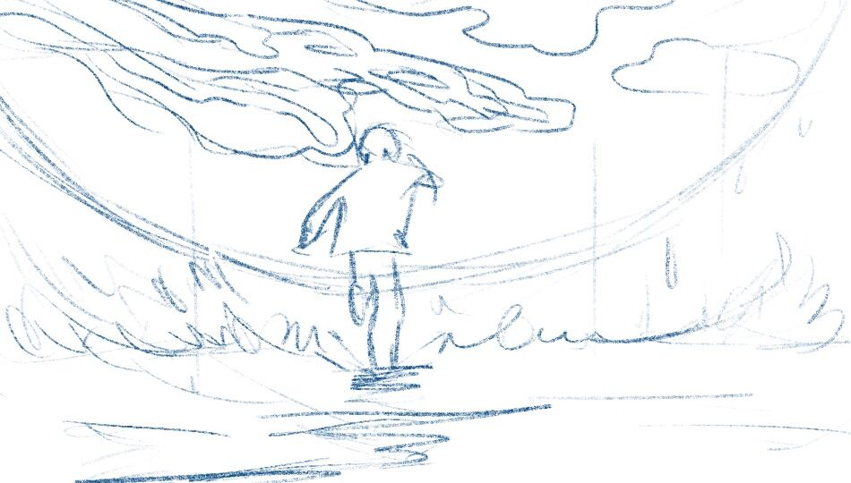

</Cell>

<Cell>

</Cell>

<Cell>

The 'Escape' scene demonstrates the acts performed, signifying the user's attempt to escape the consequences of the incident, but being stuck at a dead end due to inappropriate behavior.

</Cell>

</Grid>

</Tab>

<Tab label="05. Indulge">

<Grid cols={2}>

<Cell>

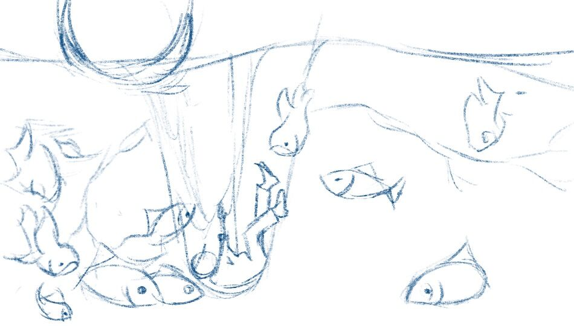

</Cell>

<Cell>

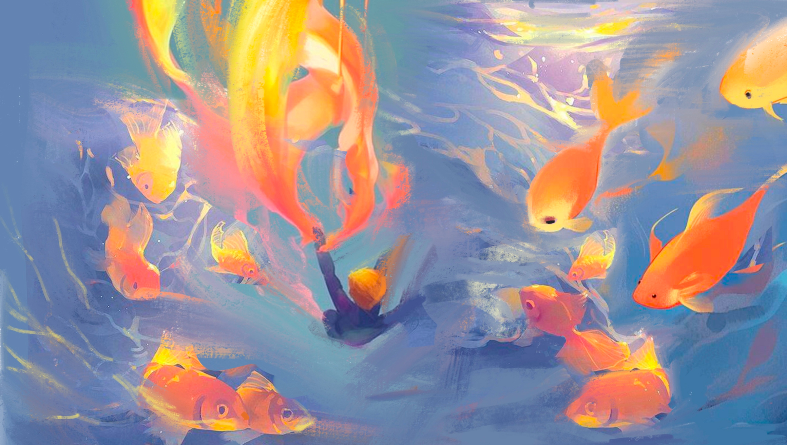

</Cell>

<Cell>

The 'Indulge' scenario artfully employs vibrant visuals of submerging into water surrounded by goldfish and moonlight, symbolizing a metaphorical salvation that not only captures the gravity of the situation but also imbues the viewer with a nuanced understanding of the profound and optimistic aspects of the experience.

</Cell>

</Grid>

</Tab>

</Tabs>

#### Information Architecture

The patient's bot's information architecture is carefully designed into five stages, which correspond to the sequential steps of a medical consultation. This allows users to experience an intuitive journey that is similar to visiting a doctor.

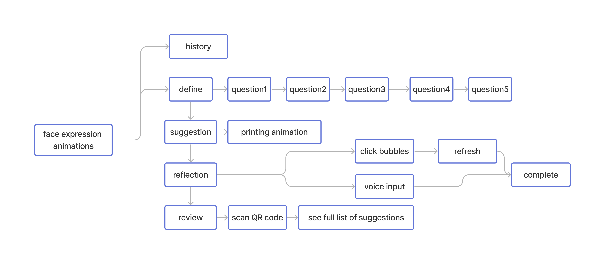

#### Interactions - Reflection Stage

The interface design entails clicking on bubbles to dynamically increase words because the screen is too small to allow for typing. This visually accentuates and encourages users to investigate and consider the primary themes of their emotional experiences.

<Row>

<Col span={6}>

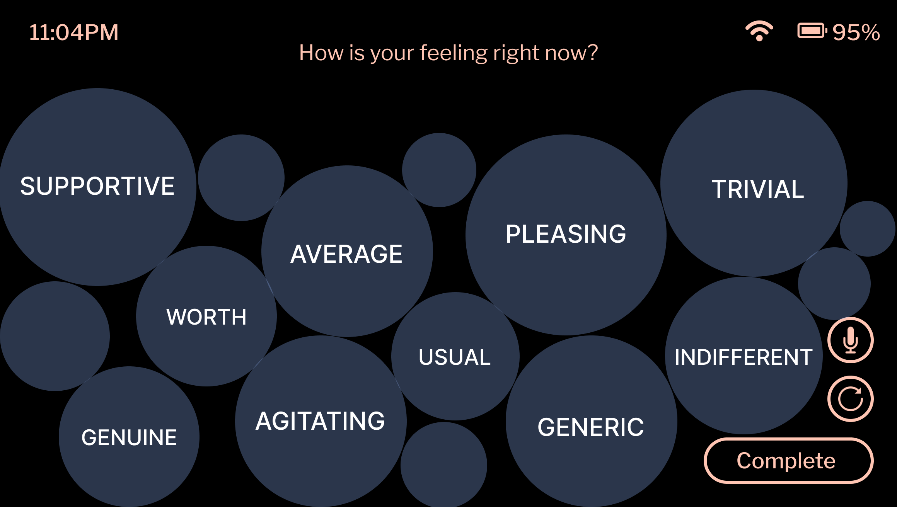

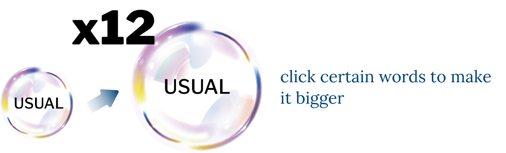

</Col>

<Col span={2}>

Supportive Helpful Encouraging Genuine Heartwarming Inspiring Insightful Comforting Assisting Worth trying Pleasing Knowledgeable Uplifting Mutual aid ...

</Col>

<Col span={2}>

Irrelevant Unhelpful Confusing Ineffective Trivial Disruptive Uninspiring Agitating Perplexing Indifferent Unfriendly Unsympathetic Unsupportive Inauthentic ...

</Col>

<Col span={2}>

Generic Moderate So-so Average Neutral emotions Standard advice No strong opinion No significant preference Common support Usual insights Typical suggestions ...

</Col>

</Row>

#### Interactions - Face Expression for Other Stages

<Grid cols={2}>

<Cell>

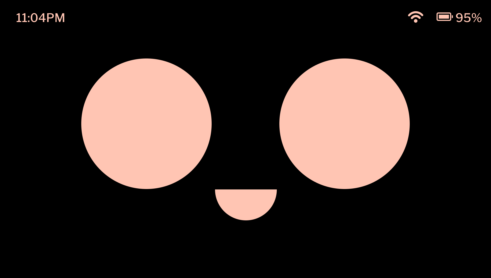

</Cell>

<Cell>

The machine will appear as cute facial expressions before, during, and after each stage, and match the current action the machine is doing.

e.g. it is showing dizziness and a question mark when looking for an appropriate prescription from the parents’ app.

</Cell>

<Cell>

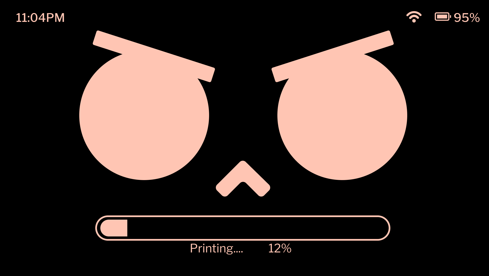

</Cell>

<Cell>

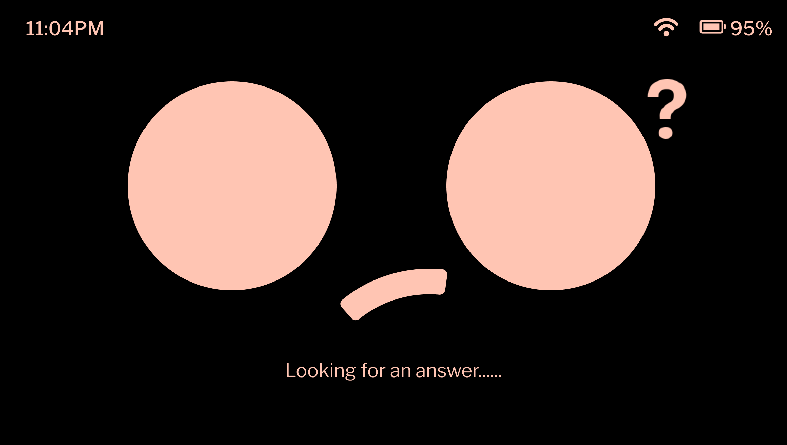

</Cell>

</Grid>

### Parents' App

#### Information Architecture

The parent app is essentially a user-friendly social media platform that parents can easily interact with, discuss, and contribute to when it comes to issues pertaining to their children.

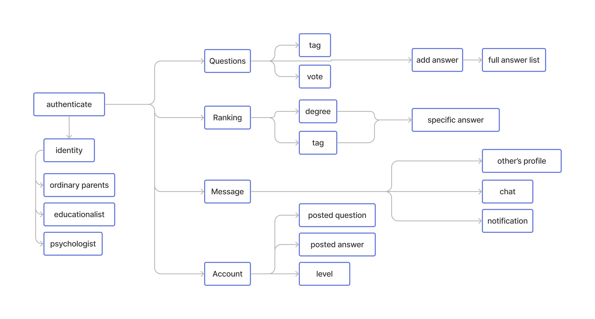

#### Wireframes

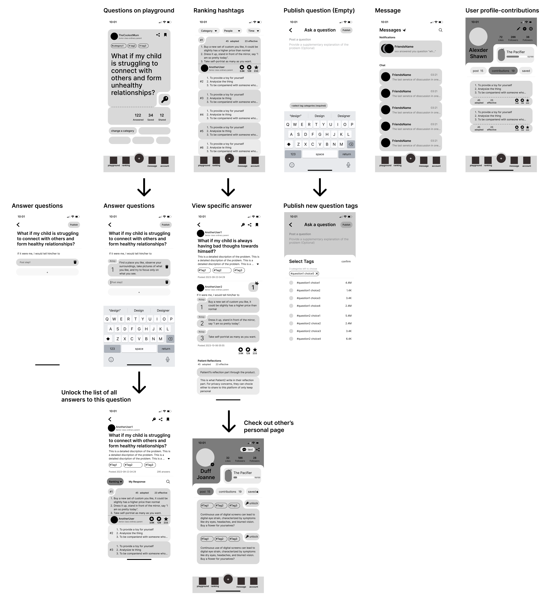

### Model Making

In order to test the healing effect, I 3D printed the shell and assembled it to a work-like product.

<Row>

<Col span={4}>

#### 3D Modelling

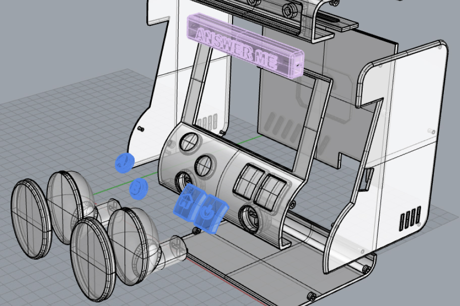

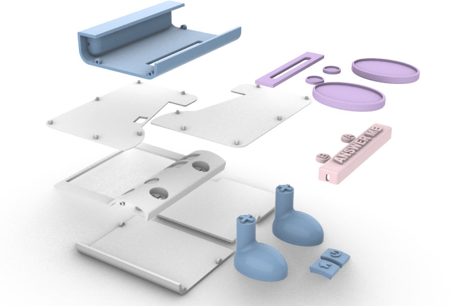

</Col>

<Col span={4}>

#### 3D Printing

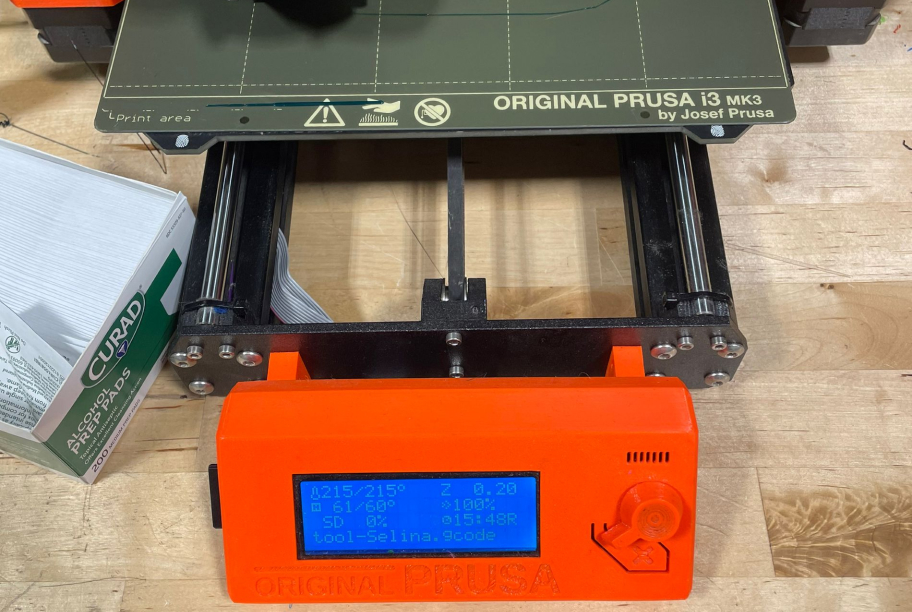

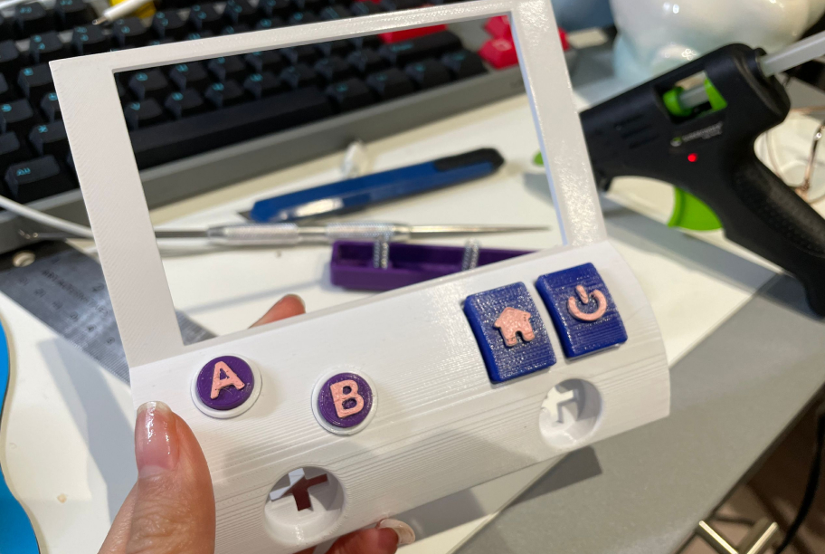

</Col>

<Col span={4}>

#### Assembling


</Col>

</Row>

### User Journey

<Grid cols={3}>

<Cell>

1\. hit the “ANSWER ME” button


</Cell>

<Cell>

2\. fulfill 5 questions


</Cell>

<Cell>

3\. get the printed prescription


</Cell>

<Cell>

4\. implement and record


</Cell>

<Cell>

5\. make reflections


</Cell>

<Cell>

6\. check the discussion behind


</Cell>

</Grid>

<Divider id="conclusion">💡Conclusion</Divider>

### Key Takeaways

<Grid cols={2}>

<Cell>

#### Tracing Origins

Nowadays, most of the design researches only focus on how to solve the problem rather than figuring out the cause of the problem. This project not only analyze patients' origin but also guide them on a journey to understand the roots of their experiences.

</Cell>

<Cell>

#### Contextualization (The Power of Language)

This project employs metaphorical narratives within the five questions, providing users with a rich and symbolic framework for self-reflection. This unique approach not only enhances personal introspection but also integrates responses from the "best parents' app" into a meaningful and resonant exploration of the user's journey.

</Cell>

<Cell>

#### Beneficiary & Stakeholder

It is unique that the roles are interdependent and mutually influential for this project. Patients find healing through parents and professionals, who, in turn, benefit from patient reflections. Simultaneously, parents collaborating within the ecosystem not only support each other but also contribute significantly to the healing of patients.

</Cell>

<Cell>

#### Landing Feasibility

It goes beyond the conceptual by meticulously planning the release at each step, ensuring a feasible and practical deployment that transforms the project into a concrete reality. It is important to consider and test the landing feasibility for other projects in the future.

</Cell>

</Grid>
