<Lead>Sonicpedia is an innovative touch-screen signage in shape of a book, featuring street sign indicators and soundscape data tablet.</Lead>

<MetaGrid>

<Meta label="Timeline">

05/2023 - 07/2023

</Meta>

<Meta label="Role">

Product Design User Interface Design UX Research Avatar Design

</Meta>

<Meta label="For">

Individual Concept Project

</Meta>

<Meta label="Tools">

</Meta>

</MetaGrid>

### Overview

<Row>

<Col span={7}>

Sonicpedia is an innovative interactive touch-screen signage in the shape of a book, featuring street sign indicators. Its captures real-time environmental sounds through the dynamic persona "Mixie Melodia" and users can gauge their satisfaction interacting with the signage. By using a dedicated mobile app, users can play with “Mixie Melodia” and explore diverse soundscapes within the city.

Behind this immersive experience lies a powerful language model, continually learning from users' activities, incorporating new soundscapes into its database. Urban planners can harness the data generated by this language model to plan and construct more vibrant, community-friendly neighborhoods and cities.

</Col>

<Col span={5}>

</Col>

</Row>

<Divider id="product">📱Main Features</Divider>

<Row>

<Col span={5}>

### 01. A Signage to detech the Soundscape

#### In shape of book wich inspired from the word "encyclopedia"

Shaped as an closed book, this signage integrates into the cityscape while retaining the functionality of traditional street signs. Positioned above, it serves as a unique yet familiar landmark, combining aesthetic appeal with practical utility. The book-shaped structure not only enhances visibility but also adds a touch of artistic sophistication to urban settings.

</Col>

<Col span={7}>

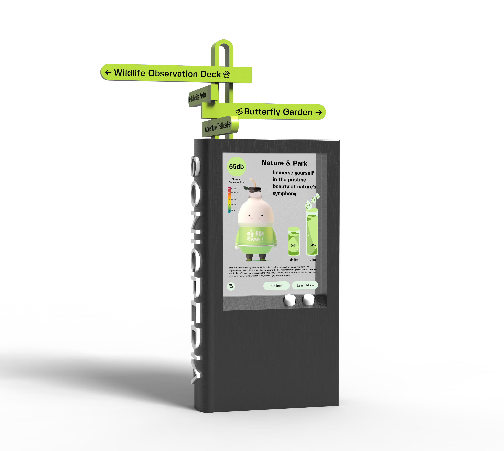

</Col>

</Row>

<Row>

<Col span={7}>

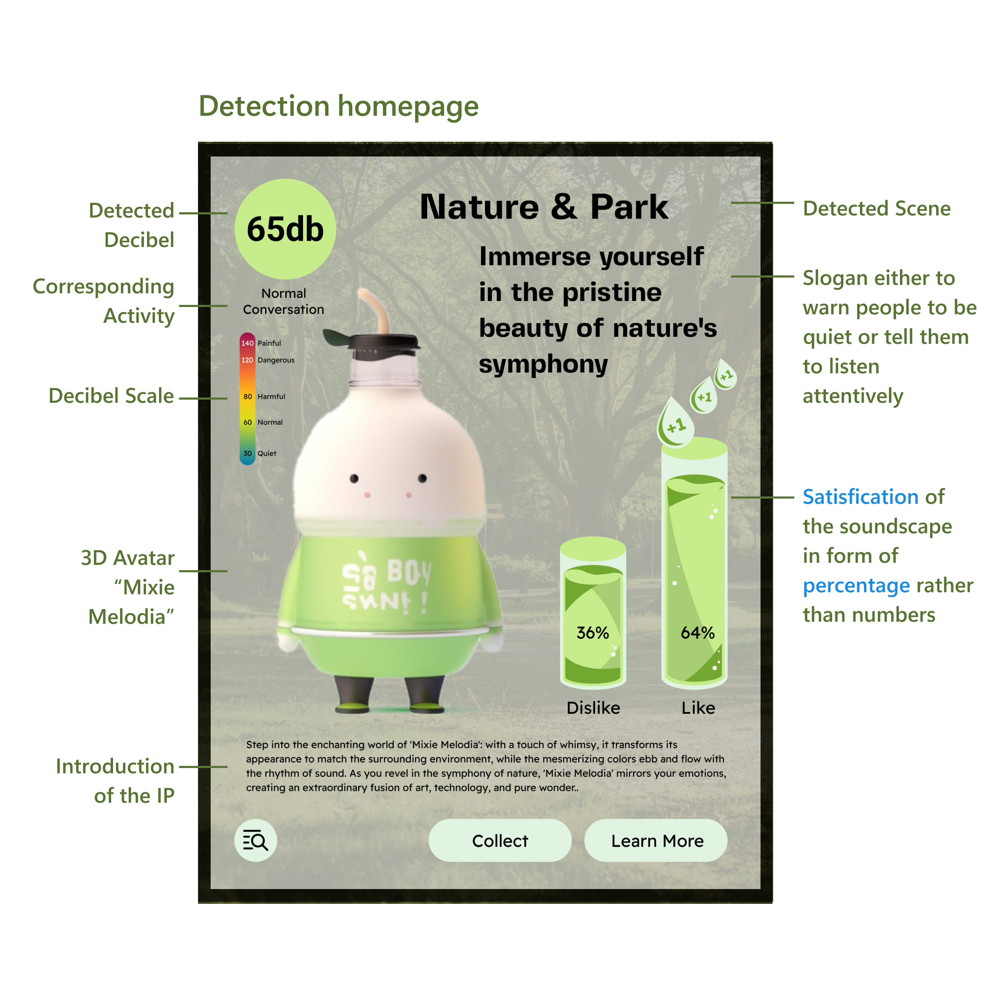

</Col>

<Col span={5}>

### 02. Exploring

#### Primary - Detection and Interaction

"Mixie Melodia," an enchanting avatar that responds dynamically to the surrounding soundscape. As users traverse the city, Mixie Melodia becomes a whimsical companion, harmonizing with the environment and elevating the ordinary street sign into an interactive urban artwork.

</Col>

</Row>

<Row>

<Col span={4}>

#### Secondary - Introduction & Information

Let people know more about this specific sound environment and overall acoustical scale around the city by clicking "Learn More" or "Library" icon.

</Col>

<Col span={8}>

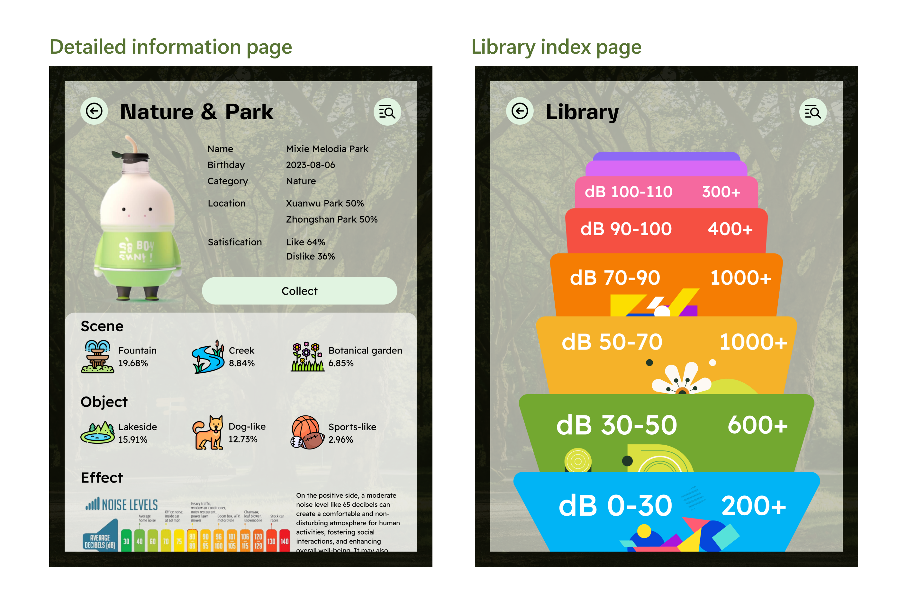

</Col>

</Row>

<Row>

<Col span={4}>

#### Index & Library

By looking at the "library", users can know more about the entire city. This curated collection serves not only personal exploration but becomes a valuable resource for professionals studying urban acoustics. Additionally, it connects like-minded individuals, fostering a harmonious city soundscape.

</Col>

<Col span={8}>

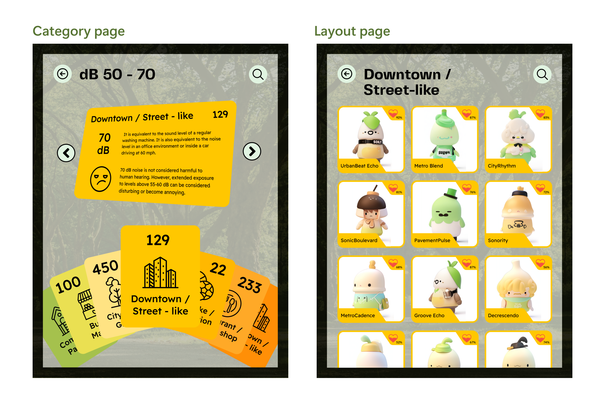

</Col>

</Row>

<Row>

<Col span={7}>

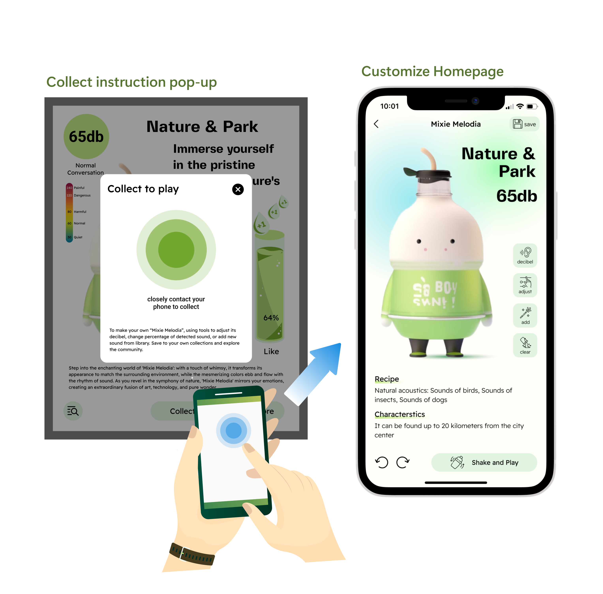

</Col>

<Col span={5}>

### 03. Collecting

#### To explore

Following the trend of young people’s preference of “clock in” popular locations, the transition of signage to APP help them explore more.

Contacting phone to transform the avatar to APP, it allows players find an appropriate soundscape space that suits them more enjoyably through the “Change Mixie Melodia’s Clothes” game service.

</Col>

</Row>

### 04. Customization

#### To experience

The customization journey goes from collecting avatar from current signage, changing scenes and objects that already detected, saving to own folders, recommending related sites, and directing.

<Row>

<Col span={3}>

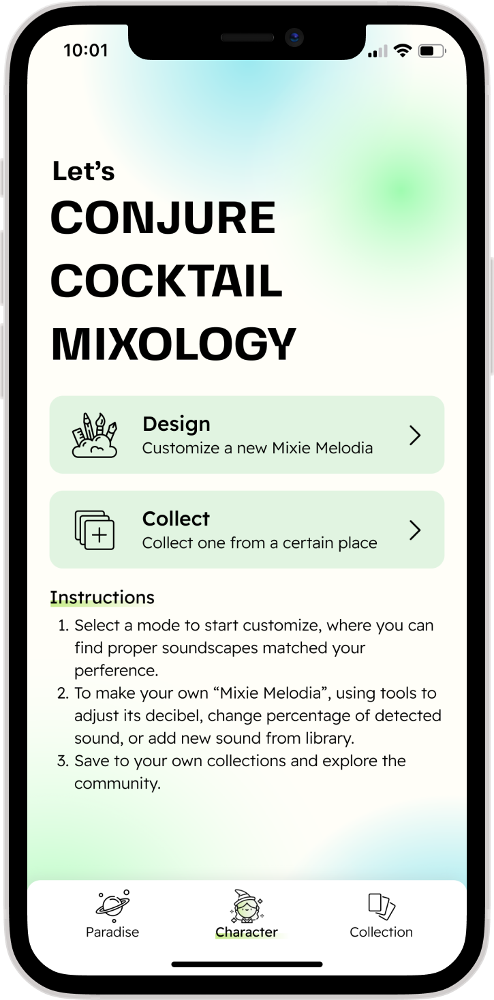

</Col>

<Col span={3}>

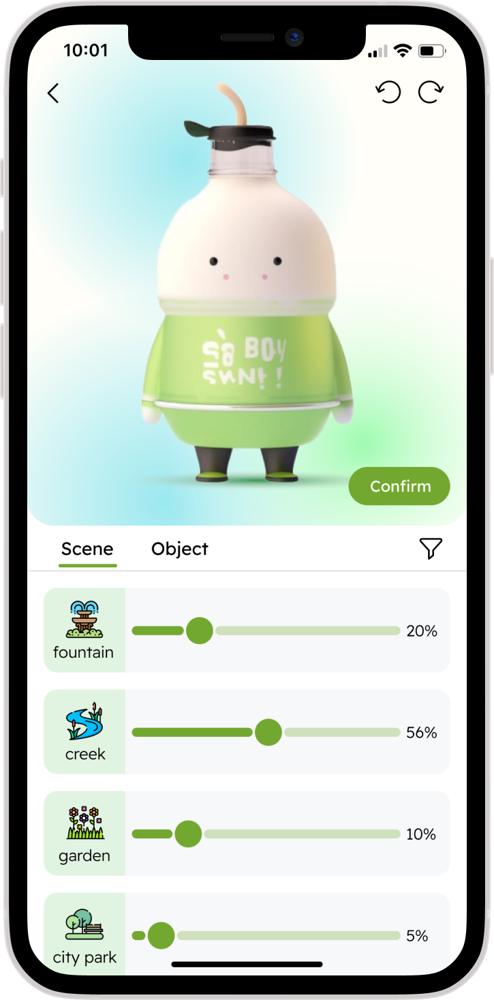

</Col>

<Col span={3}>

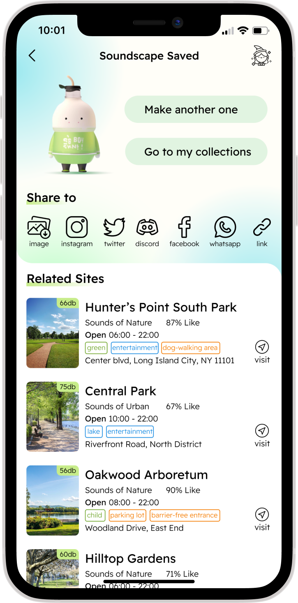

</Col>

<Col span={3}>

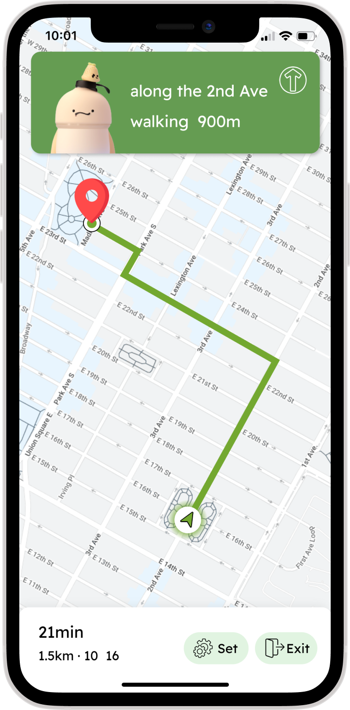

</Col>

</Row>

### 05. Avatar's community

#### To share

Enthusiasts are promoted to avatar art collectors and urban soundscape explorers, and the platform provides an interactive community that enhance social attributes creative desire.

<Row>

<Col span={3}>

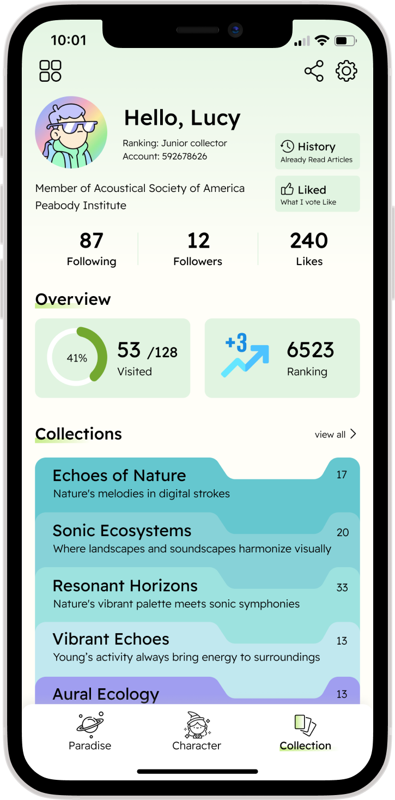

</Col>

<Col span={3}>

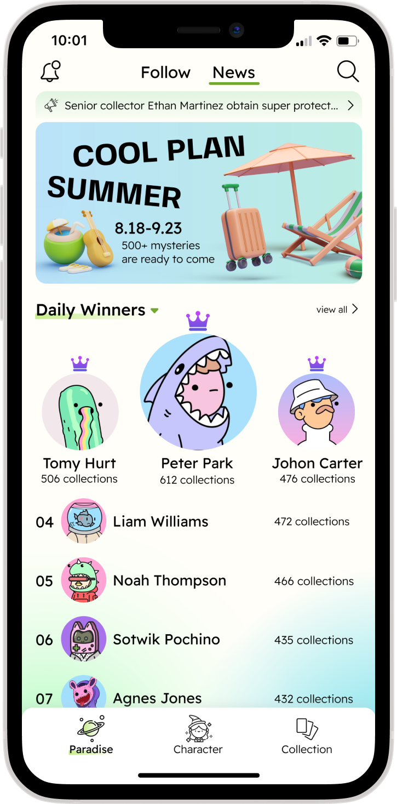

</Col>

<Col span={3}>

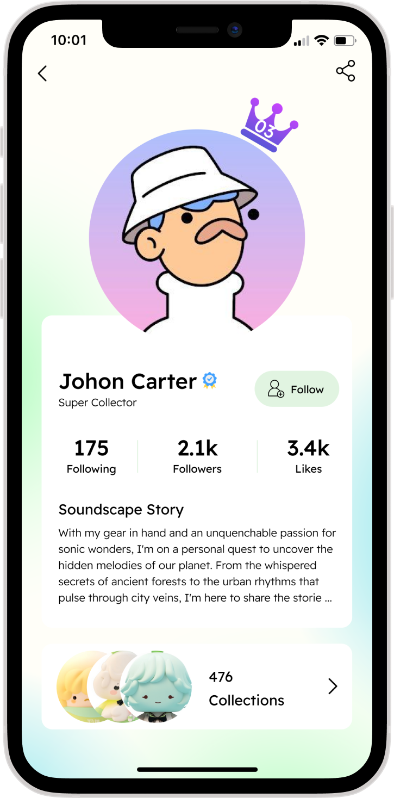

</Col>

<Col span={3}>

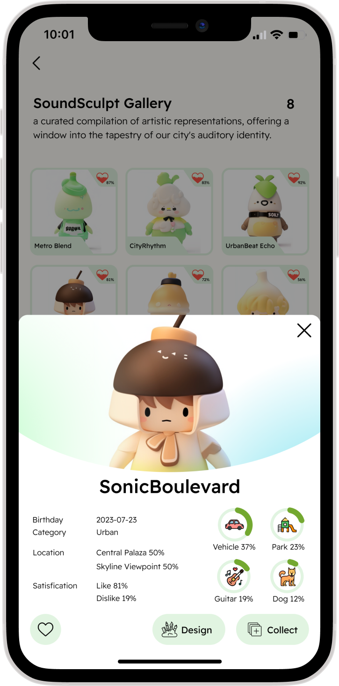

</Col>

</Row>

<Divider id="background">👋 Background</Divider>

### What is Soundscape?

<Row>

<Col span={6}>

"A soundscape is the acoustic environment as perceived by humans, in context." However, for this project, it could be understood physically and cognitivley.

Physically, it is the sum of all sound energies in a given environment.

Cognitively, it emphasizes the “immersive” perception of landscape. It is a shared cultural autopoietic system willingly or involuntarily contributed by lives.

</Col>

<Col span={6}>

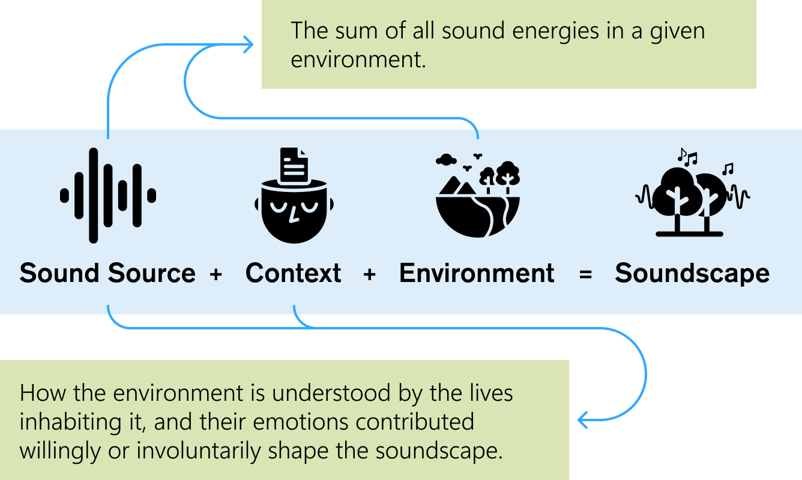

</Col>

</Row>

### The Problem

In order to envision a future in which urban environments resonate with a more harmonious and people-centric acoustic experience by using soundscapes as a strategy, I first investigated present noise pollution issues.

<Grid cols={2}>

<Cell>

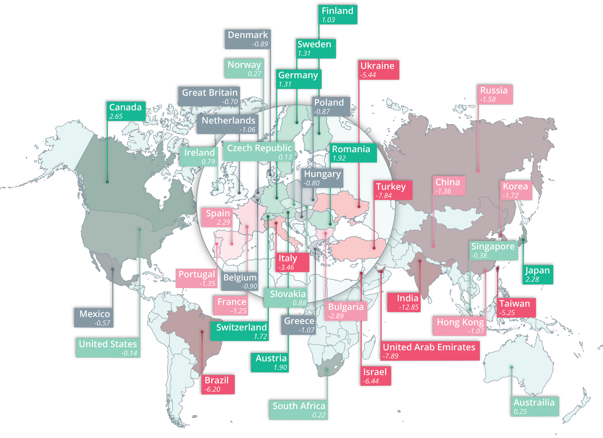

</Cell>

<Cell>

Urban noise pollution exists in more than half of the world's countries

</Cell>

<Cell>

Silos and sound imbalances make the city divided into fragments of quiet and noisy

</Cell>

<Cell>

Not taking full advantage of the voice of human social interaction

</Cell>

</Grid>

### Effect & Value

The value of soundscape to people and society cannot be underestimated, it plays a vital role in shaping our perception of the environment, facilitating communication and creating positive experiences.

<Grid cols={5}>

<Cell>

#### Cultural

It is an important part of regional culture and social identity. It’ll trigger resonance and emotional connection.

</Cell>

<Cell>

#### Environmental

It conveys the status of the ecological environment, urban development, and human activities.

</Cell>

<Cell>

#### Psychological

Different soundscapes create different atmospheres. Certain soundscapes can help reduce stress, anxiety, and fatigue.

</Cell>

<Cell>

#### Social

It provides a shared background and facilitate communication and interaction between people.

</Cell>

<Cell>

#### Aesthetical

It is a medium for artists to express their creativity, cultural values, and stories.

</Cell>

</Grid>

### Classification

<Row>

<Col span={8}>

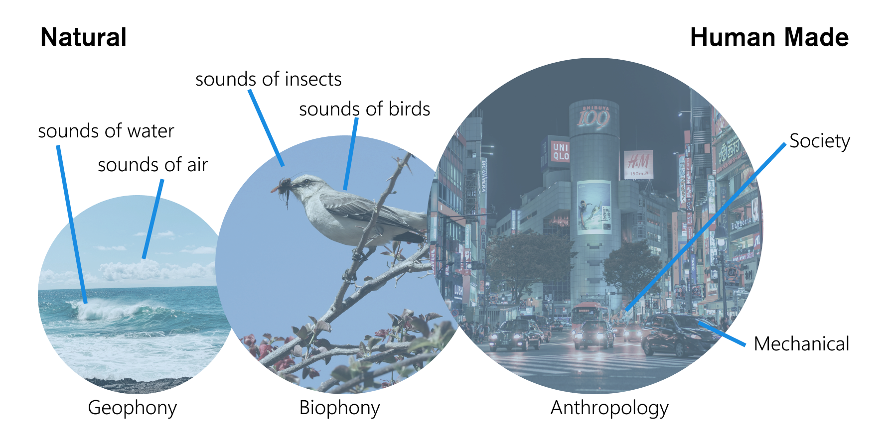

</Col>

<Col span={4}>

A soundscape includes three fundamental sound source types: ‍ 1. Geophony, which includes all non biological natural sounds like wind or ocean waves ‍ 2. Biophony, which embraces the biological, wild, non-human sounds that emanate from environments ‍ 3. Anthrophony, man-made sounds, commonly referred as noise

</Col>

</Row>

### How does soundscape affect people?

<Grid cols={4}>

<Cell>

#### Individual Difference

Each person has different senses and experiences, they may react and interpret the same sounds differently

</Cell>

<Cell>

#### Social Factors

People in different social contexts may have different attitudes and emotional responses to certain sounds

</Cell>

<Cell>

#### Urban Development

Urban construction and planning decisions can shape the character of soundscapes

</Cell>

<Cell>

#### Group Behavior

People's collective activities and behavior patterns produce specific sounds and have a persistent effect

</Cell>

</Grid>

<Divider id="anlysis">🔬Analysis</Divider>

### Experiment 1. How people understand different soundscape?

In order to understand the pattern of how are soundscapes perceived by people, I designed an experiment by inviting a group of people to listen 8 environmental audio and write down words for each following questions: 1. three words to describe the feeling of hearing this sound 2. one word describe the context in which the sound belongs 3. three words to imagine the effect of living in such an environment

<Row>

<Col span={6}>

#### Without Imagery

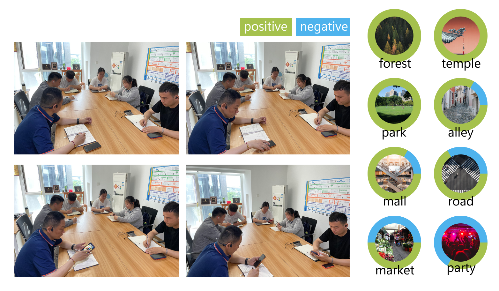

</Col>

<Col span={6}>

#### With Imagery

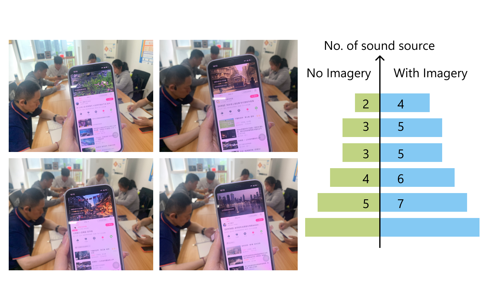

</Col>

</Row>

#### Conclusion 1.0

1\. The more abundant the sound source, the greater the difference in people's perception 2. Without being told, people are good at extracting sound elements from audio that match their memories; Once there is a visual element, people will be attracted to the visual element

### Experiment 2. How individuals process audio in various context?

<Row>

<Col span={3}>

By inviting participants to describe their emotions and perceptions while exposed to soundscapes with and without disturbed voices, the study aims to explore how the presence of disturbed voices may influence the overall experience and emotional response to the sound environment.

</Col>

<Col span={3}>

#### Without Audio

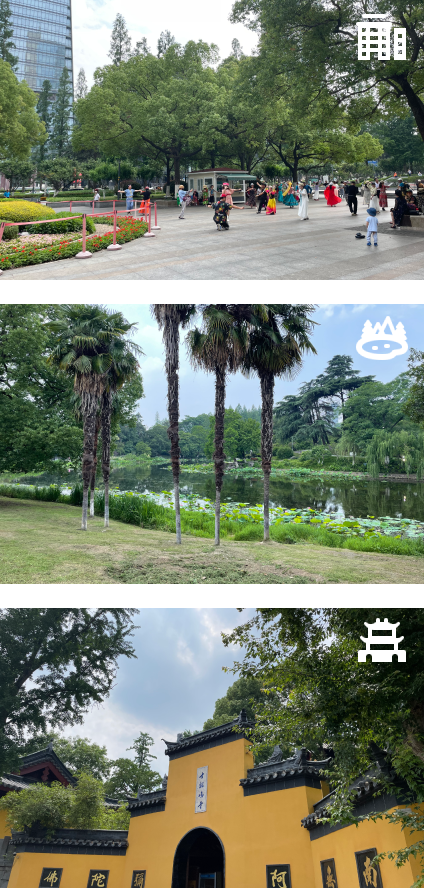

</Col>

<Col span={6}>

#### With Audio

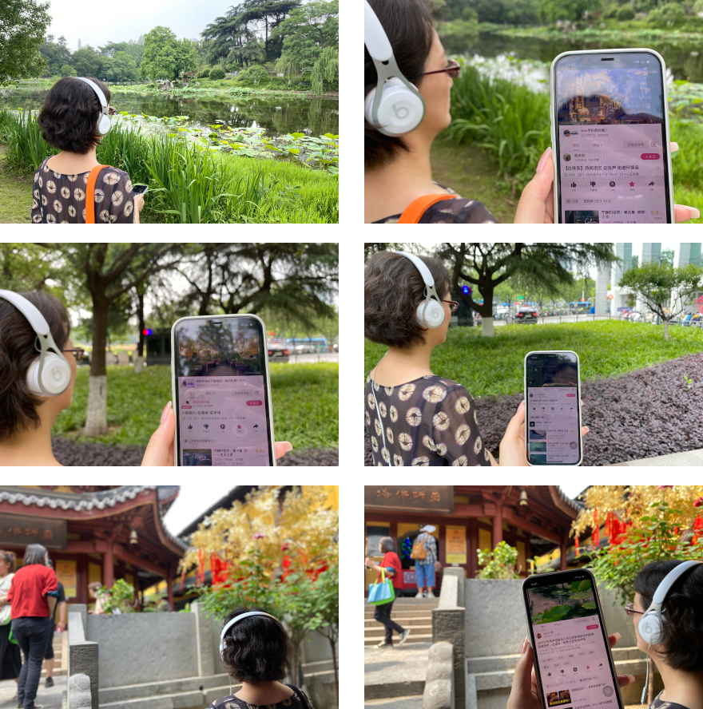

</Col>

</Row>

### Interview: How do people participate in the soundscape?

<Row>

<Col span={8}>

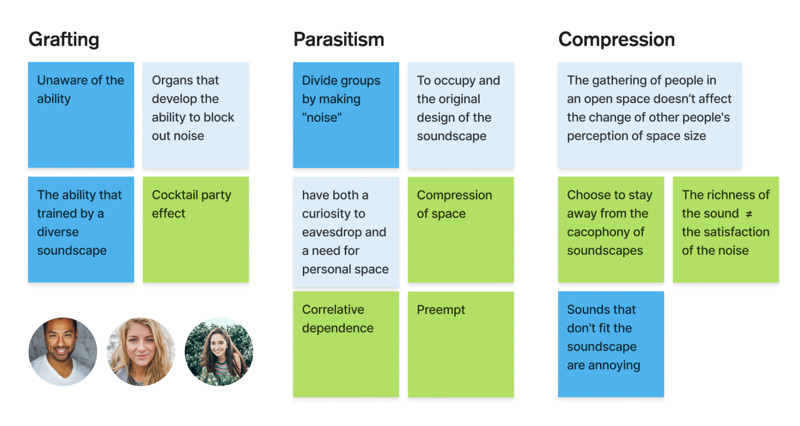

</Col>

<Col span={4}>

Through these interviews, the research seeks to explore participants' subjective experiences, perceptions, and interpretations of the observed phenomena.  It provides me a comprehensive understanding of the dynamics between individuals, soundscapes, and the perceptual and cognitive processes involved.

</Col>

</Row>

<Section bg="#d9e5b4">

### Experiment Results & Conclusion

#### Design Goal: To make people experience the soundscape they like

<Row>

<Col span={4}>

1\. Automatic Soundscape Integration 2. Seamlessly merge and process auditory stimuli

</Col>

<Col span={4}>

1\. Compression of Perceived Spatial Size 2. Novel Soundscapes Generated by Human Activities

</Col>

<Col span={4}>

1\. Parasitic Development of Populations within Soundscapes e.g. people feel harmonious to hear bell sound at beach, although they are not matched in people’s mind

</Col>

</Row>

</Section>

### User Journey Map

I created a user journey map that detailed the challenges people had when looking for individualized soundscapes, stressing many crucial touchpoints for "looking for a space": indicator, warning, and education.

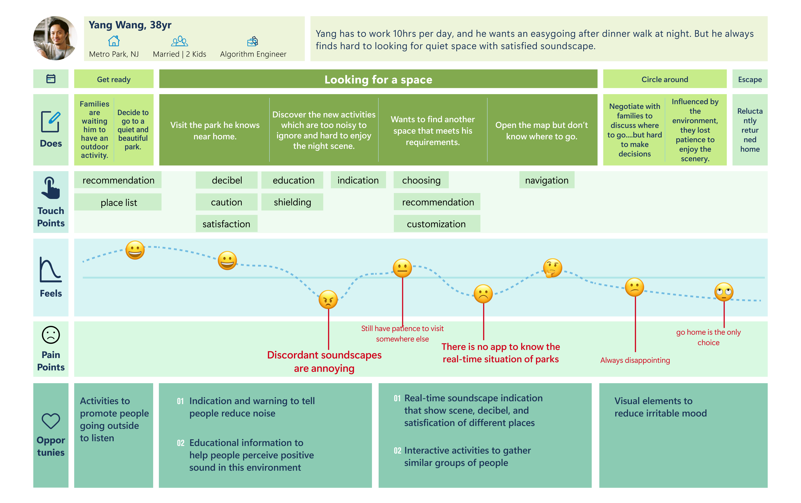

<Divider id="brainstorm">🧠 Brainstorm</Divider>

### Ideas & Evaluation

Considering various problems from real people's understading of their surrounding soundscapes, I came up with several solutions that are either interactive or functional. By evaluating the technical difficulty, accessibility, and social impact, the "Interactive Signage" solution wins.

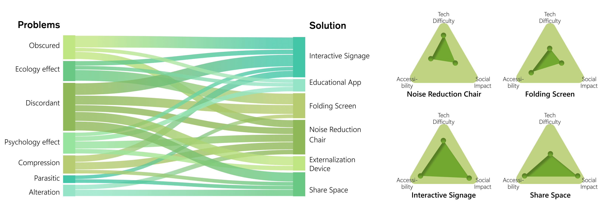

### Concept Development & Co-creation Design

#### Community Collaboration

<Row>

<Col span={3}>

By inviting community members who participated in activities at park and random spectators to provide their insights about the product, it makes me better understanding the function needed to solve the problem.

</Col>

<Col span={9}>

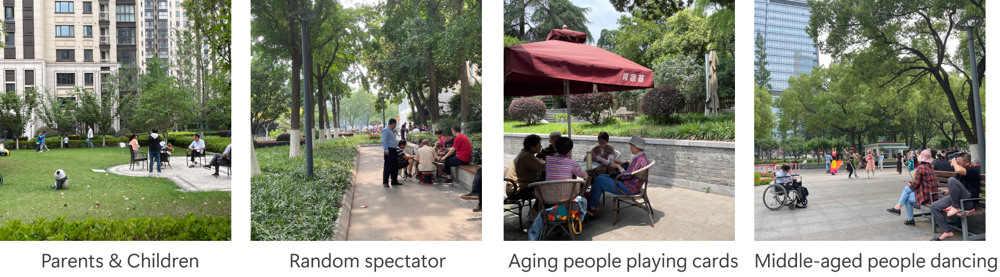

</Col>

</Row>

#### Soundnet

I found this MIT open source model useful that it can Recognize Objects and Scenes from Sound. They leverage the natural synchronization between vision and sound to learn an acoustic representation using two-million unlabeled videos.

<Row>

<Col span={5}>

Using the code in Torch7:

Some results about scene and object:

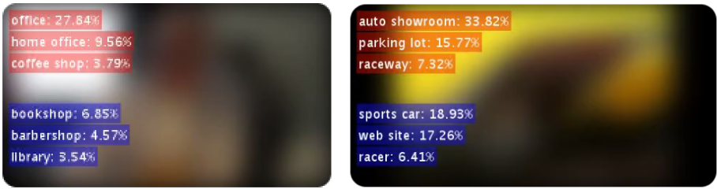

</Col>

<Col span={7}>

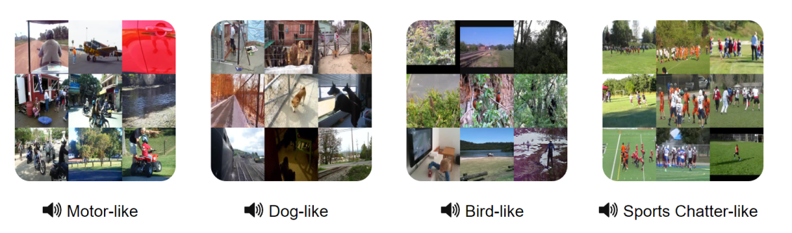

Based on this technology with real-time sensor, it allows my product to better capture the useful signals about sound, transfers discriminative visual knowledge from well established visual recognition models into the sound modality.

</Col>

</Row>

Yusuf Aytar, Carl Vondrick, and Antonio Torralba. "Soundnet: Learning sound representations from unlabeled video." Advances in Neural Information Processing Systems. 2016.

<Divider id="design">🎨 Design</Divider>

### System Map

Because the design can influence both the noise creator and the spectator and can be used as big data for city planners and communities, I created this system map to show the interconnected elements.

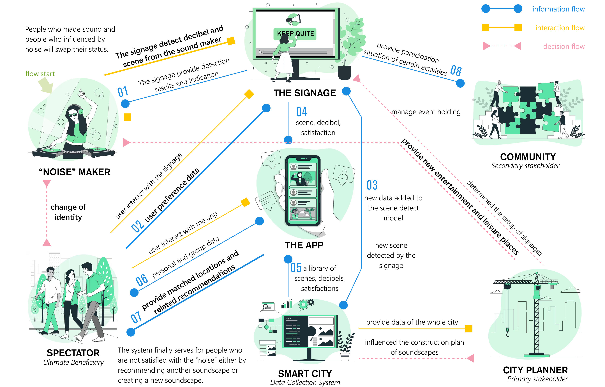

### Signage Design

<Row>

<Col span={2}>

</Col>

<Col span={7}>

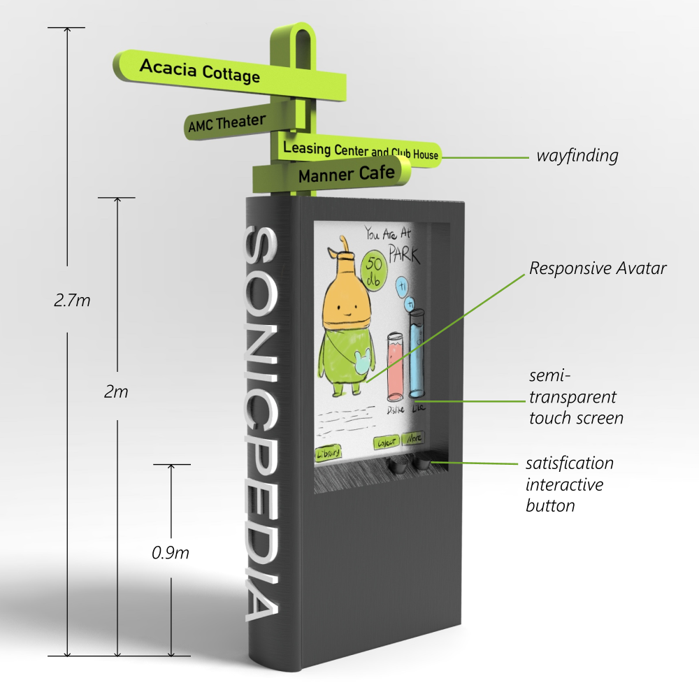

</Col>

<Col span={3}>

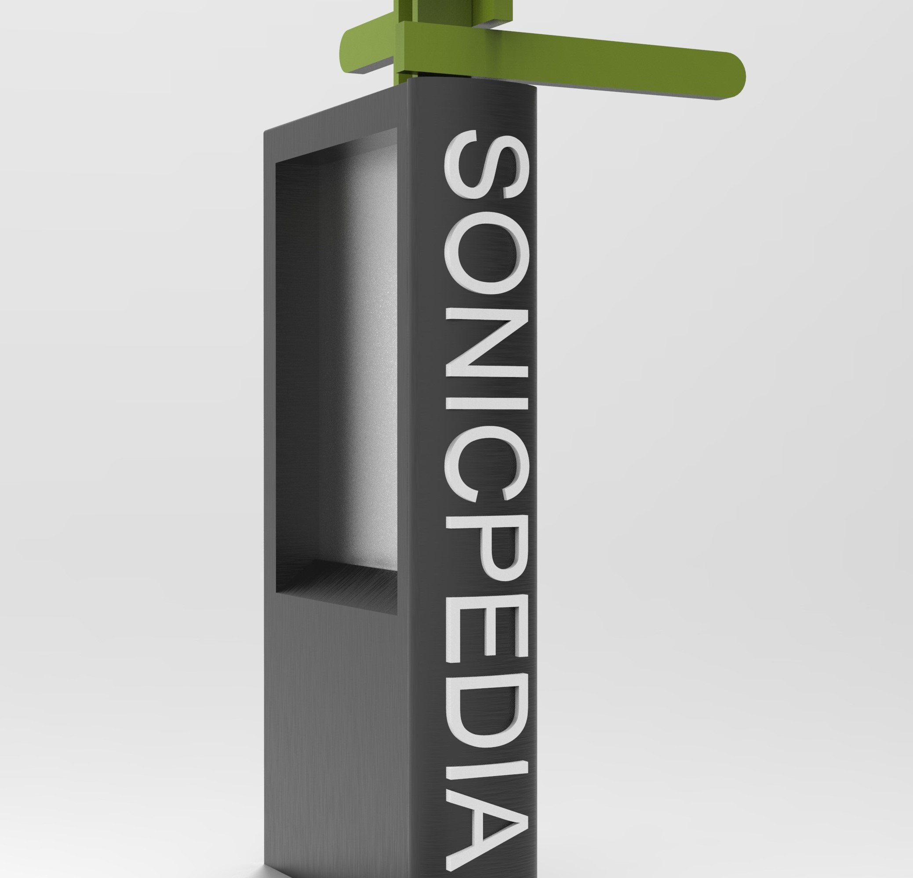

</Col>

</Row>

### Avatar Design

<Row>

<Col span={6}>

#### Cocktail party effect

Inspired from the phenomenon of the brain's ability to focus one's auditory attention on a particular stimulus while filtering out a range of other stimuli, such as when a party-goer can focus on a single conversation in a noisy room, I decided to use the element “cocktail” as the IP design, representing changes of soundscapes by different stimuli.     Inspirations--&gt;

</Col>

<Col span={6}>

</Col>

</Row>

<Row>

<Col span={6}>

#### Sketches

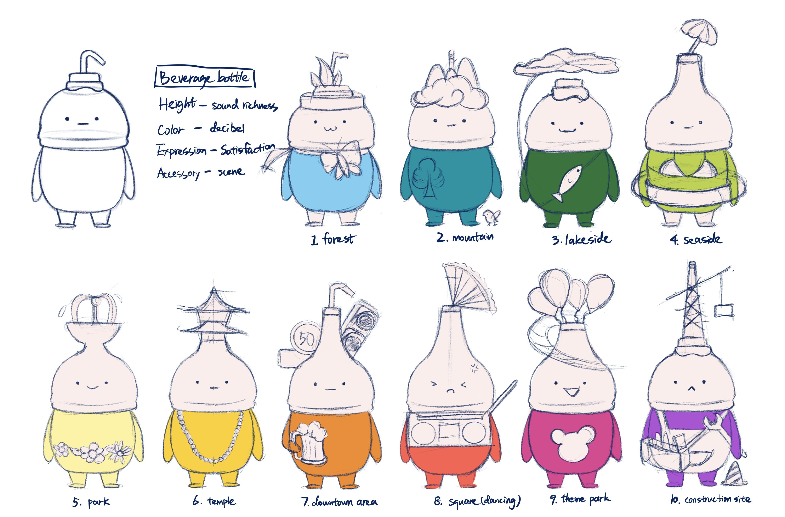

</Col>

<Col span={6}>

#### 3D Renderings of "Mixie Melodia"

The name comes from “mix” and “melody”, symbolizing the blending of various sounds.

</Col>

</Row>

### Signage Interfaces (Wireframe)

<Row>

<Col span={9}>

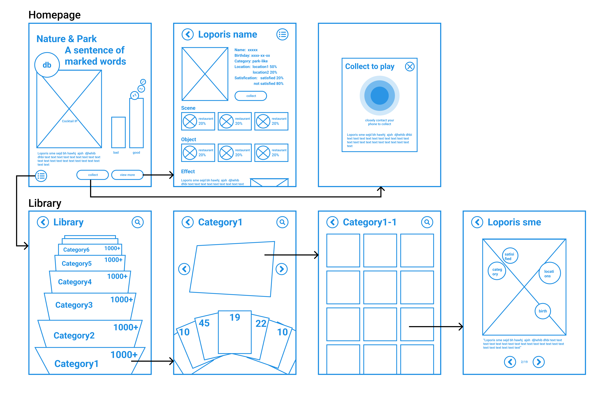

</Col>

<Col span={3}>

#### Liquid Volume

To match the concept of cocktail, I made the "voting" section in liquid form and bubbles containing "+1" will appear on the top of the glass bottle when user clicking "good" or "bad".

#### Sorting Cards

To make the exploration process more interesting, I add different interactive cards that can slide, flip, and enlarge as users are opening different categories step by step.

</Col>

</Row>

### App Interfaces (Wireframe)

<Row>

<Col span={4}>

By printing low-fi interfaces on paper in real phone size and doing usability testing, it helps make the flow more reasonable and know what’s missing.

</Col>

<Col span={4}>

</Col>

<Col span={4}>

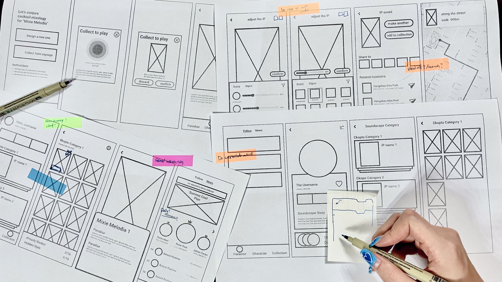

</Col>

</Row>

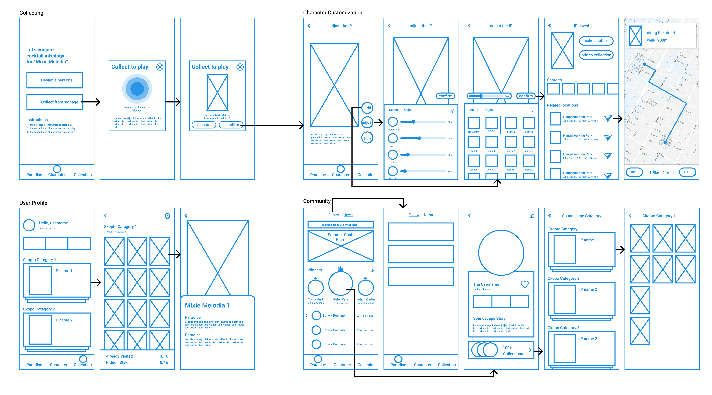

### Scenario

<Grid cols={2}>

<Cell>

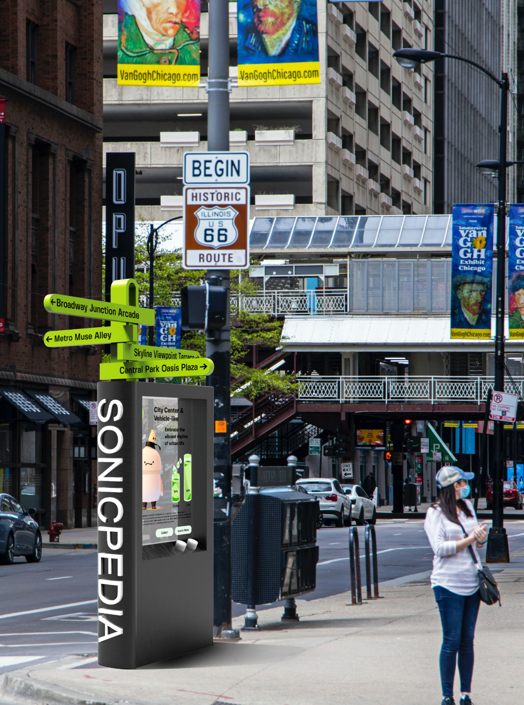

#### 1.SIGNAGE CONTINUOUSLY DETECT

The journey begins as the signage detect surrounding scene from decibel and environment. The advanced technology captures real-time sound data, feeding it into the underlying scene and acoustical model. This dynamic data fusion enables the system to generate context-aware responses.

</Cell>

<Cell>

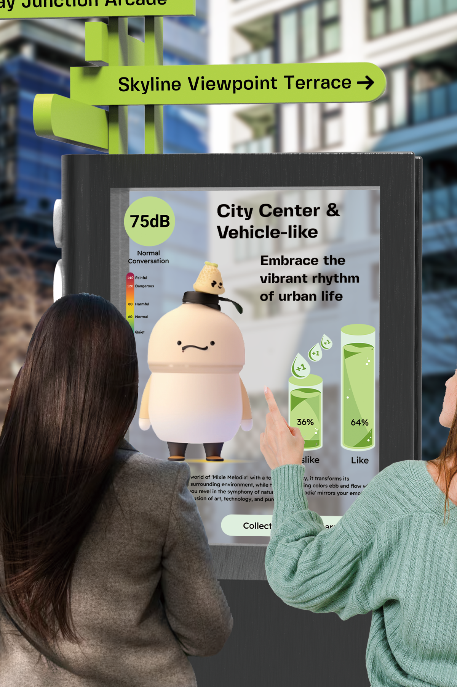

#### 2. USER INTERACT WITH THE SIGNAGE

Through interactions, they explore informative content about the soundscape, observe real-time changes of the avatar, and express their satisfaction levels with the urban auditory environment, all while being connected to the city's sonic identity through a resonating slogan.

</Cell>

<Cell>

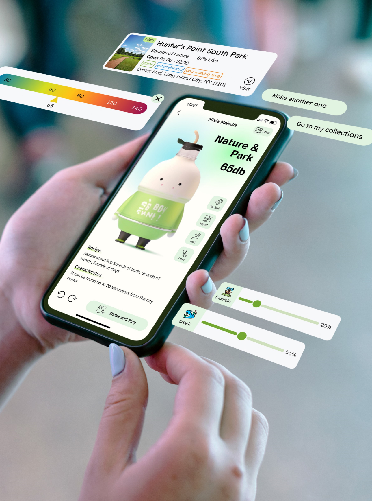

#### 3. USER INTERACT WITH THE APP

By extending their engagement through the mobile app, users customize their own avatar to represent their ideal sonic preferences. They explore the diverse avatars crafted by others, and contribute to the community's shared understanding of the urban soundscape's richness and nuances.

</Cell>

<Cell>

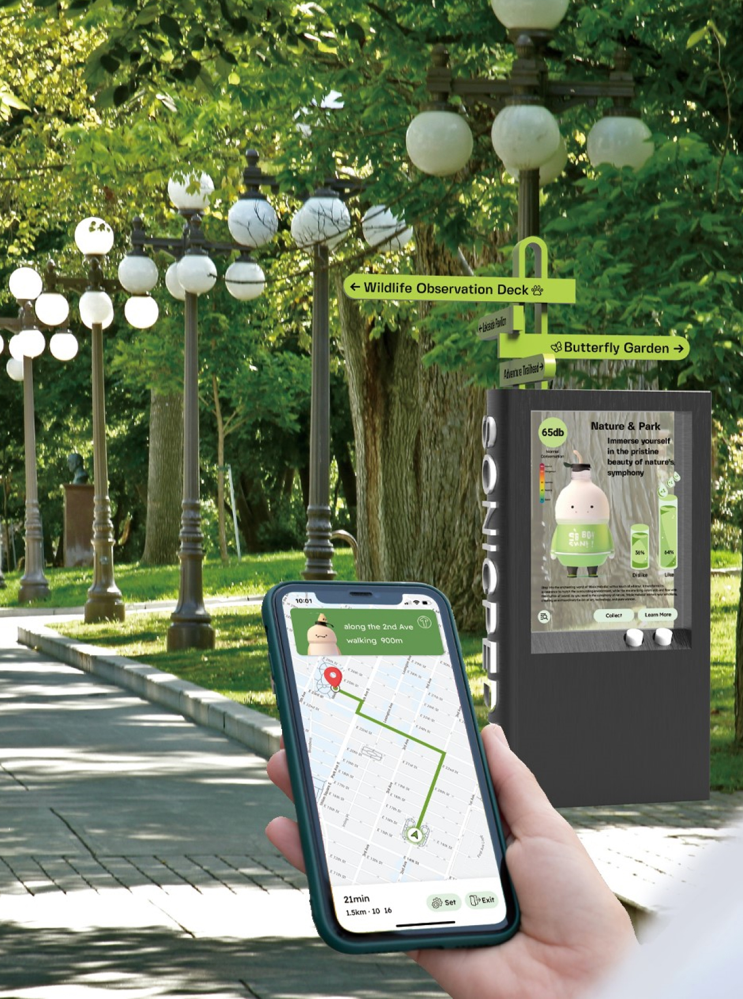

#### 4. EXPLORE OTHER SOUNDSCAPES

Empowered by the collected expressions and model, users can navigate to different locations, accessing real-time sound data. The app allows users to compare and contrast the acoustic environments across different areas of the city, enriching users' understanding of the urban soundscape but also encourages them to contribute actively to the soundscape narrative.

</Cell>

</Grid>

<Divider id="reflection">💡Reflections</Divider>

### Future Plan

<Row>

<Col span={4}>

This final product is an experimental prototype that serves as a robust foundation for future endeavors. Building upon this initial success, I envision expanding my research on soundscape data analytics and human-centric sound design to benefit urban planners, policymakers, and communities alike.  By exploring innovative ways to integrate the language model's database and real-time sound monitoring, I aim to create an extensive soundscape mapping system that empowers citizens to actively shape their acoustic environments.

</Col>

<Col span={8}>

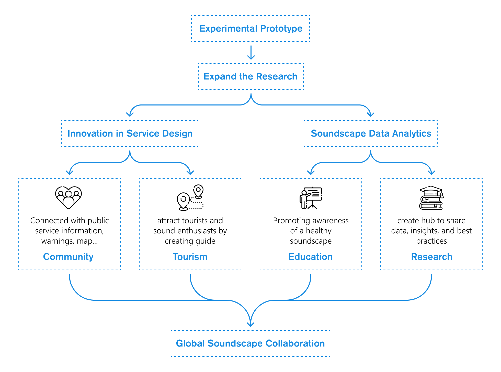

</Col>

</Row>

### Key Takeaways

<Row>

<Col span={4}>

#### Experimentation

The significance of conducting studies in order to quantify the topic "soundscape".

</Col>

<Col span={4}>

#### Community Engagement

The concept of community engagement is successful. In order to take a more inclusive and group approach, I would look into further opportunities for community involvement and collaboration in future projects.

</Col>

<Col span={4}>

#### Privacy & Security

Should consider the aspect of user privacy and data security. I acknowledge that finding the ideal balance between data-driven personalization and user information security is a complex task that calls for constant consideration and improvement.

</Col>

</Row>
